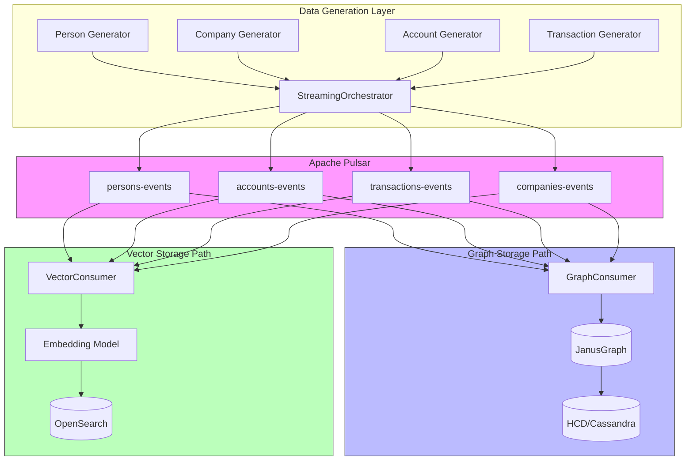
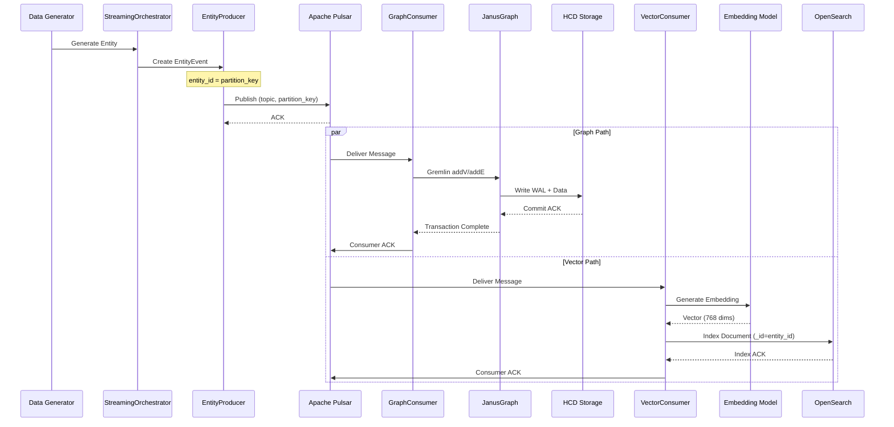
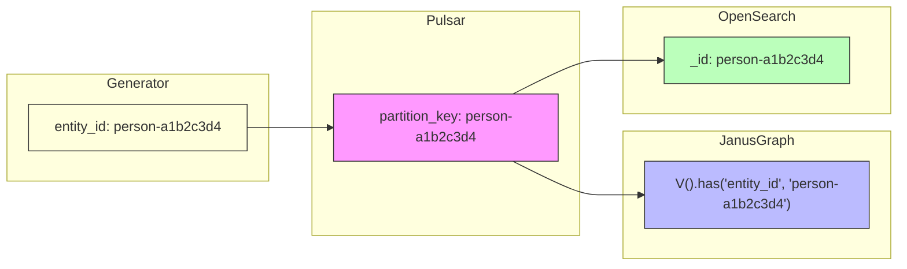
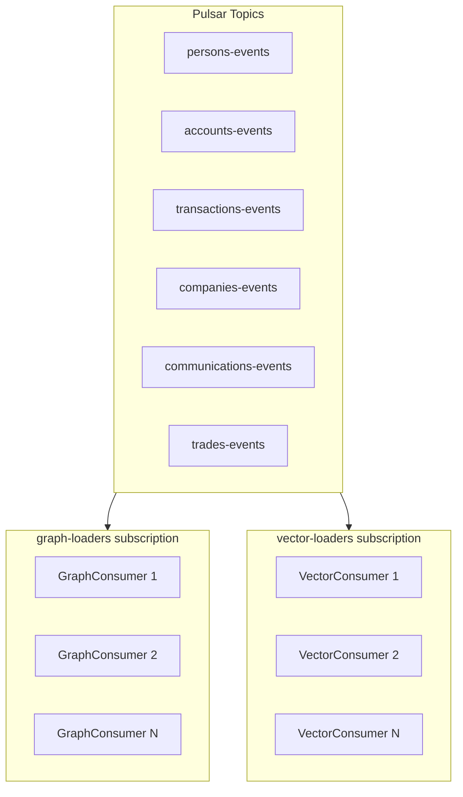
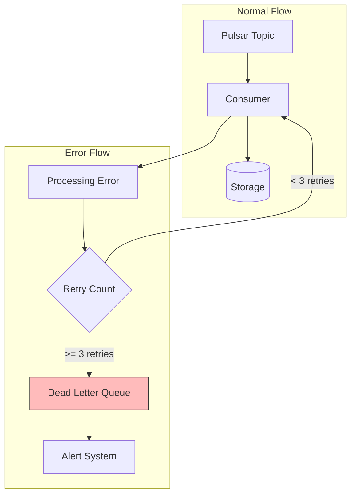
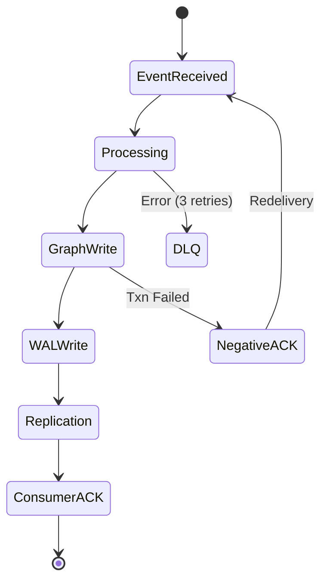

# Unified Data Flow Documentation

**Created**: 2026-02-06  
**Version**: 1.0  
**Status**: Active

---

## TL;DR

Complete data flow from synthetic generation to queryable graph and vector search:

1. **Data Generators** → Create synthetic banking entities (persons, accounts, transactions)
2. **Apache Pulsar** → Event streaming with guaranteed ordering and deduplication
3. **JanusGraph + HCD** → Graph storage with ACID properties
4. **OpenSearch** → Vector embeddings for semantic search

**Key Guarantee**: 1:1 ID mapping across all systems (Pulsar partition key = JanusGraph entity_id = OpenSearch _id)

---

## High-Level Architecture

### ASCII Diagram

```
┌─────────────────────────────────────────────────────────────────────────────┐
│                           DATA GENERATION LAYER                              │
├─────────────────────────────────────────────────────────────────────────────┤
│  ┌─────────────┐  ┌─────────────┐  ┌─────────────┐  ┌─────────────┐        │
│  │   Person    │  │   Company   │  │   Account   │  │ Transaction │        │
│  │  Generator  │  │  Generator  │  │  Generator  │  │  Generator  │        │
│  └──────┬──────┘  └──────┬──────┘  └──────┬──────┘  └──────┬──────┘        │
│         │                │                │                │                │
│         └────────────────┴────────────────┴────────────────┘                │
│                                   │                                          │
│                          ┌────────▼────────┐                                 │
│                          │ StreamingOrchestrator │                           │
│                          │   (EntityProducer)    │                           │
│                          └────────┬────────┘                                 │
└───────────────────────────────────┼─────────────────────────────────────────┘
                                    │
┌───────────────────────────────────▼─────────────────────────────────────────┐
│                           STREAMING LAYER (Pulsar)                          │
├─────────────────────────────────────────────────────────────────────────────┤
│  ┌─────────────┐  ┌─────────────┐  ┌─────────────┐  ┌─────────────┐        │
│  │  persons-   │  │  accounts-  │  │transactions-│  │  companies- │        │
│  │   events    │  │   events    │  │   events    │  │   events    │        │
│  └──────┬──────┘  └──────┬──────┘  └──────┬──────┘  └──────┬──────┘        │
│         │                │                │                │                │
│         └────────────────┴────────────────┴────────────────┘                │
│                                   │                                          │
│                          Key_Shared Subscription                             │
└───────────────────────────────────┼─────────────────────────────────────────┘
                                    │
                    ┌───────────────┴───────────────┐
                    │                               │
┌───────────────────▼───────────────┐   ┌──────────▼──────────────────────────┐
│         GRAPH STORAGE             │   │         VECTOR STORAGE               │
├───────────────────────────────────┤   ├─────────────────────────────────────┤
│  ┌─────────────────────────────┐  │   │  ┌─────────────────────────────┐    │
│  │      GraphConsumer          │  │   │  │     VectorConsumer          │    │
│  │   (Gremlin Transactions)    │  │   │  │   (Embedding Generation)    │    │
│  └──────────────┬──────────────┘  │   │  └──────────────┬──────────────┘    │
│                 │                 │   │                 │                    │
│  ┌──────────────▼──────────────┐  │   │  ┌──────────────▼──────────────┐    │
│  │        JanusGraph           │  │   │  │        OpenSearch           │    │
│  │  (Vertices, Edges, Props)   │  │   │  │  (Vectors, Metadata)        │    │
│  └──────────────┬──────────────┘  │   │  └─────────────────────────────┘    │
│                 │                 │   │                                      │
│  ┌──────────────▼──────────────┐  │   │                                      │
│  │      HCD (Cassandra)        │  │   │                                      │
│  │   (WAL, 3x Replication)     │  │   │                                      │
│  └─────────────────────────────┘  │   │                                      │
└───────────────────────────────────┘   └──────────────────────────────────────┘
```

### Mermaid Flowchart



---

## Detailed Data Flow

### Sequence Diagram



---

## ID Consistency Mapping

### The Golden Rule

**Every entity maintains the same ID across all systems:**

| System | ID Field | Example |
|--------|----------|---------|
| Pulsar | `partition_key` | `person-a1b2c3d4` |
| JanusGraph | `entity_id` property | `person-a1b2c3d4` |
| OpenSearch | `_id` field | `person-a1b2c3d4` |

### ID Flow Diagram



### Code Example

```python
# Entity creation with consistent ID
from banking.streaming import create_person_event

# ID generated once, used everywhere
entity_id = f"person-{uuid.uuid4().hex[:8]}"

event = create_person_event(
    person_id=entity_id,  # Used as partition_key in Pulsar
    name="John Smith",
    payload={
        "entity_id": entity_id,  # Stored in JanusGraph
        "name": "John Smith",
        # ... other fields
    }
)

# In GraphConsumer:
# g.addV('person').property('entity_id', entity_id)

# In VectorConsumer:
# opensearch.index(index='persons', id=entity_id, body={...})
```

---

## Topic Structure

### Pulsar Topics

| Topic | Entity Type | Partition Key | Consumer Groups |
|-------|-------------|---------------|-----------------|
| `persons-events` | Person | `person_id` | graph-loaders, vector-loaders |
| `accounts-events` | Account | `account_id` | graph-loaders, vector-loaders |
| `transactions-events` | Transaction | `from_account_id` | graph-loaders, vector-loaders |
| `companies-events` | Company | `company_id` | graph-loaders, vector-loaders |
| `communications-events` | Communication | `from_person_id` | graph-loaders, vector-loaders |
| `trades-events` | Trade | `account_id` | graph-loaders, vector-loaders |

### Topic Flow Diagram



---

## Error Handling & DLQ

### Dead Letter Queue Flow



### DLQ Topics

| Original Topic | DLQ Topic | Purpose |
|---------------|-----------|---------|
| `persons-events` | `persons-events-dlq` | Failed person processing |
| `transactions-events` | `transactions-events-dlq` | Failed transaction processing |
| (all topics) | `*-events-dlq` | Pattern for all entity types |

---

## Consistency Guarantees

### ACID Properties

| Property | Mechanism | Guarantee |
|----------|-----------|-----------|
| **Atomicity** | JanusGraph Txn + Pulsar ACK | All-or-nothing per batch |
| **Consistency** | Schema validation | Valid state transitions |
| **Isolation** | MVCC | Read Committed level |
| **Durability** | WAL + 3x replication | No data loss |

### Consistency Flow



---

## Performance Characteristics

### Latency Breakdown

| Stage | Latency | Notes |
|-------|---------|-------|
| Producer → Pulsar | 5ms p99 | With batching |
| Pulsar → Consumer | 2ms p99 | Key_Shared routing |
| Consumer batch | 10ms | 1000 msgs or timeout |
| Graph write | 100ms | Atomic transaction |
| Vector indexing | 50ms | Embedding + index |
| **Total (Graph)** | ~115ms | Event to queryable |
| **Total (Vector)** | ~65ms | Event to searchable |

### Throughput

| Component | Throughput | Scale Factor |
|-----------|------------|--------------|
| Pulsar | 3M msg/sec | Per topic |
| Graph Loader | 1K vertices/sec | Per worker |
| Vector Loader | 2K docs/sec | Per worker |
| **System** | 100K writes/sec | With 100 workers |

---

## Related Documentation

- [Streaming Architecture](streaming-architecture.md) - Detailed streaming design
- [System Architecture](system-architecture.md) - Overall system design
- [banking/streaming/README.md](`banking/streaming/README.md`) - Implementation guide

---

**Document Status**: Active  
**Last Updated**: 2026-02-06  
**Version**: 1.0
