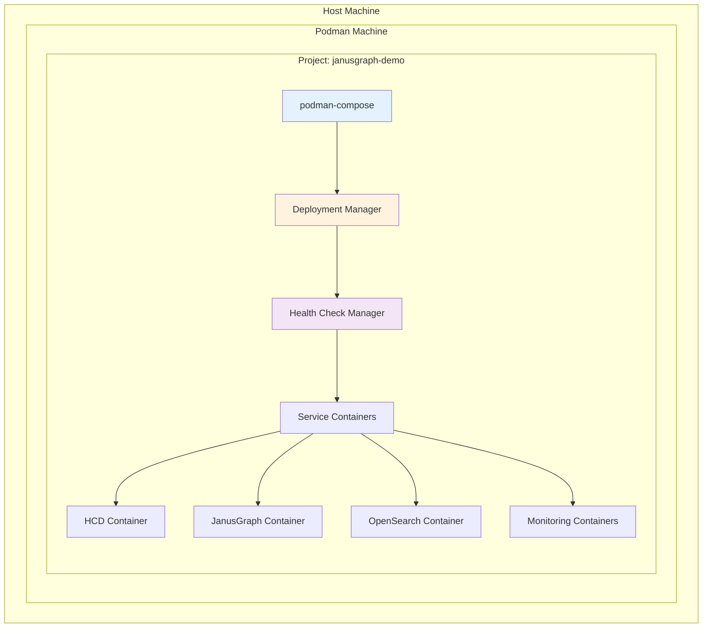
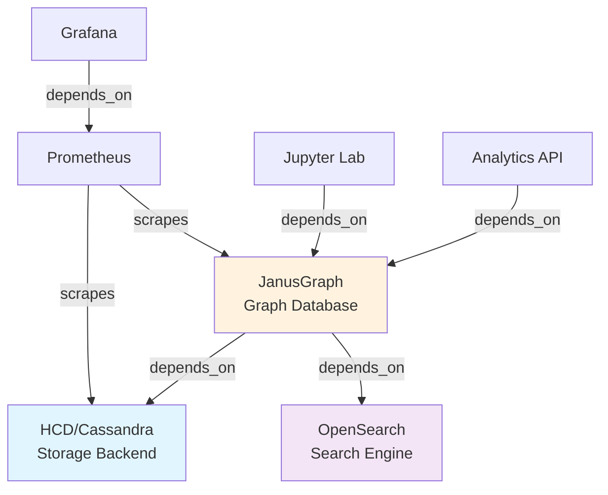
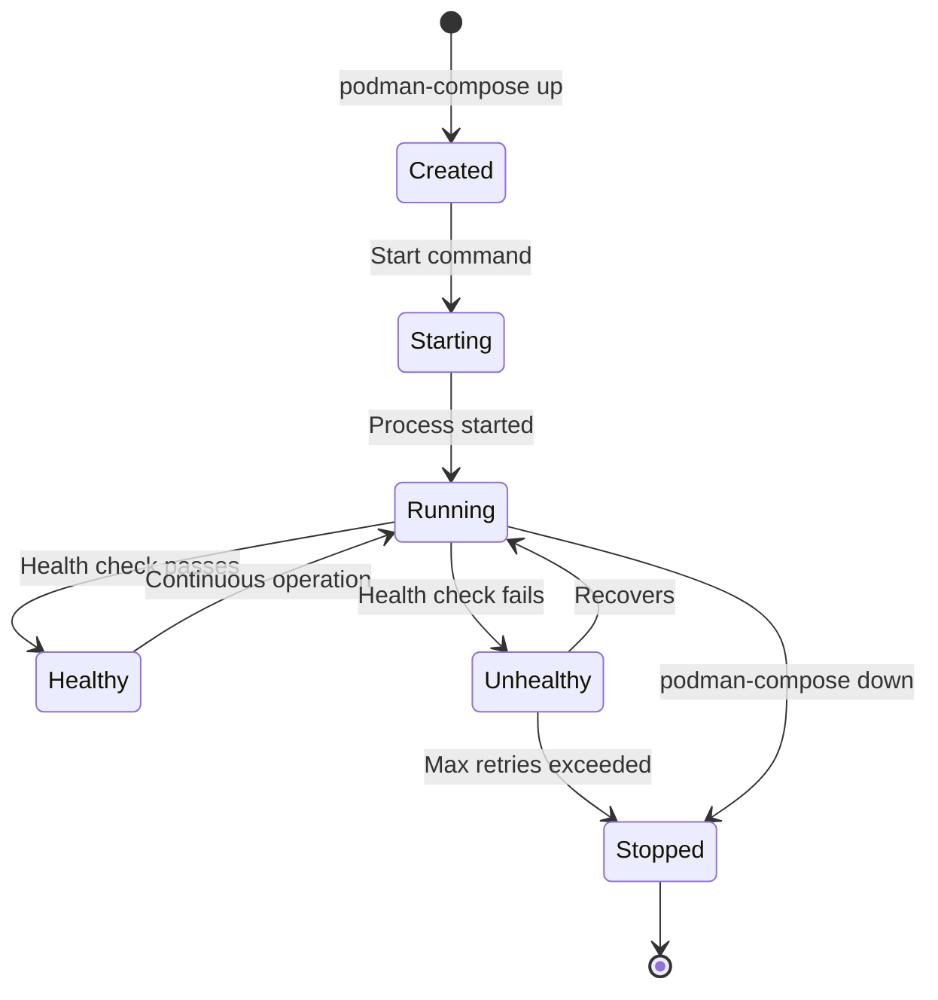
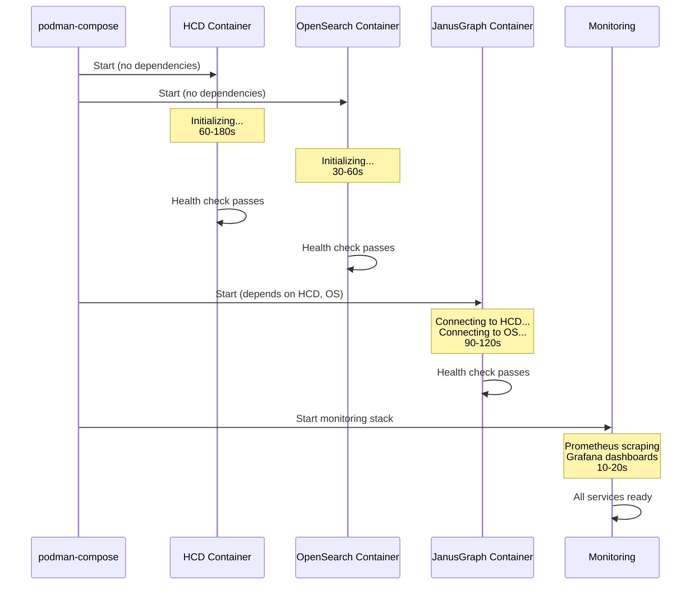
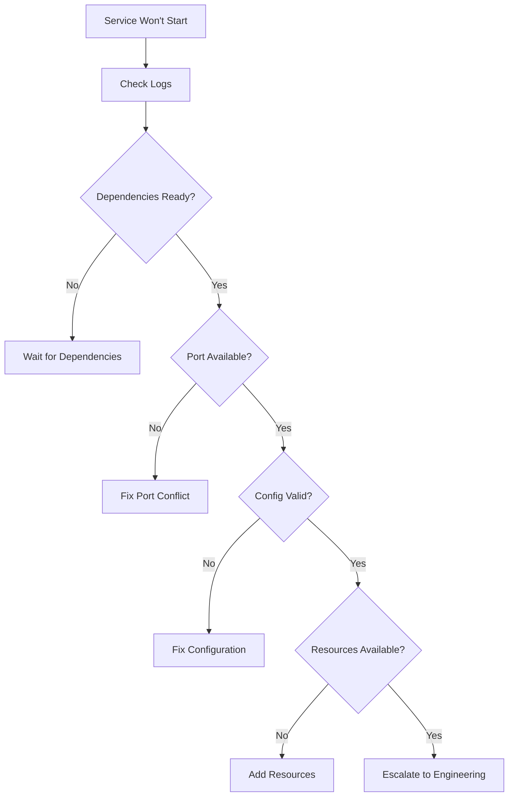
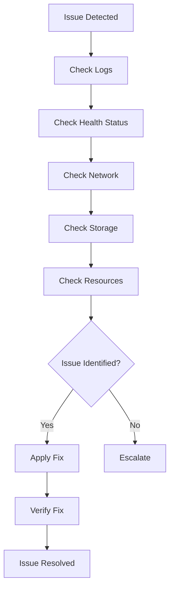

# Deployment Architecture

**Version:** 1.0  
**Date:** 2026-02-19  
**Status:** Active  
**Target Audience:** Users, Operators, Architects

---

## Executive Summary

This document describes the complete deployment architecture for the HCD + JanusGraph Banking Compliance Platform. It bridges high-level architectural design with operational deployment reality, providing a unified view of how components are orchestrated, isolated, and managed in production.

**Key Architectural Decisions:**
- **Container Runtime:** Podman (rootless, daemonless)
- **Orchestration:** podman-compose with project isolation
- **Isolation Strategy:** Five-layer isolation model
- **Deployment Model:** Single-command deterministic deployment
- **Resource Management:** Explicit limits and reservations

---

## Table of Contents

1. [Overview](#overview)
2. [Deployment Model](#deployment-model)
3. [Container Orchestration Architecture](#container-orchestration-architecture)
4. [Network Architecture](#network-architecture)
5. [Storage Architecture](#storage-architecture)
6. [Resource Management](#resource-management)
7. [Security Architecture](#security-architecture)
8. [Service Startup Sequence](#service-startup-sequence)
9. [Deployment Topology](#deployment-topology)
10. [Deployment Procedures](#deployment-procedures)
11. [Monitoring Integration](#monitoring-integration)
12. [Troubleshooting Architecture](#troubleshooting-architecture)
13. [Validation & Verification](#validation--verification)
14. [References](#references)

---

## Overview

### Purpose

This document provides the **authoritative deployment architecture** for the platform, answering:
- How are services deployed and orchestrated?
- How is isolation achieved between projects?
- What is the network and storage topology?
- How do services start and become healthy?
- How is the deployment validated?

### Architectural Context

```
┌─────────────────────────────────────────────────────────────────┐
│                    ARCHITECTURAL LAYERS                          │
├─────────────────────────────────────────────────────────────────┤
│  Logical Architecture (What)                                    │
│  └─ Components, Data Flow, Interactions                         │
│                           ↓                                      │
│  Deployment Architecture (How) ← THIS DOCUMENT                  │
│  └─ Containers, Networks, Volumes, Orchestration                │
│                           ↓                                      │
│  Operational Architecture (Run)                                 │
│  └─ Monitoring, Health Checks, Incident Response                │
└─────────────────────────────────────────────────────────────────┘
```

### Key Principles

1. **Isolation First:** Every project completely isolated
2. **Deterministic Deployment:** Same inputs → Same outputs
3. **Explicit Configuration:** No implicit defaults
4. **Health-Driven:** Services declare readiness
5. **Fail-Fast:** Early detection of issues

---

## Deployment Model

### Podman-Based Containerization

**Why Podman?**
- **Rootless:** Better security, no daemon as root
- **Daemonless:** No single point of failure
- **Pod Support:** Kubernetes-compatible
- **Docker Compatible:** Same CLI, better architecture

**Architecture:**

```
┌─────────────────────────────────────────────────────────────────┐
│                      HOST MACHINE (macOS)                        │
│  ┌────────────────────────────────────────────────────────┐    │
│  │              PODMAN MACHINE (VM)                       │    │
│  │  ┌──────────────────────────────────────────────────┐  │    │
│  │  │  PROJECT: janusgraph-demo (ISOLATED)             │  │    │
│  │  │  ┌────────────────────────────────────────────┐  │  │    │
│  │  │  │  CONTAINERS (podman-compose managed)       │  │    │    │
│  │  │  │  - janusgraph-demo_hcd-server_1            │  │  │    │
│  │  │  │  - janusgraph-demo_janusgraph-server_1     │  │  │    │
│  │  │  │  - janusgraph-demo_opensearch_1            │  │  │    │
│  │  │  │  - janusgraph-demo_jupyter_1               │  │  │    │
│  │  │  │  - janusgraph-demo_prometheus_1            │  │  │    │
│  │  │  │  - janusgraph-demo_grafana_1               │  │  │    │
│  │  │  └────────────────────────────────────────────┘  │  │    │
│  │  └──────────────────────────────────────────────────┘  │    │
│  └────────────────────────────────────────────────────────┘    │
└─────────────────────────────────────────────────────────────────┘
```

### Project Isolation Strategy

**Isolation Layers:**
1. **Network:** Separate subnet per project
2. **Volume:** Project-prefixed volumes
3. **Resource:** CPU/memory limits per project
4. **Port:** Unique port mappings
5. **Labels:** Project tagging for management

**See:** [Podman Isolation Architecture](podman-isolation-architecture.md) for complete details.

### Multi-Environment Support

| Environment | Purpose | Isolation | Configuration |
|-------------|---------|-----------|---------------|
| **Development** | Local testing | Project-name | `.env` |
| **Staging** | Pre-production | Project-name + namespace | `config/environments/staging/` |
| **Production** | Live system | Project-name + namespace + network policies | `config/environments/prod/` |

---

## Container Orchestration Architecture

### Orchestration Layer



### podman-compose Role

**Responsibilities:**
- Parse compose files
- Create networks and volumes
- Start containers in dependency order
- Monitor health checks
- Manage lifecycle (start, stop, restart)

**Project Name Enforcement:**

```bash
# MANDATORY: Always use -p flag
podman-compose -p janusgraph-demo -f docker-compose.full.yml up -d

# This ensures:
# - Containers: janusgraph-demo_<service>_1
# - Networks: janusgraph-demo_<network>
# - Volumes: janusgraph-demo_<volume>
```

### Service Dependency Management

**Dependency Graph:**



**Compose Configuration:**

```yaml
services:
  janusgraph-server:
    depends_on:
      hcd-server:
        condition: service_healthy
      opensearch:
        condition: service_healthy
```

### Container Lifecycle



### Health Check Cascade

**Purpose:** Ensure services are truly ready before dependent services start.

**Implementation:**

```yaml
services:
  hcd-server:
    healthcheck:
      test: ["CMD", "/opt/hcd/bin/nodetool", "status"]
      interval: 30s
      timeout: 30s
      retries: 10
      start_period: 180s
  
  janusgraph-server:
    depends_on:
      hcd-server:
        condition: service_healthy
    healthcheck:
      test: ["CMD-SHELL", "bash -c 'cat < /dev/null > /dev/tcp/127.0.0.1/8182'"]
      interval: 30s
      timeout: 10s
      retries: 5
      start_period: 90s
```

---

## Network Architecture

### Network Topology

```
┌─────────────────────────────────────────────────────────────────┐
│                    PODMAN MACHINE NETWORK                        │
│                                                                  │
│  ┌────────────────────────────────────────────────────────┐    │
│  │  PROJECT NETWORK: janusgraph-demo_hcd-janusgraph-network │    │
│  │  Subnet: 10.89.X.0/24                                   │    │
│  │  Driver: bridge                                         │    │
│  │                                                         │    │
│  │  ┌──────────────┐  ┌──────────────┐  ┌──────────────┐  │    │
│  │  │ HCD          │  │ JanusGraph   │  │ OpenSearch   │  │    │
│  │  │ 10.89.X.2    │  │ 10.89.X.3    │  │ 10.89.X.4    │  │    │
│  │  │ Port: 9042   │  │ Port: 8182   │  │ Port: 9200   │  │    │
│  │  └──────┬───────┘  └──────┬───────┘  └──────┬───────┘  │    │
│  │         │                 │                 │          │    │
│  │         └─────────────────┴─────────────────┘          │    │
│  │                    Internal DNS                        │    │
│  │         (hcd-server, janusgraph-server, opensearch)    │    │
│  └────────────────────────────────────────────────────────┘    │
│                              │                                  │
│                              │ Port Mapping                     │
│                              ▼                                  │
│  ┌────────────────────────────────────────────────────────┐    │
│  │  HOST PORTS (Exposed to macOS)                         │    │
│  │  19042 → 9042  (HCD CQL)                               │    │
│  │  18182 → 8182  (JanusGraph Gremlin)                    │    │
│  │  9200  → 9200  (OpenSearch API)                        │    │
│  │  8888  → 8888  (Jupyter Lab)                           │    │
│  │  9090  → 9090  (Prometheus)                            │    │
│  │  3001  → 3000  (Grafana)                               │    │
│  └────────────────────────────────────────────────────────┘    │
└─────────────────────────────────────────────────────────────────┘
```

### Isolation Boundaries

**Network Isolation:**
- Each project has dedicated network
- Containers in different projects cannot communicate
- DNS resolution scoped to project network

**Security Boundaries:**
- Internal communication: Container-to-container (no encryption by default)
- External access: Host ports (can add TLS)
- No cross-project traffic possible

### DNS Resolution

**Internal DNS (Container Names):**

```bash
# From JanusGraph container
ping hcd-server          # Resolves to 10.89.X.2
ping opensearch          # Resolves to 10.89.X.4

# From outside project
ping hcd-server          # Does not resolve
```

**External DNS (Host Ports):**

```bash
# From host machine
curl http://localhost:18182  # JanusGraph
curl http://localhost:9200   # OpenSearch
```

### Port Mapping Strategy

**Default Port Allocations:**

| Service | Internal Port | External Port | Protocol | Purpose |
|---------|---------------|---------------|----------|---------|
| HCD CQL | 9042 | 19042 | TCP | Cassandra queries |
| HCD Thrift | 9160 | 19160 | TCP | Legacy Thrift |
| HCD JMX | 7199 | 17199 | TCP | JMX monitoring |
| JanusGraph Gremlin | 8182 | 18182 | WebSocket | Graph queries |
| JanusGraph Management | 8184 | 18184 | HTTP | Management API |
| OpenSearch API | 9200 | 9200 | HTTP | Search API |
| OpenSearch Perf | 9600 | 9600 | HTTP | Performance analyzer |
| Jupyter Lab | 8888 | 8888 | HTTP | Notebook interface |
| Prometheus | 9090 | 9090 | HTTP | Metrics |
| Grafana | 3000 | 3001 | HTTP | Dashboards |
| AlertManager | 9093 | 9093 | HTTP | Alerts |
| Pulsar Binary | 6650 | 6650 | TCP | Message broker |
| Pulsar Admin | 8081 | 8081 | HTTP | Admin API |

**Custom Port Configuration:**

```bash
# .env file
HOST_JANUSGRAPH_PORT=28182
HOST_HCD_PORT=29042
HOST_JUPYTER_PORT=28888

# Compose file uses these variables
ports:
  - "${HOST_JANUSGRAPH_PORT:-18182}:8182"
```

---

## Storage Architecture

### Volume Strategy

**Principle:** All volumes must be project-prefixed for isolation.

**Volume Topology:**

```
┌─────────────────────────────────────────────────────────────────┐
│                    PODMAN MACHINE STORAGE                        │
├─────────────────────────────────────────────────────────────────┤
│                                                                  │
│  Project: janusgraph-demo                                       │
│  ┌────────────────────────────────────────────────────────┐    │
│  │  janusgraph-demo_hcd-data                              │    │
│  │  └─ /var/lib/hcd/data (Cassandra SSTables)            │    │
│  │                                                         │    │
│  │  janusgraph-demo_hcd-commitlog                         │    │
│  │  └─ /var/lib/hcd/commitlog (Write-ahead log)          │    │
│  │                                                         │    │
│  │  janusgraph-demo_janusgraph-db                         │    │
│  │  └─ /var/lib/janusgraph (Graph metadata)              │    │
│  │                                                         │    │
│  │  janusgraph-demo_opensearch-data                       │    │
│  │  └─ /usr/share/opensearch/data (Indices)              │    │
│  │                                                         │    │
│  │  janusgraph-demo_prometheus-data                       │    │
│  │  └─ /prometheus (Time-series data)                    │    │
│  │                                                         │    │
│  │  janusgraph-demo_grafana-data                          │    │
│  │  └─ /var/lib/grafana (Dashboards)                     │    │
│  │                                                         │    │
│  │  janusgraph-demo_vault-data                            │    │
│  │  └─ /vault/data (Secrets)                             │    │
│  │                                                         │    │
│  │  janusgraph-demo_pulsar-data                           │    │
│  │  └─ /pulsar/data (Message storage)                    │    │
│  └────────────────────────────────────────────────────────┘    │
└─────────────────────────────────────────────────────────────────┘
```

### Data Persistence Guarantees

| Volume | Persistence | Backup Priority | Recovery Time |
|--------|-------------|-----------------|---------------|
| `hcd-data` | Critical | P0 | < 1 hour |
| `janusgraph-db` | Critical | P0 | < 1 hour |
| `opensearch-data` | High | P1 | < 4 hours |
| `prometheus-data` | Medium | P2 | < 24 hours |
| `grafana-data` | Low | P3 | Rebuild |
| `vault-data` | Critical | P0 | < 15 minutes |
| `pulsar-data` | High | P1 | < 4 hours |

### Data Flow

**Write Path:**

```
Application → JanusGraph → HCD → WAL → SSTables → Disk
                        ↓
                   OpenSearch → Lucene Index → Disk
```

**Read Path:**

```
Application → JanusGraph → HCD → MemTable/SSTable → Response
                        ↓
                   OpenSearch → Index → Response
```

**Backup Path:**

```
Volume → Snapshot → Tar Archive → Encrypted Storage → S3/NFS
```

---

## Resource Management

### Resource Allocation

**Total Resource Budget:**

| Resource | Total Available | Allocated | Reserved | Overhead |
|----------|----------------|-----------|----------|----------|
| CPU | 10 cores | 9.0 cores | 4.5 cores | 1.0 core |
| Memory | 32 GB | 20 GB | 10 GB | 2 GB |
| Disk | 500 GB | 200 GB | 100 GB | 50 GB |

**Per-Service Allocation:**

```yaml
services:
  hcd-server:
    deploy:
      resources:
        limits:
          cpus: '4.0'      # Maximum CPU
          memory: 8G       # Maximum memory
        reservations:
          cpus: '2.0'      # Guaranteed CPU
          memory: 4G       # Guaranteed memory
  
  janusgraph-server:
    deploy:
      resources:
        limits:
          cpus: '2.0'
          memory: 6G
        reservations:
          cpus: '1.0'
          memory: 3G
  
  opensearch:
    deploy:
      resources:
        limits:
          cpus: '2.0'
          memory: 4G
        reservations:
          cpus: '1.0'
          memory: 2G
```

### Resource Monitoring

**Prometheus Metrics:**

```promql
# CPU usage by container
rate(container_cpu_usage_seconds_total{project="janusgraph-demo"}[5m])

# Memory usage by container
container_memory_usage_bytes{project="janusgraph-demo"}

# Disk usage by volume
container_fs_usage_bytes{project="janusgraph-demo"}
```

**Alert Thresholds:**

| Metric | Warning | Critical | Action |
|--------|---------|----------|--------|
| CPU Usage | > 80% | > 95% | Scale up |
| Memory Usage | > 80% | > 95% | Scale up |
| Disk Usage | > 70% | > 85% | Add storage |
| Network I/O | > 80% | > 95% | Investigate |

---

## Security Architecture

### Isolation Security

**Network Isolation:**
- Project-level network segmentation
- No cross-project communication
- Internal DNS scoped to project

**Volume Isolation:**
- Project-prefixed volumes
- No shared storage
- Independent backup/restore

**Process Isolation:**
- Rootless containers (Podman)
- User namespace isolation
- cgroups resource limits

### Access Control

**Port Exposure Strategy:**

```yaml
# Development: Expose all ports
ports:
  - "19042:9042"  # HCD
  - "18182:8182"  # JanusGraph
  - "8888:8888"   # Jupyter

# Production: Expose only necessary ports
ports:
  - "18182:8182"  # JanusGraph (API only)
  # No direct HCD access
  # No Jupyter access
```

**Authentication Points:**

1. **JanusGraph:** Optional authentication (disabled in dev)
2. **OpenSearch:** Basic auth (admin/admin in dev)
3. **Grafana:** User authentication (admin/admin in dev)
4. **Vault:** Token-based authentication
5. **Jupyter:** Token-based authentication

### Secrets Management

**Vault Integration:**

```
┌─────────────────────────────────────────────────────────────┐
│                    SECRETS FLOW                              │
├─────────────────────────────────────────────────────────────┤
│                                                              │
│  1. Vault Initialization                                    │
│     └─ scripts/security/init_vault.sh                       │
│                                                              │
│  2. Secret Storage                                          │
│     └─ vault kv put janusgraph/admin password=<secret>      │
│                                                              │
│  3. Secret Injection                                        │
│     └─ Environment variables from Vault                     │
│                                                              │
│  4. Application Access                                      │
│     └─ Services read from environment                       │
└─────────────────────────────────────────────────────────────┘
```

**Secret Rotation:**

```bash
# Rotate database password
vault kv put janusgraph/admin password=<new-password>

# Restart services to pick up new secret
podman-compose -p janusgraph-demo restart janusgraph-server
```

---

## Service Startup Sequence

### Startup Flow



### Timing Expectations

| Service | Start Time | Health Check | Total Time |
|---------|------------|--------------|------------|
| HCD | 60-180s | nodetool status | 60-180s |
| OpenSearch | 30-60s | cluster health | 30-60s |
| JanusGraph | 20-30s | + wait for HCD/OS | 90-120s |
| Jupyter | 5-10s | HTTP check | 5-10s |
| Prometheus | 5-10s | HTTP check | 5-10s |
| Grafana | 5-10s | HTTP check | 5-10s |
| **Total** | - | - | **90-180s** |

### Health Check Cascade

**Level 1: Primary Services (No Dependencies)**
- HCD (storage backend)
- OpenSearch (search engine)

**Level 2: Secondary Services (Depend on Level 1)**
- JanusGraph (depends on HCD + OpenSearch)

**Level 3: Tertiary Services (Depend on Level 2)**
- Analytics API (depends on JanusGraph)
- Jupyter Lab (depends on JanusGraph)

**Level 4: Monitoring (Depends on All)**
- Prometheus (scrapes all services)
- Grafana (visualizes Prometheus)

---

## Deployment Topology

### Development Topology

```
┌─────────────────────────────────────────────────────────────┐
│                    DEVELOPMENT (Single Node)                 │
├─────────────────────────────────────────────────────────────┤
│                                                              │
│  MacBook Pro (M3)                                           │
│  ┌────────────────────────────────────────────────────┐    │
│  │  Podman Machine (VM)                               │    │
│  │  ┌──────────────────────────────────────────────┐  │    │
│  │  │  All Services in One Project                 │  │    │
│  │  │  - HCD (single node)                         │  │    │
│  │  │  - JanusGraph (single instance)              │  │    │
│  │  │  - OpenSearch (single node)                  │  │    │
│  │  │  - Monitoring stack                          │  │    │
│  │  │  - Jupyter Lab                               │  │    │
│  │  └──────────────────────────────────────────────┘  │    │
│  └────────────────────────────────────────────────────┘    │
│                                                              │
│  Resources: 10 CPU, 20GB RAM, 200GB Disk                   │
│  Purpose: Local development and testing                     │
└─────────────────────────────────────────────────────────────┘
```

### Staging Topology

```
┌─────────────────────────────────────────────────────────────┐
│                    STAGING (Multi-Node)                      │
├─────────────────────────────────────────────────────────────┤
│                                                              │
│  Node 1: Storage                                            │
│  - HCD (3-node cluster)                                     │
│  - OpenSearch (3-node cluster)                              │
│                                                              │
│  Node 2: Query                                              │
│  - JanusGraph (2 instances)                                 │
│  - Load balancer                                            │
│                                                              │
│  Node 3: Monitoring                                         │
│  - Prometheus                                               │
│  - Grafana                                                  │
│  - AlertManager                                             │
│                                                              │
│  Resources: 30 CPU, 64GB RAM, 1TB Disk                     │
│  Purpose: Pre-production testing                            │
└─────────────────────────────────────────────────────────────┘
```

### Production Topology

```
┌─────────────────────────────────────────────────────────────┐
│                    PRODUCTION (HA Multi-Node)                │
├─────────────────────────────────────────────────────────────┤
│                                                              │
│  Storage Tier (3+ nodes)                                    │
│  - HCD cluster (RF=3)                                       │
│  - OpenSearch cluster (3+ nodes)                            │
│  - Pulsar cluster (3+ brokers)                              │
│                                                              │
│  Query Tier (3+ nodes)                                      │
│  - JanusGraph instances (3+)                                │
│  - Load balancer (HA)                                       │
│  - API instances (3+)                                       │
│                                                              │
│  Monitoring Tier (2+ nodes)                                 │
│  - Prometheus (HA)                                          │
│  - Grafana (HA)                                             │
│  - AlertManager (HA)                                        │
│                                                              │
│  Resources: 100+ CPU, 256GB+ RAM, 10TB+ Disk               │
│  Purpose: Production workloads                              │
└─────────────────────────────────────────────────────────────┘
```

---

## Deployment Procedures

### Initial Deployment

**Prerequisites:**
1. Podman installed and machine running
2. `.env` file configured
3. All images built (if custom)
4. Ports available

**Procedure:**

```bash
# 1. Validate environment
./scripts/validation/preflight_check.sh

# 2. Validate isolation configuration
./scripts/validation/validate_podman_isolation.sh --strict

# 3. Deploy stack (MUST run from config/compose)
cd config/compose
bash ../../scripts/deployment/deploy_full_stack.sh

# 4. Wait for services to be healthy (90-180s)
watch podman ps --filter "label=project=janusgraph-demo"

# 5. Verify deployment
./scripts/testing/check_graph_counts.sh

# 6. Run smoke tests
pytest tests/integration/test_smoke.py -v
```

**Expected Output:**

```
✅ Preflight checks passed
✅ Isolation validation passed
✅ Services deployed
✅ Health checks passed
✅ Graph accessible
✅ Smoke tests passed
```

### Update Deployment

**Procedure:**

```bash
# 1. Backup current state
./scripts/backup/backup_volumes.sh

# 2. Pull new images (if applicable)
podman pull docker.io/janusgraph/janusgraph:1.1.0

# 3. Update compose files (if needed)
# Edit config/compose/docker-compose.full.yml

# 4. Deploy updates
cd config/compose
podman-compose -p janusgraph-demo -f docker-compose.full.yml up -d

# 5. Verify health
podman ps --filter "label=project=janusgraph-demo"

# 6. Run integration tests
pytest tests/integration/ -v
```

### Rollback Procedure

**When to Rollback:**
- Deployment fails health checks
- Integration tests fail
- Critical functionality broken

**Procedure:**

```bash
# 1. Stop current deployment
cd config/compose
bash ../../scripts/deployment/stop_full_stack.sh

# 2. Restore from backup
./scripts/backup/restore_volumes.sh /backups/janusgraph/backup-<timestamp>

# 3. Checkout previous version (if code changed)
git checkout <previous-tag>

# 4. Deploy previous version
cd config/compose
bash ../../scripts/deployment/deploy_full_stack.sh

# 5. Verify functionality
pytest tests/integration/ -v
```

---

## Monitoring Integration

### Metrics Collection Points

```
┌─────────────────────────────────────────────────────────────┐
│                    MONITORING ARCHITECTURE                   │
├─────────────────────────────────────────────────────────────┤
│                                                              │
│  Services (Metrics Exporters)                               │
│  ┌────────────────────────────────────────────────────┐    │
│  │  HCD → JMX Exporter → :7199/metrics                │    │
│  │  JanusGraph → Custom Exporter → :9091/metrics      │    │
│  │  OpenSearch → Built-in → :9200/_prometheus/metrics │    │
│  │  Podman → cAdvisor → :8080/metrics                 │    │
│  └────────────────┬───────────────────────────────────┘    │
│                   │                                          │
│                   ▼                                          │
│  ┌────────────────────────────────────────────────────┐    │
│  │  Prometheus (Scraper & Storage)                    │    │
│  │  - Scrape interval: 15s                            │    │
│  │  - Retention: 15 days                              │    │
│  │  - Storage: janusgraph-demo_prometheus-data        │    │
│  └────────────────┬───────────────────────────────────┘    │
│                   │                                          │
│                   ▼                                          │
│  ┌────────────────────────────────────────────────────┐    │
│  │  Grafana (Visualization)                           │    │
│  │  - Dashboards: JanusGraph, HCD, System             │    │
│  │  - Alerts: Integrated with AlertManager            │    │
│  └────────────────────────────────────────────────────┘    │
│                                                              │
│  ┌────────────────────────────────────────────────────┐    │
│  │  AlertManager (Alert Routing)                      │    │
│  │  - Routes: Email, Slack, PagerDuty                 │    │
│  │  - Grouping: By severity and service               │    │
│  └────────────────────────────────────────────────────┘    │
└─────────────────────────────────────────────────────────────┘
```

### Health Check Architecture

**Health Check Types:**

1. **Liveness Probe:** Is the service running?
2. **Readiness Probe:** Is the service ready to accept traffic?
3. **Startup Probe:** Has the service finished starting?

**Implementation:**

```yaml
services:
  janusgraph-server:
    healthcheck:
      test: ["CMD-SHELL", "bash -c 'cat < /dev/null > /dev/tcp/127.0.0.1/8182'"]
      interval: 30s        # Check every 30s
      timeout: 10s         # Timeout after 10s
      retries: 5           # Retry 5 times
      start_period: 90s    # Grace period for startup
```

### Alert Integration

**Alert Flow:**

```
Service → Prometheus → AlertManager → Notification Channel
                ↓
            Grafana (Visualization)
```

**Alert Rules:**

```yaml
groups:
  - name: janusgraph
    rules:
      - alert: JanusGraphDown
        expr: up{job="janusgraph"} == 0
        for: 5m
        labels:
          severity: critical
        annotations:
          summary: "JanusGraph is down"
      
      - alert: HighQueryLatency
        expr: janusgraph_query_duration_seconds > 1
        for: 10m
        labels:
          severity: warning
        annotations:
          summary: "High query latency detected"
```

---

## Troubleshooting Architecture

### Common Failure Modes

**1. Service Won't Start**



**2. Health Check Failures**

```bash
# Check health status
podman inspect janusgraph-demo_janusgraph-server_1 --format '{{.State.Health.Status}}'

# View health check logs
podman inspect janusgraph-demo_janusgraph-server_1 --format '{{json .State.Health}}' | jq

# Manual health check
podman exec janusgraph-demo_janusgraph-server_1 bash -c 'cat < /dev/null > /dev/tcp/127.0.0.1/8182'
```

**3. Network Connectivity Issues**

```bash
# Check network
podman network inspect janusgraph-demo_hcd-janusgraph-network

# Test connectivity
podman exec janusgraph-demo_janusgraph-server_1 ping -c 3 hcd-server

# Check DNS resolution
podman exec janusgraph-demo_janusgraph-server_1 nslookup hcd-server
```

**4. Volume Permission Issues**

```bash
# Check volume mounts
podman inspect janusgraph-demo_hcd-server_1 --format '{{json .Mounts}}' | jq

# Check permissions
podman exec janusgraph-demo_hcd-server_1 ls -la /var/lib/hcd/data
```

### Diagnostic Flow



### Recovery Procedures

**Service Restart:**

```bash
# Restart single service
podman restart janusgraph-demo_janusgraph-server_1

# Restart all services
cd config/compose
podman-compose -p janusgraph-demo restart
```

**Volume Repair:**

```bash
# Check volume integrity
podman volume inspect janusgraph-demo_hcd-data

# Restore from backup if corrupted
./scripts/backup/restore_volumes.sh /backups/janusgraph/backup-<timestamp>
```

**Network Reset:**

```bash
# Remove and recreate network
podman network rm janusgraph-demo_hcd-janusgraph-network
cd config/compose
podman-compose -p janusgraph-demo up -d
```

**Full Stack Reset:**

```bash
# Stop all services
bash scripts/deployment/stop_full_stack.sh

# Remove all resources (CAUTION: Data loss)
podman ps -a --filter "label=project=janusgraph-demo" --format "{{.Names}}" | xargs podman rm -f
podman volume ls --filter "label=project=janusgraph-demo" --format "{{.Name}}" | xargs podman volume rm
podman network ls --filter "label=project=janusgraph-demo" --format "{{.Name}}" | xargs podman network rm

# Redeploy
cd config/compose
bash ../../scripts/deployment/deploy_full_stack.sh
```

---

## Validation & Verification

### Pre-Deployment Validation

```bash
# Run comprehensive preflight check
./scripts/validation/preflight_check.sh

# Checks performed:
# ✅ Podman installed and running
# ✅ Python environment configured
# ✅ Required tools available
# ✅ Configuration files present
# ✅ Ports available
# ✅ Sufficient resources
```

### Post-Deployment Verification

```bash
# 1. Check all services running
podman ps --filter "label=project=janusgraph-demo"

# 2. Check all services healthy
podman ps --filter "label=project=janusgraph-demo" --filter "health=healthy"

# 3. Verify graph connectivity
curl -s http://localhost:18182/health | jq

# 4. Run smoke tests
pytest tests/integration/test_smoke.py -v

# 5. Check monitoring
curl -s http://localhost:9090/-/healthy
curl -s http://localhost:3001/api/health
```

### Continuous Validation

**Monitoring Checks:**
- Service health status (every 30s)
- Resource usage (every 15s)
- Query latency (every 15s)
- Error rates (every 15s)

**Automated Tests:**
- Smoke tests (every deployment)
- Integration tests (nightly)
- Performance tests (weekly)

---

## References

### Internal Documentation
- [Podman Isolation Architecture](podman-isolation-architecture.md) - Five-layer isolation model
- [System Architecture](system-architecture.md) - Logical component architecture
- [Streaming Architecture](streaming-architecture.md) - Pulsar streaming design
- [Data Flow Unified](data-flow-unified.md) - Complete data flow
- [Operations Runbook](../operations/operations-runbook.md) - Day-to-day operations

### Scripts
- Deployment: `scripts/deployment/deploy_full_stack.sh`
- Validation: `scripts/validation/preflight_check.sh`
- Isolation: `scripts/validation/validate_podman_isolation.sh`
- Health Check: `scripts/testing/check_graph_counts.sh`

### Configuration
- Compose Files: `config/compose/docker-compose.full.yml`
- Environment: `.env.example`
- JanusGraph: `config/janusgraph/janusgraph-hcd.properties`

### External Resources
- [Podman Documentation](https://docs.podman.io/)
- [Docker Compose Specification](https://docs.docker.com/compose/compose-file/)
- [JanusGraph Deployment](https://docs.janusgraph.org/operations/deployment/)

---

## Appendices

### Appendix A: Complete Port Reference

| Service | Internal | External | Protocol | Purpose | Required |
|---------|----------|----------|----------|---------|----------|
| HCD CQL | 9042 | 19042 | TCP | Cassandra queries | Yes |
| HCD Thrift | 9160 | 19160 | TCP | Legacy Thrift | No |
| HCD Inter-node | 7000-7001 | 17000-17001 | TCP | Cluster communication | Yes (multi-node) |
| HCD JMX | 7199 | 17199 | TCP | JMX monitoring | Yes (monitoring) |
| JanusGraph Gremlin | 8182 | 18182 | WebSocket | Graph queries | Yes |
| JanusGraph Management | 8184 | 18184 | HTTP | Management API | No |
| OpenSearch API | 9200 | 9200 | HTTP | Search API | Yes |
| OpenSearch Perf | 9600 | 9600 | HTTP | Performance analyzer | No |
| OpenSearch Dashboards | 5601 | 5601 | HTTP | Web UI | Yes |
| Jupyter Lab | 8888 | 8888 | HTTP | Notebook interface | Yes |
| Prometheus | 9090 | 9090 | HTTP | Metrics | Yes |
| Grafana | 3000 | 3001 | HTTP | Dashboards | Yes |
| AlertManager | 9093 | 9093 | HTTP | Alerts | Yes |
| JanusGraph Exporter | 9091 | 9091 | HTTP | Custom metrics | Yes |
| Pulsar Binary | 6650 | 6650 | TCP | Message broker | Yes (streaming) |
| Pulsar Admin | 8081 | 8081 | HTTP | Admin API | Yes (streaming) |
| Vault | 8200 | 8200 | HTTP | Secrets | Yes (production) |

### Appendix B: Volume Mount Reference

| Volume | Mount Point | Purpose | Size | Backup |
|--------|-------------|---------|------|--------|
| `hcd-data` | `/var/lib/hcd/data` | Cassandra SSTables | 50-500GB | Critical |
| `hcd-commitlog` | `/var/lib/hcd/commitlog` | Write-ahead log | 10-50GB | Critical |
| `janusgraph-db` | `/var/lib/janusgraph` | Graph metadata | 1-10GB | Critical |
| `opensearch-data` | `/usr/share/opensearch/data` | Search indices | 20-200GB | High |
| `prometheus-data` | `/prometheus` | Time-series data | 10-100GB | Medium |
| `grafana-data` | `/var/lib/grafana` | Dashboards | 1-5GB | Low |
| `vault-data` | `/vault/data` | Secrets | 1-5GB | Critical |
| `pulsar-data` | `/pulsar/data` | Message storage | 10-100GB | High |

### Appendix C: Environment Variables

| Variable | Default | Purpose | Required |
|----------|---------|---------|----------|
| `COMPOSE_PROJECT_NAME` | `janusgraph-demo` | Project isolation | Yes |
| `PODMAN_CONNECTION` | `podman-wxd` | Podman machine | Yes |
| `HOST_JANUSGRAPH_PORT` | `18182` | JanusGraph port | No |
| `HOST_HCD_PORT` | `19042` | HCD port | No |
| `HOST_JUPYTER_PORT` | `8888` | Jupyter port | No |
| `HCD_HEAP_SIZE` | `4G` | HCD memory | No |
| `JANUSGRAPH_HEAP_SIZE` | `2G` | JanusGraph memory | No |
| `OPENSEARCH_JAVA_OPTS` | `-Xms512m -Xmx512m` | OpenSearch memory | No |

### Appendix D: Resource Limits

| Service | CPU Limit | CPU Reserve | Memory Limit | Memory Reserve |
|---------|-----------|-------------|--------------|----------------|
| HCD | 4.0 | 2.0 | 8G | 4G |
| JanusGraph | 2.0 | 1.0 | 6G | 3G |
| OpenSearch | 2.0 | 1.0 | 4G | 2G |
| Jupyter | 1.0 | 0.5 | 2G | 1G |
| Prometheus | 1.0 | 0.5 | 2G | 1G |
| Grafana | 0.5 | 0.25 | 1G | 512M |
| AlertManager | 0.5 | 0.25 | 1G | 512M |
| Pulsar | 2.0 | 1.0 | 4G | 2G |
| **Total** | **13.0** | **6.5** | **28G** | **14G** |

---

**Document Status:** Active  
**Last Updated:** 2026-02-19  
**Next Review:** 2026-03-19  
**Owner:** Platform Engineering Team  
**Reviewers:** Architecture Team, Operations Team