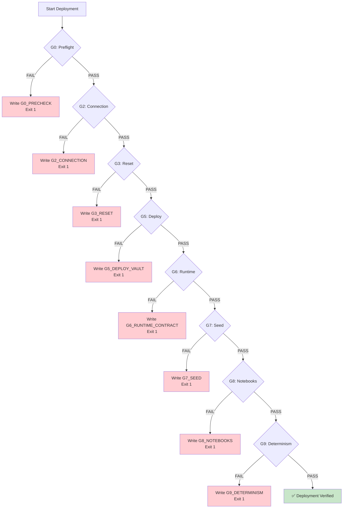

# Deterministic Deployment Architecture

**Version:** 1.0  
**Date:** 2026-02-19  
**Status:** Active  
**Target Audience:** Operators, Architects, CI/CD Engineers

---

## Executive Summary

This document describes the **deterministic deployment architecture** for the HCD + JanusGraph Banking Compliance Platform. It explains how the platform achieves reproducible deployments through gate-based validation, state management, and artifact verification.

**Key Concepts:**
- **Gate-Based Validation:** 10 validation gates (G0-G9) ensure deployment quality
- **Deterministic State:** Reproducible deployments with seed management
- **Artifact Verification:** Checksums and baselines ensure consistency
- **Fail-Fast Design:** Early detection of issues prevents cascading failures

---

## Table of Contents

1. [Overview](#overview)
2. [Deterministic Principles](#deterministic-principles)
3. [Gate-Based Validation System](#gate-based-validation-system)
4. [Canonical Deployment Command](#canonical-deployment-command)
5. [Deployment Flow](#deployment-flow)
6. [Gate Definitions](#gate-definitions)
7. [State Management](#state-management)
8. [Artifact Verification](#artifact-verification)
9. [Troubleshooting by Gate](#troubleshooting-by-gate)
10. [CI/CD Integration](#cicd-integration)
11. [References](#references)

---

## Overview

### Purpose

The deterministic deployment architecture ensures that:
1. **Same inputs produce same outputs** - Reproducible deployments
2. **Failures are detected early** - Gate-based validation
3. **State is managed explicitly** - No hidden dependencies
4. **Artifacts are verifiable** - Checksums and baselines

### Architecture Context

```
┌─────────────────────────────────────────────────────────────────┐
│                    DEPLOYMENT ARCHITECTURE LAYERS                │
├─────────────────────────────────────────────────────────────────┤
│  Physical Deployment (How containers run)                       │
│  └─ Podman, Networks, Volumes                                   │
│                           ↓                                      │
│  Deterministic Deployment (How to ensure reproducibility) ← THIS│
│  └─ Gates, State Management, Verification                       │
│                           ↓                                      │
│  Operational Deployment (How to run in production)              │
│  └─ Monitoring, Health Checks, Recovery                         │
└─────────────────────────────────────────────────────────────────┘
```

### Key Benefits

| Benefit | Description | Impact |
|---------|-------------|--------|
| **Reproducibility** | Same seed → same output | Debugging, testing |
| **Early Detection** | Fail-fast at gates | Reduced MTTR |
| **Auditability** | Complete artifact trail | Compliance, forensics |
| **Confidence** | Verified deployments | Production safety |

---

## Deterministic Principles

### 1. Explicit State Management

**Principle:** All state must be explicitly managed and resettable.

**Implementation:**
```bash
# Reset state before deployment
podman-compose -p janusgraph-demo -f docker-compose.full.yml down -v

# This removes:
# - All containers
# - All volumes
# - All networks
```

**Why:** Hidden state causes non-deterministic behavior.

### 2. Seed-Based Randomness

**Principle:** All random values must be derived from a seed.

**Implementation:**
```bash
export DEMO_SEED=42
export PYTHONHASHSEED=0

# All generators use this seed
python -c "import random; random.seed(42); print(random.random())"
# Always outputs: 0.6394267984578837
```

**Why:** Reproducible data generation for testing.

### 3. Bounded Execution

**Principle:** All operations must have timeouts.

**Implementation:**
```bash
# Notebook execution timeout
export DEMO_NOTEBOOK_TOTAL_TIMEOUT=420  # 7 minutes

# Per-cell timeout
export DEMO_NOTEBOOK_CELL_TIMEOUT=180   # 3 minutes

# Service health check timeout
export MAX_HEALTH_WAIT_SEC=300          # 5 minutes
```

**Why:** Prevents infinite hangs, enables fail-fast.

### 4. Artifact Verification

**Principle:** All outputs must be verifiable against baselines.

**Implementation:**
```bash
# Capture runtime fingerprint
sha256sum requirements.txt > runtime_fingerprint.txt

# Compare against baseline
diff baseline_fingerprint.txt runtime_fingerprint.txt
```

**Why:** Detects drift and ensures consistency.

### 5. Fail-Fast Design

**Principle:** Stop immediately on first failure.

**Implementation:**
```bash
set -euo pipefail  # Bash strict mode

# Gate failure immediately stops pipeline
if ! run_gate_validation; then
    echo "G0_PRECHECK" > failed_gate.txt
    exit 1
fi
```

**Why:** Prevents cascading failures and wasted time.

---

## Gate-Based Validation System

### Gate Architecture

```
┌─────────────────────────────────────────────────────────────────┐
│                    GATE-BASED VALIDATION FLOW                    │
├─────────────────────────────────────────────────────────────────┤
│                                                                  │
│  G0: Preflight Checks                                           │
│  └─ Environment, Tools, Ports                                   │
│                ↓ PASS                                            │
│  G2: Connection                                                  │
│  └─ Podman Machine Reachable                                    │
│                ↓ PASS                                            │
│  G3: State Reset                                                 │
│  └─ Clean Slate (down -v)                                       │
│                ↓ PASS                                            │
│  G5: Deploy + Vault                                              │
│  └─ Services Up, Healthy, Vault Ready                           │
│                ↓ PASS                                            │
│  G6: Runtime Contract                                            │
│  └─ Secrets, Packages, Determinism Checks                       │
│                ↓ PASS                                            │
│  G7: Graph Seed                                                  │
│  └─ Demo Data Loaded                                             │
│                ↓ PASS                                            │
│  G8: Notebooks                                                   │
│  └─ All Notebooks Execute Successfully                           │
│                ↓ PASS                                            │
│  G9: Determinism Verification                                    │
│  └─ Artifacts Match Baselines                                   │
│                ↓ PASS                                            │
│  ✅ DEPLOYMENT VERIFIED                                          │
│                                                                  │
└─────────────────────────────────────────────────────────────────┘
```

### Gate Failure Handling



---

## Canonical Deployment Command

### Wrapper Script

**Location:** `scripts/deployment/deterministic_setup_and_proof_wrapper.sh`

**Purpose:** Governance-only wrapper that delegates to the pipeline runner.

**Usage:**

```bash
# Full deterministic deployment with status report
bash scripts/deployment/deterministic_setup_and_proof_wrapper.sh \
  --status-report exports/deterministic-status.json

# Dry-run (show execution plan)
bash scripts/deployment/deterministic_setup_and_proof_wrapper.sh --dry-run

# Pass options to pipeline
bash scripts/deployment/deterministic_setup_and_proof_wrapper.sh --skip-notebooks
```

**What it does:**
1. Validates pipeline runner exists
2. Exports `COMPOSE_PROJECT_NAME`
3. Executes pipeline runner
4. Writes status report (if requested)

### Pipeline Runner

**Location:** `scripts/testing/run_demo_pipeline_repeatable.sh`

**Purpose:** Executes the complete deterministic deployment pipeline.

**Key Options:**

| Option | Purpose | Use Case |
|--------|---------|----------|
| `--skip-notebooks` | Skip notebook execution | Services-only testing |
| `--skip-data-generators` | Skip generator smoke tests | Fast validation |
| `--skip-preflight` | Skip preflight checks | Already-running stack |
| `--skip-deploy` | Skip deployment | Live verification |
| `--skip-graph-seed` | Skip graph seeding | Pre-seeded graph |
| `--no-reset` | Disable state reset | Incremental testing |
| `--deterministic-off` | Disable artifact verification | Development mode |
| `--dry-run` | Show commands only | Planning |

**Environment Variables:**

| Variable | Default | Purpose |
|----------|---------|---------|
| `DEMO_PIPELINE_RUN_ID` | `demo-<timestamp>` | Unique run identifier |
| `COMPOSE_PROJECT_NAME` | `janusgraph-demo` | Project isolation |
| `DEMO_SEED` | `42` | Random seed |
| `DEMO_NOTEBOOK_TOTAL_TIMEOUT` | `420` | Notebook timeout (seconds) |
| `DEMO_NOTEBOOK_CELL_TIMEOUT` | `180` | Cell timeout (seconds) |
| `MAX_HEALTH_WAIT_SEC` | `300` | Health check timeout |
| `DEMO_DETERMINISTIC_MODE` | `1` | Enable determinism checks |
| `DEMO_RESET_STATE` | `1` | Enable state reset |

---

## Deployment Flow

### Complete Flow Diagram

```
┌─────────────────────────────────────────────────────────────────┐
│                    DETERMINISTIC DEPLOYMENT FLOW                 │
├─────────────────────────────────────────────────────────────────┤
│                                                                  │
│  1. INITIALIZATION                                              │
│     ├─ Set RUN_ID (demo-<timestamp>)                           │
│     ├─ Set DEMO_SEED (42)                                       │
│     ├─ Create report directory (exports/<RUN_ID>/)              │
│     └─ Export environment variables                             │
│                                                                  │
│  2. PREFLIGHT (G0)                                              │
│     ├─ Check Python environment                                 │
│     ├─ Check Podman installation                                │
│     ├─ Check port availability                                  │
│     └─ Validate configuration files                             │
│                                                                  │
│  3. CONNECTION (G2)                                              │
│     ├─ Resolve Podman connection                                │
│     ├─ Test Podman machine reachability                         │
│     └─ Verify Podman API access                                 │
│                                                                  │
│  4. STATE RESET (G3)                                             │
│     ├─ Stop all containers (podman-compose down)                │
│     ├─ Remove all volumes (-v flag)                             │
│     └─ Clean slate for deterministic start                      │
│                                                                  │
│  5. DEPLOYMENT (G5)                                              │
│     ├─ Deploy full stack (deploy_full_stack.sh)                 │
│     ├─ Wait for service health (up to 300s)                     │
│     ├─ Initialize Vault (if needed)                             │
│     └─ Capture service snapshot                                 │
│                                                                  │
│  6. RUNTIME CONTRACT (G6)                                        │
│     ├─ Validate secrets (api_jwt_secret)                        │
│     ├─ Capture package fingerprint                              │
│     └─ Check notebook determinism contracts                     │
│                                                                  │
│  7. GRAPH SEED (G7)                                              │
│     ├─ Check if demo data exists                                │
│     ├─ Load demo data if missing                                │
│     └─ Validate graph counts                                    │
│                                                                  │
│  8. NOTEBOOK EXECUTION (G8)                                      │
│     ├─ Execute all notebooks with timeouts                      │
│     ├─ Check for error cells                                    │
│     └─ Generate notebook report (TSV)                           │
│                                                                  │
│  9. DETERMINISM VERIFICATION (G9)                                │
│     ├─ Compare artifacts against baselines                      │
│     ├─ Verify checksums                                         │
│     └─ Validate reproducibility                                 │
│                                                                  │
│  10. COMPLETION                                                  │
│      ├─ Write pipeline summary                                  │
│      ├─ Write status report (JSON)                              │
│      └─ Exit with appropriate code                              │
│                                                                  │
└─────────────────────────────────────────────────────────────────┘
```

### Timing Expectations

| Phase | Typical Duration | Maximum Duration | Timeout |
|-------|------------------|------------------|---------|
| Preflight | 5-10s | 30s | 60s |
| Connection | 1-2s | 5s | 10s |
| State Reset | 10-30s | 60s | 120s |
| Deployment | 90-180s | 300s | 600s |
| Health Wait | 60-120s | 300s | 300s |
| Runtime Contract | 10-20s | 60s | 120s |
| Graph Seed | 30-60s | 120s | 300s |
| Notebooks | 300-600s | 900s | 420s (configurable) |
| Determinism | 5-10s | 30s | 60s |
| **Total** | **8-18 minutes** | **30 minutes** | **40 minutes** |

---

## Gate Definitions

### G0: Preflight Checks

**Purpose:** Validate environment before deployment.

**Script:** `scripts/validation/preflight_check.sh`

**Checks:**
- Python 3.11+ installed
- Conda environment activated
- Podman installed and running
- Required ports available (18182, 19042, 8888, etc.)
- Configuration files present (.env, compose files)
- Sufficient disk space (20GB+)
- Sufficient memory (8GB+)

**Failure Modes:**
- Missing dependencies
- Port conflicts
- Insufficient resources
- Configuration errors

**Recovery:**
```bash
# Install missing dependencies
brew install podman python@3.11

# Free up ports
lsof -ti:18182 | xargs kill -9

# Fix configuration
cp .env.example .env
```

**Output:** `exports/<RUN_ID>/preflight.log`

---

### G2: Connection Validation

**Purpose:** Ensure Podman machine is reachable.

**Script:** `scripts/utils/podman_connection.sh` (resolve_podman_connection)

**Checks:**
- Podman machine exists
- Podman machine is running
- Podman API is accessible
- Connection can list containers

**Failure Modes:**
- Podman machine not started
- Podman machine crashed
- Network connectivity issues
- API timeout

**Recovery:**
```bash
# Start Podman machine
podman machine start

# Restart Podman machine
podman machine stop && podman machine start

# Recreate Podman machine
podman machine rm && podman machine init --cpus 4 --memory 8192
```

**Output:** Inline (no separate log)

---

### G3: State Reset

**Purpose:** Clean slate for deterministic deployment.

**Command:** `podman-compose -p janusgraph-demo -f docker-compose.full.yml down -v`

**Actions:**
- Stop all containers
- Remove all containers
- Remove all volumes
- Remove all networks

**Failure Modes:**
- Containers stuck in stopping state
- Volume removal permission errors
- Network removal conflicts

**Recovery:**
```bash
# Force remove containers
podman ps -a --filter "label=project=janusgraph-demo" --format "{{.Names}}" | xargs podman rm -f

# Force remove volumes
podman volume ls --filter "label=project=janusgraph-demo" --format "{{.Name}}" | xargs podman volume rm -f

# Force remove networks
podman network ls --filter "label=project=janusgraph-demo" --format "{{.Name}}" | xargs podman network rm -f
```

**Output:** `exports/<RUN_ID>/state_reset.log`

---

### G5: Deploy + Vault

**Purpose:** Deploy services and ensure health.

**Script:** `scripts/deployment/deploy_full_stack.sh`

**Actions:**
1. Deploy compose stack
2. Wait for service health (up to 300s)
3. Initialize Vault (if needed)
4. Verify all services healthy

**Checks:**
- All containers started
- All health checks passing
- Vault initialized and unsealed
- Graph database accessible

**Failure Modes:**
- Container startup failures
- Health check timeouts
- Vault initialization errors
- Network connectivity issues

**Recovery:**
```bash
# Check container logs
podman logs janusgraph-demo_hcd-server_1
podman logs janusgraph-demo_janusgraph-server_1

# Restart failed service
podman restart janusgraph-demo_janusgraph-server_1

# Reinitialize Vault
bash scripts/security/init_vault.sh
```

**Output:** `exports/<RUN_ID>/deploy.log`, `exports/<RUN_ID>/health.log`

---

### G6: Runtime Contract

**Purpose:** Validate runtime environment and contracts.

**Scripts:**
- `scripts/testing/check_runtime_contracts.sh`
- `scripts/testing/capture_runtime_package_fingerprint.sh`
- `scripts/testing/check_notebook_determinism_contracts.sh`

**Checks:**
- `api_jwt_secret` is configured (not default)
- Python package versions match expected
- Notebook determinism patterns validated
- No hard-coded timestamps in notebooks
- No random.random() without seed

**Failure Modes:**
- Missing secrets
- Package version mismatches
- Non-deterministic code patterns
- ABI incompatibilities

**Recovery:**
```bash
# Set required secrets
export API_JWT_SECRET="secure-secret-not-default"
export api_jwt_secret="$API_JWT_SECRET"

# Fix package versions
conda activate janusgraph-analysis
uv pip install --force-reinstall "numpy==2.2.6" "pandas==2.2.3"

# Fix notebook patterns
# Remove datetime.now() calls
# Add seed to random.seed() calls
```

**Output:** 
- `exports/<RUN_ID>/runtime_contracts.log`
- `exports/<RUN_ID>/runtime_package_fingerprint.txt`
- `exports/<RUN_ID>/notebook_determinism_contracts.log`

---

### G7: Graph Seed

**Purpose:** Ensure demo data is loaded.

**Script:** `scripts/testing/seed_demo_graph.sh`

**Actions:**
1. Check if demo data exists (vertex count > 0)
2. Load demo data if missing
3. Validate graph structure

**Checks:**
- Vertex count > 0
- Edge count > 0
- Expected labels present
- Sample queries work

**Failure Modes:**
- Graph connection errors
- Data loading failures
- Schema initialization errors

**Recovery:**
```bash
# Manually load data
python scripts/init/load_data.py

# Verify graph
curl http://localhost:18182?gremlin=g.V().count()
```

**Output:** `exports/<RUN_ID>/seed_graph.log`

---

### G8: Notebooks

**Purpose:** Execute all notebooks successfully.

**Script:** `scripts/testing/run_notebooks_live_repeatable.sh`

**Actions:**
1. Execute each notebook with timeout
2. Check for error cells
3. Generate execution report

**Checks:**
- All notebooks execute without errors
- No timeout violations
- No error output cells
- Expected outputs present

**Failure Modes:**
- Notebook execution timeout
- Cell execution errors
- Service unavailability
- Data generation failures

**Recovery:**
```bash
# Run single notebook for debugging
jupyter nbconvert --to notebook --execute \
  --ExecutePreprocessor.timeout=600 \
  banking/notebooks/01_Sanctions_Screening_Demo.ipynb

# Check notebook for errors
grep -A 5 '"output_type": "error"' notebook.ipynb
```

**Output:** 
- `exports/<RUN_ID>/notebooks.log`
- `exports/<RUN_ID>/notebook_run_report.tsv`

---

### G9: Determinism Verification

**Purpose:** Verify artifacts match baselines.

**Script:** `scripts/testing/verify_determinism_artifacts.sh`

**Actions:**
1. Compare runtime fingerprint against baseline
2. Verify notebook output checksums
3. Validate data generator outputs

**Checks:**
- Package versions unchanged
- Notebook outputs reproducible
- Data generator outputs match seed

**Failure Modes:**
- Package drift
- Non-deterministic notebook outputs
- Seed mismatch

**Recovery:**
```bash
# Update baseline
cp exports/<RUN_ID>/runtime_package_fingerprint.txt \
   exports/determinism-baselines/runtime_package_fingerprint.txt

# Verify seed usage
grep -r "random.seed" banking/
```

**Output:** `exports/<RUN_ID>/determinism_verification.log`

---

## State Management

### State Types

| State Type | Location | Persistence | Reset Method |
|------------|----------|-------------|--------------|
| **Container State** | Podman machine | Ephemeral | `podman-compose down` |
| **Volume State** | Podman volumes | Persistent | `podman-compose down -v` |
| **Network State** | Podman networks | Ephemeral | `podman-compose down` |
| **Configuration State** | `.env`, compose files | Persistent | Manual edit |
| **Secrets State** | Vault, `.vault-keys` | Persistent | `init_vault.sh` |
| **Runtime State** | Python packages | Persistent | `uv pip install` |

### State Reset Procedure

**Full Reset (Deterministic):**

```bash
# 1. Stop and remove everything
cd config/compose
podman-compose -p janusgraph-demo -f docker-compose.full.yml down -v

# 2. Verify clean state
podman ps -a --filter "label=project=janusgraph-demo"  # Should be empty
podman volume ls --filter "label=project=janusgraph-demo"  # Should be empty

# 3. Redeploy
bash ../../scripts/deployment/deploy_full_stack.sh
```

**Partial Reset (Development):**

```bash
# Reset only containers (keep volumes)
podman-compose -p janusgraph-demo -f docker-compose.full.yml down

# Reset only specific service
podman restart janusgraph-demo_janusgraph-server_1
```

### State Verification

```bash
# Check container state
podman ps --filter "label=project=janusgraph-demo"

# Check volume state
podman volume ls --filter "label=project=janusgraph-demo"

# Check network state
podman network ls --filter "label=project=janusgraph-demo"

# Check graph state
curl http://localhost:18182?gremlin=g.V().count()
```

---

## Artifact Verification

### Artifact Types

| Artifact | Purpose | Verification Method |
|----------|---------|---------------------|
| **Runtime Fingerprint** | Package versions | SHA256 checksum |
| **Notebook Outputs** | Execution results | Cell-by-cell comparison |
| **Graph Data** | Seeded data | Vertex/edge counts |
| **Service Logs** | Deployment evidence | Timestamp analysis |
| **Status Report** | Pipeline outcome | JSON schema validation |

### Verification Process

```bash
# 1. Capture baseline (first successful run)
cp exports/demo-20260219/runtime_package_fingerprint.txt \
   exports/determinism-baselines/baseline_fingerprint.txt

# 2. Compare subsequent runs
diff exports/determinism-baselines/baseline_fingerprint.txt \
     exports/demo-20260220/runtime_package_fingerprint.txt

# 3. Investigate differences
if [ $? -ne 0 ]; then
    echo "❌ Determinism violation detected"
    # Review package changes
    # Update baseline if intentional
fi
```

### Baseline Management

**Baseline Directory:** `exports/determinism-baselines/`

**Contents:**
- `runtime_package_fingerprint.txt` - Python package versions
- `notebook_outputs/` - Expected notebook outputs
- `graph_counts.json` - Expected vertex/edge counts

**Update Procedure:**

```bash
# After verified successful run
RUN_ID="demo-20260219"

# Update runtime baseline
cp exports/${RUN_ID}/runtime_package_fingerprint.txt \
   exports/determinism-baselines/

# Update notebook baselines
cp -r exports/${RUN_ID}/notebook_outputs/ \
      exports/determinism-baselines/

# Commit baselines
git add exports/determinism-baselines/
git commit -m "chore: update determinism baselines"
```

---

## Troubleshooting by Gate

### Quick Reference

| Gate | Common Issue | Quick Fix |
|------|--------------|-----------|
| **G0** | Port conflict | `lsof -ti:18182 \| xargs kill -9` |
| **G2** | Podman not running | `podman machine start` |
| **G3** | Volume removal fails | `podman volume rm -f <volume>` |
| **G5** | Service won't start | Check logs: `podman logs <container>` |
| **G6** | Missing secrets | `export API_JWT_SECRET=<secret>` |
| **G7** | Graph empty | `python scripts/init/load_data.py` |
| **G8** | Notebook timeout | Increase `DEMO_NOTEBOOK_TOTAL_TIMEOUT` |
| **G9** | Baseline mismatch | Update baseline or fix drift |

### Detailed Troubleshooting

**G0 Failure: Preflight Check**

```bash
# Read preflight log
cat exports/<RUN_ID>/preflight.log

# Common issues:
# 1. Python version
python --version  # Should be 3.11+

# 2. Conda environment
conda activate janusgraph-analysis

# 3. Port conflicts
lsof -i :18182  # Check what's using the port
```

**G2 Failure: Connection**

```bash
# Check Podman machine status
podman machine list

# Start if stopped
podman machine start

# Test connection
podman --remote ps
```

**G5 Failure: Deployment**

```bash
# Read deployment log
cat exports/<RUN_ID>/deploy.log

# Check service logs
podman logs janusgraph-demo_hcd-server_1
podman logs janusgraph-demo_janusgraph-server_1

# Check health
podman ps --filter "health=unhealthy"
```

**G8 Failure: Notebooks**

```bash
# Read notebook report
cat exports/<RUN_ID>/notebook_run_report.tsv

# Find failed notebook
grep FAIL exports/<RUN_ID>/notebook_run_report.tsv

# Run notebook manually
jupyter nbconvert --to notebook --execute \
  --ExecutePreprocessor.timeout=600 \
  banking/notebooks/<notebook>.ipynb
```

---

## CI/CD Integration

### GitHub Actions Workflow

**File:** `.github/workflows/deterministic-proof.yml`

**Trigger:** Push to main, pull requests

**Steps:**
1. Checkout code
2. Set up Python environment
3. Install Podman
4. Run deterministic deployment
5. Upload artifacts
6. Report status

**Example:**

```yaml
name: Deterministic Proof

on:
  push:
    branches: [main]
  pull_request:
    branches: [main]

jobs:
  deterministic-proof:
    runs-on: ubuntu-latest
    steps:
      - uses: actions/checkout@v4
      
      - name: Set up Python
        uses: actions/setup-python@v5
        with:
          python-version: '3.11'
      
      - name: Install Podman
        run: |
          sudo apt-get update
          sudo apt-get install -y podman
      
      - name: Run Deterministic Deployment
        run: |
          bash scripts/deployment/deterministic_setup_and_proof_wrapper.sh \
            --status-report exports/deterministic-status.json
      
      - name: Upload Artifacts
        if: always()
        uses: actions/upload-artifact@v4
        with:
          name: deterministic-proof-artifacts
          path: exports/
      
      - name: Check Status
        run: |
          EXIT_CODE=$(jq -r '.exit_code' exports/deterministic-status.json)
          if [ "$EXIT_CODE" != "0" ]; then
            echo "❌ Deterministic proof failed"
            exit 1
          fi
```

### Branch Protection

**Required Checks:**
- `Deterministic Proof / deterministic-proof`

**Configuration:**
```bash
# GitHub CLI
gh api repos/:owner/:repo/branches/main/protection \
  --method PUT \
  --field required_status_checks[strict]=true \
  --field required_status_checks[contexts][]=deterministic-proof
```

---

## References

### Internal Documentation
- [Deployment Architecture](deployment-architecture.md) - Physical deployment
- [Podman Isolation Architecture](podman-isolation-architecture.md) - Isolation model
- [System Architecture](system-architecture.md) - Logical architecture

### Scripts
- Wrapper: `scripts/deployment/deterministic_setup_and_proof_wrapper.sh`
- Pipeline: `scripts/testing/run_demo_pipeline_repeatable.sh`
- Preflight: `scripts/validation/preflight_check.sh`
- Isolation: `scripts/validation/validate_podman_isolation.sh`

### Configuration
- Environment: `.env.example`
- Compose: `config/compose/docker-compose.full.yml`
- Baselines: `exports/determinism-baselines/`

---

## Appendices

### Appendix A: Gate Exit Codes

| Gate | Exit Code | Meaning |
|------|-----------|---------|
| G0_PRECHECK | 1 | Preflight or isolation check failed |
| G2_CONNECTION | 1 | Podman connection unreachable |
| G3_RESET | 1 | State reset failed |
| G5_DEPLOY_VAULT | 1 | Deployment or health check failed |
| G6_RUNTIME_CONTRACT | 1 | Runtime contract violation |
| G7_SEED | 1 | Graph seeding failed |
| G8_NOTEBOOKS | 1 | Notebook execution failed |
| G9_DETERMINISM | 1 | Determinism verification failed |

### Appendix B: Environment Variables Reference

| Variable | Default | Purpose | Required |
|----------|---------|---------|----------|
| `DEMO_PIPELINE_RUN_ID` | `demo-<timestamp>` | Unique run ID | No |
| `COMPOSE_PROJECT_NAME` | `janusgraph-demo` | Project isolation | Yes |
| `DEMO_SEED` | `42` | Random seed | No |
| `DEMO_NOTEBOOK_TOTAL_TIMEOUT` | `420` | Notebook timeout (s) | No |
| `DEMO_NOTEBOOK_CELL_TIMEOUT` | `180` | Cell timeout (s) | No |
| `MAX_HEALTH_WAIT_SEC` | `300` | Health check timeout | No |
| `DEMO_DETERMINISTIC_MODE` | `1` | Enable determinism | No |
| `DEMO_RESET_STATE` | `1` | Enable state reset | No |
| `DEMO_BASELINE_DIR` | `exports/determinism-baselines` | Baseline directory | No |
| `PODMAN_CONNECTION` | Auto-detected | Podman machine | No |

### Appendix C: Output Artifacts

| Artifact | Location | Purpose |
|----------|----------|---------|
| `preflight.log` | `exports/<RUN_ID>/` | Preflight check output |
| `podman_isolation.log` | `exports/<RUN_ID>/` | Isolation validation |
| `state_reset.log` | `exports/<RUN_ID>/` | State reset output |
| `deploy.log` | `exports/<RUN_ID>/` | Deployment output |
| `health.log` | `exports/<RUN_ID>/` | Health check output |
| `services_snapshot.log` | `exports/<RUN_ID>/` | Service status snapshot |
| `runtime_contracts.log` | `exports/<RUN_ID>/` | Runtime contract checks |
| `runtime_package_fingerprint.txt` | `exports/<RUN_ID>/` | Package versions |
| `notebook_determinism_contracts.log` | `exports/<RUN_ID>/` | Notebook determinism |
| `seed_graph.log` | `exports/<RUN_ID>/` | Graph seeding output |
| `notebooks.log` | `exports/<RUN_ID>/` | Notebook execution |
| `notebook_run_report.tsv` | `exports/<RUN_ID>/` | Notebook results |
| `determinism_verification.log` | `exports/<RUN_ID>/` | Determinism checks |
| `pipeline_summary.txt` | `exports/<RUN_ID>/` | Overall summary |
| `failed_gate.txt` | `exports/<RUN_ID>/` | Failed gate (if any) |
| `deterministic-status.json` | `exports/` | Status report |

---

**Document Status:** Active  
**Last Updated:** 2026-02-19  
**Next Review:** 2026-03-19  
**Owner:** Platform Engineering Team  
**Reviewers:** Architecture Team, CI/CD Team