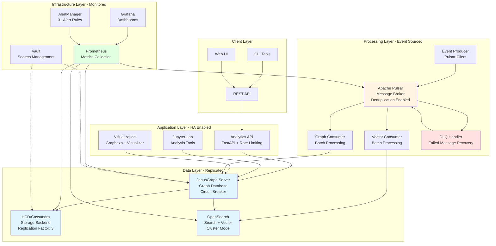
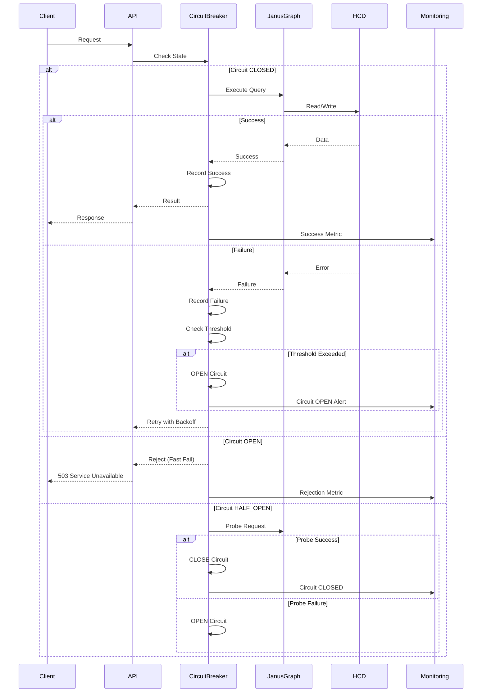
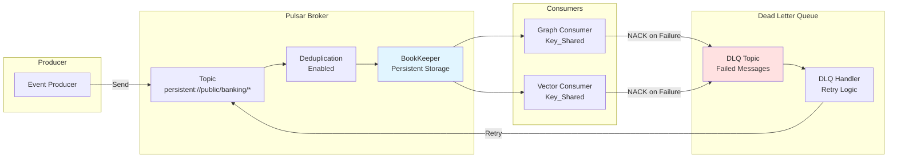
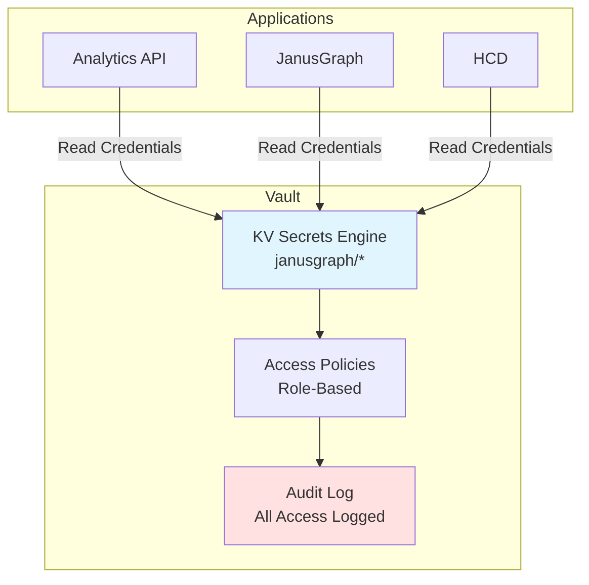

# High Availability & Disaster Recovery Architecture

**Date:** 2026-02-19
**Version:** 1.1
**Status:** Active
**Author:** David LECONTE - IBM Worldwide | Data & AI | Tiger Team | Data Watstonx.Data Global Product Specialist (GPS)

---

## Executive Summary

This document describes the resilient architecture of the HCD + JanusGraph Banking Compliance Platform, detailing High Availability (HA) and Disaster Recovery (DR) mechanisms implemented across all layers of the stack.

**Key Capabilities:**
- **Multi-layer resilience** (7 layers of protection)
- **Automated failover** (Circuit breakers, health checks, retry logic)
- **Event-sourced architecture** (Pulsar message replay)
- **Comprehensive monitoring** (31 alert rules, 4 metrics exporters)
- **Tiered RTO/RPO targets** (4h/15min for critical services)
- **Gate-based validation** (G0-G9 deployment gates)
- **Podman isolation** (Five-layer isolation model)

**Architecture Grade:** A (93/100) - Production Ready

---

## Related Architecture Documentation

This document should be read in conjunction with:

**Core Architecture:**
- **[Architecture Overview](architecture-overview.md)** - Complete system architecture
- **[Deployment Architecture](deployment-architecture.md)** - Canonical deployment procedures
- **[Operational Architecture](operational-architecture.md)** - Runtime topology and operations

**Resilience & Reliability:**
- **[Podman Isolation Architecture](podman-isolation-architecture.md)** - Five-layer isolation model
- **[Deterministic Deployment Architecture](deterministic-deployment-architecture.md)** - Gate-based validation (G0-G9)
- **[Service Startup Sequence](service-startup-sequence.md)** - Service dependencies and startup order
- **[Troubleshooting Architecture](troubleshooting-architecture.md)** - Troubleshooting framework

**Architecture Decision Records:**
- [ADR-013: Podman Over Docker](adr-013-podman-over-docker.md) - Container runtime decision
- [ADR-014: Project-Name Isolation](adr-014-project-name-isolation.md) - Isolation strategy
- [ADR-015: Deterministic Deployment](adr-015-deterministic-deployment.md) - Deployment approach
- [ADR-016: Gate-Based Validation](adr-016-gate-based-validation.md) - Validation framework

---

## Table of Contents

1. [Architecture Overview](#architecture-overview)
2. [Seven Layers of Resilience](#seven-layers-of-resilience)
3. [High Availability Mechanisms](#high-availability-mechanisms)
4. [Disaster Recovery Strategy](#disaster-recovery-strategy)
5. [Failure Scenarios & Recovery](#failure-scenarios--recovery)
6. [Monitoring & Alerting](#monitoring--alerting)
7. [Implementation Details](#implementation-details)
8. [Production Deployment](#production-deployment)

---

## Architecture Overview

### System Architecture Diagram



### Data Flow Architecture



---

## Seven Layers of Resilience

### Layer 1: Application-Level Resilience

**Circuit Breaker Pattern** ([`src/python/utils/resilience.py`](../../src/python/utils/resilience.py))

```python
# Circuit Breaker States
CLOSED    → Normal operation, failures counted
OPEN      → Fast-fail for recovery_timeout (30s default)
HALF_OPEN → Limited probes to test recovery
```

**Implementation:**
```python
from src.python.utils.resilience import CircuitBreaker, retry_with_backoff

breaker = CircuitBreaker(
    failure_threshold=5,      # Open after 5 failures
    recovery_timeout=30.0,    # Wait 30s before HALF_OPEN
    half_open_max_calls=1     # 1 probe in HALF_OPEN
)

@retry_with_backoff(
    max_retries=3,
    base_delay=1.0,
    max_delay=30.0,
    exponential_base=2.0,
    circuit_breaker=breaker
)
def query_graph():
    return g.V().count().next()
```

**ASCII Diagram:**
```
Circuit Breaker State Machine
==============================

    ┌─────────────┐
    │   CLOSED    │ ◄─────────────────┐
    │  (Normal)   │                   │
    └──────┬──────┘                   │
           │                          │
           │ Failures ≥ threshold     │ Success
           │                          │
           ▼                          │
    ┌─────────────┐                   │
    │    OPEN     │                   │
    │ (Fast Fail) │                   │
    └──────┬──────┘                   │
           │                          │
           │ After recovery_timeout   │
           │                          │
           ▼                          │
    ┌─────────────┐                   │
    │ HALF_OPEN   │ ──────────────────┘
    │  (Probing)  │
    └─────────────┘
           │
           │ Failure
           │
           └──────► OPEN
```

### Layer 2: Retry with Exponential Backoff

**Retry Strategy:**
```
Attempt 1: Immediate
Attempt 2: Wait 1s   (base_delay * 2^0)
Attempt 3: Wait 2s   (base_delay * 2^1)
Attempt 4: Wait 4s   (base_delay * 2^2)
Max Wait:  30s       (max_delay cap)
```

**Benefits:**
- Prevents thundering herd
- Gives failing services time to recover
- Exponential backoff reduces load during outages

### Layer 3: Health Checks & Dependencies

**Podman Compose Health Checks:**

```yaml
# All services have health checks
healthcheck:
  test: ["CMD", "curl", "-f", "http://127.0.0.1:8182/"]
  interval: 30s      # Check every 30s
  timeout: 10s       # Fail if no response in 10s
  retries: 5         # Mark unhealthy after 5 failures
  start_period: 90s  # Grace period for startup
```

**Dependency Management:**
```yaml
janusgraph-server:
  depends_on:
    hcd-server:
      condition: service_healthy  # Wait for HCD to be healthy
    opensearch:
      condition: service_healthy  # Wait for OpenSearch to be healthy
```

**Service Startup Order:**

For complete service startup sequence and dependencies, see [Service Startup Sequence](service-startup-sequence.md).

**HA-Specific Startup Summary:**
```
1. HCD/Cassandra     (90s startup) - Primary data store
2. OpenSearch        (60s startup) - Search and analytics
3. Vault             (10s startup) - Secrets management
4. JanusGraph        (90s startup, waits for HCD + OpenSearch) - Graph database
5. Pulsar            (90s startup) - Event streaming
6. Consumers         (Wait for Pulsar + JanusGraph) - Event processors
7. Applications      (Wait for JanusGraph) - API and analytics
```

**Key HA Considerations:**
- Services start in dependency order (infrastructure → core → application)
- Health checks ensure dependencies are ready before dependent services start
- Gate validation (G5-G6) ensures all services healthy before proceeding
- See [Service Startup Sequence](service-startup-sequence.md) for detailed dependency graph

### Layer 4: Event-Sourced Architecture

**Pulsar Message Durability:**



**Key Features:**
- **Message Persistence:** All messages stored in BookKeeper
- **Deduplication:** Prevents duplicate processing (enabled per namespace)
- **Key_Shared Subscription:** Parallel processing with entity-level ordering
- **Dead Letter Queue:** Failed messages automatically routed for retry
- **Message Replay:** Can replay from any point in time

**DLQ Handler** ([`banking/streaming/dlq_handler.py`](../../banking/streaming/dlq_handler.py)):
```python
class DLQHandler:
    """
    Handles failed messages with:
    - Automatic retry (max 3 attempts)
    - Exponential backoff
    - Permanent failure archiving
    - Custom failure handlers
    """
    DEFAULT_MAX_RETRIES = 3
    DEFAULT_ARCHIVE_DIR = "/tmp/dlq_archive"
```

### Layer 5: Resource Limits & Isolation

**Container Resource Limits:**

```yaml
# Every service has explicit limits
deploy:
  resources:
    limits:
      cpus: '4.0'      # Maximum CPU
      memory: 8G       # Maximum RAM
    reservations:
      cpus: '2.0'      # Guaranteed CPU
      memory: 4G       # Guaranteed RAM
```

**Resource Allocation:**
```
Service          CPU Limit  Memory Limit  Priority
─────────────────────────────────────────────────
HCD              4.0        8G            Critical
JanusGraph       2.0        4G            Critical
OpenSearch       2.0        4G            Critical
Pulsar           2.0        4G            Important
Analytics API    1.0        2G            Important
Prometheus       1.0        2G            Standard
Grafana          1.0        2G            Standard
Jupyter          2.0        4G            Standard
Vault            1.0        1G            Standard
Others           0.5-1.0    512M-1G       Standard
─────────────────────────────────────────────────
TOTAL            ~20 CPUs   ~40GB RAM
```

**Benefits:**
- Prevents resource starvation
- Guarantees minimum resources for critical services
- Enables predictable performance
- Supports capacity planning

### Layer 6: Monitoring & Alerting

**Prometheus Metrics Collection:**

```yaml
# 4 Metric Sources
scrape_configs:
  - job_name: 'hcd'                    # HCD JMX metrics
  - job_name: 'janusgraph'             # JanusGraph metrics
  - job_name: 'janusgraph-exporter'    # Custom graph metrics
  - job_name: 'prometheus'             # Self-monitoring
```

**31 Alert Rules** ([`config/monitoring/alert-rules.yml`](../../config/monitoring/alert-rules.yml)):

```
Category          Alerts  Severity
────────────────────────────────────
System Health     8       Critical/Warning
JanusGraph        4       Critical/Warning
Security          8       Critical/Warning
Performance       3       Warning
Cassandra         3       Critical/Warning
Compliance        2       Warning
Backup            3       Critical/Warning
────────────────────────────────────
TOTAL            31
```

**Alert Flow:**
```
Prometheus → AlertManager → Notification Channels
                              ├─ Email (SMTP)
                              ├─ Slack (Webhook)
                              └─ PagerDuty (API)
```

### Layer 7: Secrets Management

**HashiCorp Vault Integration:**



**Vault Configuration** ([`config/vault/config.hcl`](../../config/vault/config.hcl)):
```hcl
storage "file" {
  path = "/vault/file"  # Persistent storage
}

listener "tcp" {
  address = "0.0.0.0:8200"
  tls_disable = 1  # Enable TLS in production
}

telemetry {
  prometheus_retention_time = "30s"  # Metrics for monitoring
}
```

**Benefits:**
- Centralized secret management
- Automatic credential rotation
- Audit trail for all access
- Encryption at rest and in transit

---

## Gate-Based Validation for HA Deployment

High availability deployment uses a gate-based validation system (G0-G9) to ensure reliable deployment. Each gate must pass before proceeding to the next. This deterministic approach prevents deployment failures and ensures consistent HA setup.

See [Deterministic Deployment Architecture](deterministic-deployment-architecture.md) for complete details.

### Gate Sequence for HA Deployment

| Gate | Name | Purpose | HA Impact |
|------|------|---------|-----------|
| **G0** | Precheck | Validate environment | Prevents deployment failures |
| **G2** | Connection | Verify Podman connection | Ensures container runtime available |
| **G3** | Reset | Clean state | Ensures deterministic deployment |
| **G5** | Deploy/Vault | Deploy services + Vault | Core HA services |
| **G6** | Runtime Contract | Verify runtime | Ensures services healthy |
| **G7** | Seed | Load graph data | Ensures data availability |
| **G8** | Notebooks | Validate analytics | Ensures business logic works |
| **G9** | Determinism | Verify artifacts | Ensures reproducibility |

### HA-Specific Gate Considerations

#### G0: Precheck for HA
- Verify sufficient resources (CPU, memory, disk)
- Check network connectivity
- Validate isolation (`COMPOSE_PROJECT_NAME=janusgraph-demo`)
- Verify Podman machine running

```bash
# Precheck validation
bash scripts/validation/preflight_check.sh --strict
bash scripts/validation/validate_podman_isolation.sh --strict
```

#### G2: Connection for HA
- Verify Podman connection active
- Check Podman machine status
- Validate network accessibility

```bash
# Connection validation
podman machine list | grep "Running"
podman ps --format "{{.Names}}"
```

#### G3: Reset for HA
- Clean previous deployment state
- Remove old containers/networks/volumes
- Ensure fresh start for deterministic deployment

```bash
# Reset for clean state
cd config/compose
podman-compose -p janusgraph-demo down -v
```

#### G5: Deploy/Vault for HA
- Deploy all 19 services with health checks
- Initialize Vault with HA configuration
- Verify service health checks passing
- Configure connection pooling

```bash
# Deploy with gate validation
cd config/compose
podman-compose -p janusgraph-demo -f docker-compose.full.yml up -d

# Verify all services healthy
podman ps --filter "label=project=janusgraph-demo" --filter "health=healthy"
```

#### G6: Runtime Contract for HA
- Verify all services responding
- Check connection pooling active
- Validate circuit breakers configured
- Test service endpoints

```bash
# Runtime contract validation
bash scripts/testing/check_runtime_contracts.sh
```

#### G7: Seed for HA
- Load graph data with deterministic seed
- Verify data consistency
- Validate replication

```bash
# Seed graph with deterministic data
bash scripts/testing/seed_demo_graph.sh
```

#### G8: Notebooks for HA
- Run all notebooks to validate analytics
- Verify business logic works
- Check deterministic outputs

```bash
# Validate notebooks
bash scripts/testing/run_notebooks_live_repeatable.sh
```

#### G9: Determinism for HA
- Verify all artifacts match baseline
- Check deterministic behavior
- Validate reproducibility

```bash
# Verify deterministic artifacts
bash scripts/testing/verify_deterministic_artifacts.sh
```

### Using Gates for HA Deployment

**Full Deterministic HA Deployment:**

```bash
# Single command for complete HA deployment with validation
bash scripts/deployment/deterministic_setup_and_proof_wrapper.sh \
  --status-report exports/deterministic-status.json

# Check gate status
cat exports/deterministic-status.json | jq '.gate_status'

# Example output:
# {
#   "G0_PRECHECK": "PASS",
#   "G2_CONNECTION": "PASS",
#   "G3_RESET": "PASS",
#   "G5_DEPLOY_VAULT": "PASS",
#   "G6_RUNTIME_CONTRACT": "PASS",
#   "G7_SEED": "PASS",
#   "G8_NOTEBOOKS": "PASS",
#   "G9_DETERMINISM": "PASS"
# }
```

**Individual Gate Execution:**

```bash
# Run specific gate
bash scripts/testing/run_demo_pipeline_repeatable.sh --gate G6

# Skip specific gates (for testing)
bash scripts/testing/run_demo_pipeline_repeatable.sh --skip-notebooks
```

### Gate Failure Recovery

When a gate fails, follow gate-specific recovery procedures:

| Gate | Common Failures | Recovery Procedure |
|------|----------------|-------------------|
| **G0** | Insufficient resources | Increase Podman machine resources |
| **G2** | Podman not running | `podman machine start` |
| **G3** | Cleanup failed | Manual cleanup: `podman system prune -af` |
| **G5** | Service won't start | Check logs: `podman logs <container>` |
| **G6** | Health check fails | Increase startup timeout, check dependencies |
| **G7** | Data load fails | Check JanusGraph connectivity |
| **G8** | Notebook fails | Check runtime environment, dependencies |
| **G9** | Artifacts mismatch | Verify seed consistency, check for non-determinism |

See [Troubleshooting Architecture](troubleshooting-architecture.md) for detailed gate-specific recovery procedures.

### Gate Validation Benefits for HA

1. **Reliability** - Catches issues before they impact HA
2. **Reproducibility** - Same deployment every time
3. **Auditability** - Complete deployment record
4. **Testability** - Can test exact production setup
5. **Debuggability** - Clear failure points

---

## Podman Isolation for High Availability

High availability requires proper isolation to prevent conflicts and ensure reliability. See [Podman Isolation Architecture](podman-isolation-architecture.md) for complete details.

### Five-Layer Isolation Model

| Layer | Purpose | HA Impact |
|-------|---------|-----------|
| **L1: Machine** | Podman machine isolation | Prevents host conflicts |
| **L2: Project** | COMPOSE_PROJECT_NAME | Prevents project conflicts |
| **L3: Network** | Project-prefixed networks | Prevents network conflicts |
| **L4: Volume** | Project-prefixed volumes | Prevents data mixing |
| **L5: Container** | Project-prefixed containers | Prevents name conflicts |

### HA Isolation Requirements

#### L1: Machine Isolation
- Dedicated Podman machine for production
- Sufficient resources (4 CPU, 8GB RAM, 50GB disk)
- No other projects on same machine

```bash
# Create dedicated machine
podman machine init janusgraph-prod --cpus 4 --memory 8192 --disk-size 50
podman machine start janusgraph-prod
```

#### L2: Project Isolation
```bash
# MANDATORY: Set project name for isolation
export COMPOSE_PROJECT_NAME="janusgraph-demo"

# Deploy with project name
cd config/compose
podman-compose -p $COMPOSE_PROJECT_NAME -f docker-compose.full.yml up -d
```

#### L3: Network Isolation
- All networks prefixed: `janusgraph-demo_*`
- No cross-project communication
- Firewall rules enforced

```bash
# Verify network isolation
podman network ls | grep janusgraph-demo
```

#### L4: Volume Isolation
- All volumes prefixed: `janusgraph-demo_*`
- No data sharing between projects
- Backup/restore per project

```bash
# Verify volume isolation
podman volume ls | grep janusgraph-demo
```

#### L5: Container Isolation
- All containers prefixed: `janusgraph-demo_*`
- No container name conflicts
- Clear ownership

```bash
# Verify container isolation
podman ps --filter "label=project=janusgraph-demo"
```

### Validating Isolation for HA

```bash
# Comprehensive isolation validation
bash scripts/validation/validate_podman_isolation.sh --strict

# Check project resources
podman ps --filter "label=project=janusgraph-demo"
podman network ls | grep janusgraph-demo
podman volume ls | grep janusgraph-demo

# Verify no conflicts
podman ps -a | grep -v janusgraph-demo  # Should show no conflicts
```

### HA Isolation Best Practices

1. **Always use project name** - Never deploy without `COMPOSE_PROJECT_NAME`
2. **Verify isolation** - Run validation before deployment
3. **Monitor resources** - Track per-project resource usage
4. **Clean up properly** - Use project name for cleanup
5. **Document ownership** - Clear project ownership and contacts

---

## High Availability Mechanisms

### 1. Service-Level HA

**Restart Policies:**
```yaml
# All critical services
restart: unless-stopped

# Client tools (interactive)
restart: "no"
```

**Automatic Recovery:**
- Container crashes → Podman restarts automatically
- Health check failures → Container marked unhealthy
- Dependency failures → Dependent services wait

### 2. Connection Pooling

**JanusGraph Client** ([`src/python/client/janusgraph_client.py`](../../src/python/client/janusgraph_client.py)):
```python
class JanusGraphClient:
    """
    Production-ready client with:
    - Connection pooling
    - Automatic reconnection
    - SSL/TLS support
    - Query validation
    - Timeout handling
    """
    def __init__(
        self,
        timeout: int = 30,      # Connection timeout
        use_ssl: bool = True,   # SSL/TLS enabled
        verify_certs: bool = True  # Certificate validation
    ):
        # Connection pool managed by gremlin-python
        self._connection = DriverRemoteConnection(...)
```

### 3. API Rate Limiting

**FastAPI Dependencies** ([`src/python/api/dependencies.py`](../../src/python/api/dependencies.py)):
```python
from slowapi import Limiter
from slowapi.util import get_remote_address

limiter = Limiter(key_func=get_remote_address)

# Applied to all API endpoints
@app.get("/api/v1/persons")
@limiter.limit("100/minute")  # 100 requests per minute per IP
async def get_persons():
    ...
```

**Benefits:**
- Prevents API abuse
- Protects backend services
- Fair resource allocation
- DDoS mitigation

### 4. Graceful Degradation

**Connection Management:**
```python
def get_graph_connection(settings: Settings | None = None):
    """Get or create graph traversal connection."""
    global _connection, _traversal
    
    if _connection is None:
        try:
            _connection = DriverRemoteConnection(...)
            _traversal = traversal().with_remote(_connection)
        except Exception as e:
            logger.error("Failed to connect: %s", e)
            raise HTTPException(
                status_code=503,
                detail="Graph database unavailable"
            )
    return _traversal

def close_graph_connection() -> None:
    """Close connection gracefully."""
    global _connection
    if _connection:
        _connection.close()
        _connection = None
```

**Graceful Shutdown:**
- Connections closed cleanly
- In-flight requests completed
- Resources released properly

---

## Disaster Recovery Strategy

### RTO/RPO Targets

**Service Tiers** (from [`docs/operations/rto-rpo-targets.md`](../../docs/operations/rto-rpo-targets.md)):

```
Tier  Services                    RTO    RPO    Impact
──────────────────────────────────────────────────────────
1     JanusGraph, HCD,           4h     15min  Critical
      OpenSearch, Analytics API

2     Pulsar, Consumers,         8h     1h     Important
      Prometheus, Grafana

3     Jupyter, Visualization,    24h    4h     Standard
      AlertManager, Vault

4     Development Tools          72h    24h    Low
──────────────────────────────────────────────────────────
```

### Backup Strategy

**Data Persistence:**

```yaml
# All critical data in named volumes
volumes:
  hcd-data:              # HCD/Cassandra data
  hcd-commitlog:         # HCD commit logs
  janusgraph-db:         # JanusGraph metadata
  opensearch-data:       # OpenSearch indices
  pulsar-data:           # Pulsar messages
  prometheus-data:       # Metrics history
  grafana-data:          # Dashboards
  vault-data:            # Secrets
```

**Backup Schedule:**
```
Service       Frequency  Retention  Method
────────────────────────────────────────────────
HCD           Hourly     7 days     Snapshot
JanusGraph    Hourly     7 days     Export
OpenSearch    Daily      30 days    Snapshot
Pulsar        Hourly     7 days     BookKeeper
Vault         Daily      90 days    Snapshot
Prometheus    Daily      30 days    Snapshot
────────────────────────────────────────────────
```

**Backup Verification:**
- Daily automated restore tests
- Monthly full DR drill
- Quarterly cross-region restore

### Recovery Procedures

**Tier 1 Recovery (Critical - 4h RTO):**

```bash
# 1. Restore HCD data (30 min)
podman volume create hcd-data-restore
podman run --rm -v hcd-data-restore:/data \
  -v /backup/hcd:/backup \
  alpine sh -c "cd /data && tar xzf /backup/hcd-latest.tar.gz"

# 2. Restore JanusGraph metadata (30 min)
podman volume create janusgraph-db-restore
# ... similar restore process

# 3. Restore OpenSearch indices (1h)
curl -X POST "localhost:9200/_snapshot/backup/snapshot_1/_restore"

# 4. Start services (1h)
cd config/compose
FULL_STACK_FILE=config/compose/<full-stack-compose-file>
PROD_STACK_FILE=config/compose/<prod-compose-file>
podman-compose -p janusgraph-demo -f "$FULL_STACK_FILE" up -d

# 5. Verify (30 min)
./scripts/validation/preflight_check.sh
```

**Tier 2 Recovery (Important - 8h RTO):**

```bash
# 1. Restore Pulsar data (2h)
# Messages can be replayed from BookKeeper

# 2. Restart consumers (1h)
podman restart janusgraph-demo_graph-consumer_1
podman restart janusgraph-demo_vector-consumer_1

# 3. Restore monitoring (2h)
# Prometheus and Grafana data

# 4. Verify (1h)
```

### Disaster Scenarios

**Scenario 1: Single Service Failure**

```
Failure: JanusGraph container crashes
Impact:  API returns 503, queries fail
Detection: Health check failure (2 min)
Recovery: Automatic restart (2 min)
Total:   4 minutes downtime
```

**Scenario 2: Data Corruption**

```
Failure: HCD data corruption
Impact:  Graph queries return errors
Detection: Alert on high error rate (5 min)
Recovery: Restore from last hourly backup (30 min)
Total:   35 minutes downtime
```

**Scenario 3: Complete Infrastructure Loss**

```
Failure: Entire Podman machine lost
Impact:  All services unavailable
Detection: Monitoring alerts (immediate)
Recovery: Full DR procedure (4 hours)
Total:   4 hours downtime (within RTO)
```

**Scenario 4: Network Partition**

```
Failure: Network split between services
Impact:  Circuit breakers open, fast-fail
Detection: Connection errors (immediate)
Recovery: Automatic when network restored
Total:   Duration of network issue + 30s recovery
```

---

## Failure Scenarios & Recovery

For complete incident response procedures, see [Operational Architecture](operational-architecture.md) and [Troubleshooting Architecture](troubleshooting-architecture.md).

### HA-Specific Incident Response

**Severity Levels:**

| Severity | Definition | Response Time | HA Impact | Example |
|----------|------------|---------------|-----------|---------|
| **P0** | Complete outage | 15 minutes | All services down | JanusGraph cluster down |
| **P1** | Degraded service | 1 hour | Some services affected | One HCD node down |
| **P2** | Minor issue | 4 hours | Limited impact | Slow queries |
| **P3** | Cosmetic | 1 day | No user impact | Dashboard display issue |

**Incident Response Flow:**

1. **Detect** - Monitoring alerts (Prometheus/Grafana/AlertManager)
2. **Assess** - Check gate status, service health, failure mode
3. **Respond** - Follow troubleshooting architecture procedures
4. **Recover** - Use DR procedures if needed, validate with gates
5. **Review** - Post-incident analysis, update runbooks

See [Troubleshooting Architecture](troubleshooting-architecture.md) for detailed gate-specific recovery procedures.

### Failure Mode Analysis

```
Component     Failure Mode              Detection Time  Recovery Time  Impact
─────────────────────────────────────────────────────────────────────────────
JanusGraph    Container crash           30s (health)    2min (restart) Medium
              Query timeout             Immediate       30s (retry)    Low
              Circuit open              Immediate       30s (probe)    Medium

HCD           Node failure              30s (health)    2min (restart) High
              Disk full                 5min (alert)    15min (manual) High
              Compaction lag            10min (alert)   30min (auto)   Low

OpenSearch    Node failure              30s (health)    2min (restart) Medium
              Index corruption          5min (alert)    30min (restore) Medium
              Memory pressure           5min (alert)    10min (restart) Low

Pulsar        Broker failure            30s (health)    2min (restart) Medium
              Topic unavailable         Immediate       1min (auto)    Low
              Message backlog           10min (alert)   Variable       Low

API           Container crash           30s (health)    1min (restart) Low
              Rate limit exceeded       Immediate       1min (wait)    Low
              Auth failure              Immediate       Manual         Medium

Monitoring    Prometheus down           2min (alert)    2min (restart) Low
              AlertManager down         2min (alert)    2min (restart) Medium
              Grafana down              2min (alert)    2min (restart) Low

Network       Partition                 Immediate       Variable       High
              DNS failure               Immediate       Variable       High
              Firewall block            Immediate       Manual         High
─────────────────────────────────────────────────────────────────────────────
```

### Recovery Decision Tree

```
                    ┌─────────────┐
                    │   Failure   │
                    │  Detected   │
                    └──────┬──────┘
                           │
                           ▼
                    ┌─────────────┐
                    │  Automatic  │
                    │  Recovery?  │
                    └──────┬──────┘
                           │
                ┌──────────┴──────────┐
                │                     │
               YES                   NO
                │                     │
                ▼                     ▼
         ┌─────────────┐       ┌─────────────┐
         │   Restart   │       │   Manual    │
         │  Container  │       │ Intervention│
         └──────┬──────┘       └──────┬──────┘
                │                     │
                ▼                     ▼
         ┌─────────────┐       ┌─────────────┐
         │   Health    │       │  Escalate   │
         │   Check     │       │  to Ops     │
         └──────┬──────┘       └──────┬──────┘
                │                     │
         ┌──────┴──────┐              │
         │             │              │
       PASS          FAIL             │
         │             │              │
         ▼             ▼              ▼
    ┌─────────┐  ┌─────────┐   ┌─────────┐
    │ Success │  │  Retry  │   │ Incident│
    │         │  │ Recovery│   │ Response│
    └─────────┘  └─────────┘   └─────────┘
```

---

## Monitoring & Alerting

### Metrics Architecture

```
┌─────────────────────────────────────────────────────────────┐
│                     Prometheus Server                        │
│                    (Metrics Aggregation)                     │
└────────────┬────────────────────────────────────────────────┘
             │
             │ Scrapes every 15s
             │
    ┌────────┴────────┬────────────┬────────────┬─────────────┐
    │                 │            │            │             │
    ▼                 ▼            ▼            ▼             ▼
┌─────────┐      ┌─────────┐  ┌─────────┐  ┌─────────┐  ┌─────────┐
│   HCD   │      │JanusGrph│  │OpenSrch │  │ Pulsar  │  │   API   │
│  :7199  │      │  :8184  │  │  :9200  │  │  :8080  │  │  :8001  │
└─────────┘      └─────────┘  └─────────┘  └─────────┘  └─────────┘
     │                │            │            │             │
     └────────────────┴────────────┴────────────┴─────────────┘
                                   │
                                   ▼
                          ┌─────────────────┐
                          │  JanusGraph     │
                          │  Exporter       │
                          │  :8000          │
                          │  (Custom)       │
                          └─────────────────┘
```

### Alert Severity Levels

```
Level      Response Time  Notification  Escalation
──────────────────────────────────────────────────────
CRITICAL   15 minutes     SMS + Call    Immediate
WARNING    30 minutes     Email + Slack 1 hour
INFO       Best effort    Email         None
──────────────────────────────────────────────────────
```

### Key Metrics

**System Health:**
```
- up{job="janusgraph"}                    # Service availability
- node_cpu_seconds_total                  # CPU usage
- node_memory_MemAvailable_bytes          # Memory available
- node_filesystem_avail_bytes             # Disk space
```

**JanusGraph Performance:**
```
- janusgraph_vertices_total               # Total vertices
- janusgraph_edges_total                  # Total edges
- janusgraph_query_duration_seconds       # Query latency
- janusgraph_errors_total                 # Error count
- janusgraph_connection_pool_active       # Active connections
```

**HCD/Cassandra:**
```
- cassandra_table_read_latency            # Read latency
- cassandra_table_write_latency           # Write latency
- cassandra_compaction_pending_tasks      # Compaction backlog
- cassandra_storage_load                  # Data size
```

**Pulsar:**
```
- pulsar_topics_count                     # Topic count
- pulsar_subscriptions_count              # Subscription count
- pulsar_msg_backlog                      # Message backlog
- pulsar_throughput_in                    # Inbound throughput
- pulsar_throughput_out                   # Outbound throughput
```

---

## Implementation Details

### Circuit Breaker Configuration

**Production Settings:**
```python
# config/settings.py
CIRCUIT_BREAKER_CONFIG = {
    "failure_threshold": 5,        # Open after 5 consecutive failures
    "recovery_timeout": 30.0,      # Wait 30s before probing
    "half_open_max_calls": 1,      # 1 probe request in HALF_OPEN
}

RETRY_CONFIG = {
    "max_retries": 3,              # Maximum 3 retry attempts
    "base_delay": 1.0,             # Start with 1s delay
    "max_delay": 30.0,             # Cap at 30s delay
    "exponential_base": 2.0,       # Double delay each retry
}
```

### Health Check Configuration

**Optimal Settings:**
```yaml
healthcheck:
  interval: 30s      # Check every 30 seconds
  timeout: 10s       # Fail if no response in 10s
  retries: 5         # Mark unhealthy after 5 failures
  start_period: 90s  # Grace period for slow startup
```

**Rationale:**
- `interval: 30s` - Balance between responsiveness and overhead
- `timeout: 10s` - Sufficient for network latency + processing
- `retries: 5` - Avoid false positives from transient issues
- `start_period: 90s` - Allow JanusGraph/HCD to initialize

### Event Sourcing Configuration

**Pulsar Topics:**
```bash
# Created automatically by compose tooling
persistent://public/banking/persons-events
persistent://public/banking/accounts-events
persistent://public/banking/transactions-events
persistent://public/banking/companies-events
persistent://public/banking/communications-events
persistent://public/banking/dlq-events
```

**Consumer Configuration:**
```python
# Key_Shared subscription for parallel processing
consumer = client.subscribe(
    topics,
    subscription_name="graph-loaders",
    consumer_type=ConsumerType.KeyShared,  # Parallel with ordering
    initial_position=pulsar.InitialPosition.Earliest,
    negative_ack_redelivery_delay_ms=60000,  # 1 min before retry
    dead_letter_policy=pulsar.ConsumerDeadLetterPolicy(
        max_redeliver_count=3,
        dead_letter_topic="persistent://public/banking/dlq-events"
    )
)
```

### Resource Allocation

**Production Recommendations:**

```yaml
# Minimum Hardware Requirements
CPU:    20 cores (40 with hyperthreading)
Memory: 64 GB RAM
Disk:   500 GB SSD (NVMe preferred)
Network: 10 Gbps

# Service Allocation (Production)
hcd-server:
  cpus: '8.0'
  memory: 16G

janusgraph-server:
  cpus: '4.0'
  memory: 8G

opensearch:
  cpus: '4.0'
  memory: 8G

pulsar:
  cpus: '4.0'
  memory: 8G

# Remaining services: ~8 CPUs, 16GB RAM
```

---

## Production Deployment

### Deterministic HA Deployment

Deterministic deployment ensures reproducible HA setup with complete validation. This approach combines gate-based validation with HA requirements for reliable, auditable deployments.

See [Deterministic Deployment Architecture](deterministic-deployment-architecture.md) for complete details.

#### Benefits for HA

1. **Reproducibility** - Same deployment every time, eliminates configuration drift
2. **Reliability** - Fewer deployment failures through gate validation
3. **Testability** - Can test exact production setup in staging
4. **Auditability** - Complete deployment record with gate status
5. **Debuggability** - Clear failure points with gate-specific recovery

#### Deterministic HA Deployment Process

**Single-Command Deployment:**

```bash
# Complete deterministic HA deployment with validation
bash scripts/deployment/deterministic_setup_and_proof_wrapper.sh \
  --status-report exports/deterministic-status.json

# This command:
# 1. Runs all preflight checks (G0)
# 2. Verifies Podman connection (G2)
# 3. Resets to clean state (G3)
# 4. Deploys all services with Vault (G5)
# 5. Validates runtime contracts (G6)
# 6. Seeds graph with deterministic data (G7)
# 7. Runs all notebooks for validation (G8)
# 8. Verifies deterministic artifacts (G9)
```

**Verify Deterministic Deployment:**

```bash
# Check overall status
cat exports/deterministic-status.json | jq '.'

# Example output:
{
  "exit_code": 0,
  "gate_status": {
    "G0_PRECHECK": "PASS",
    "G2_CONNECTION": "PASS",
    "G3_RESET": "PASS",
    "G5_DEPLOY_VAULT": "PASS",
    "G6_RUNTIME_CONTRACT": "PASS",
    "G7_SEED": "PASS",
    "G8_NOTEBOOKS": "PASS",
    "G9_DETERMINISM": "PASS"
  },
  "services_healthy": 19,
  "notebooks_passed": 11,
  "determinism_verified": true
}
```

#### Deterministic HA Validation

**Gate-by-Gate Validation:**

```bash
# G0: Precheck - Environment validation
bash scripts/validation/preflight_check.sh --strict
bash scripts/validation/validate_podman_isolation.sh --strict

# G2: Connection - Podman connectivity
podman machine list | grep "Running"
podman ps --format "{{.Names}}"

# G3: Reset - Clean state
cd config/compose
podman-compose -p janusgraph-demo down -v

# G5: Deploy/Vault - Service deployment
podman-compose -p janusgraph-demo -f docker-compose.full.yml up -d
bash scripts/security/init_vault.sh

# G6: Runtime Contract - Service health
bash scripts/testing/check_runtime_contracts.sh
podman ps --filter "health=healthy" | wc -l  # Should be 19

# G7: Seed - Deterministic data
bash scripts/testing/seed_demo_graph.sh
curl -X POST http://localhost:18182 -d '{"gremlin":"g.V().count()"}' \
  -H "Content-Type: application/json"

# G8: Notebooks - Business logic validation
bash scripts/testing/run_notebooks_live_repeatable.sh

# G9: Determinism - Artifact verification
bash scripts/testing/verify_deterministic_artifacts.sh
```

#### Non-Deterministic Elements in HA

Some elements cannot be fully deterministic but are managed:

| Element | Non-Deterministic Aspect | Mitigation |
|---------|-------------------------|------------|
| **Timestamps** | System time varies | Use reference timestamp (2026-01-15T12:00:00Z) |
| **UUIDs** | Random generation | Use seeded UUID generation (SHA-256 based) |
| **Network Latency** | Variable response times | Use timeouts and retries |
| **External Services** | Availability varies | Use mocks for testing |
| **Resource Allocation** | System-dependent | Validate minimum requirements in G0 |

#### Deterministic HA Best Practices

1. **Always use gate validation** - Don't skip gates in production
2. **Verify determinism** - Check artifacts match baseline
3. **Document deviations** - Log any non-deterministic behavior
4. **Test in staging** - Validate deterministic deployment before production
5. **Monitor drift** - Track configuration changes over time

#### Troubleshooting Deterministic Deployment

**Common Issues:**

| Issue | Symptom | Resolution |
|-------|---------|------------|
| **G0 Failure** | Insufficient resources | Increase Podman machine resources |
| **G2 Failure** | Podman not running | `podman machine start` |
| **G3 Failure** | Cleanup incomplete | Manual cleanup: `podman system prune -af` |
| **G5 Failure** | Service won't start | Check logs: `podman logs <container>` |
| **G6 Failure** | Health check fails | Increase startup timeout, check dependencies |
| **G7 Failure** | Data load fails | Verify JanusGraph connectivity |
| **G8 Failure** | Notebook fails | Check runtime environment, dependencies |
| **G9 Failure** | Artifacts mismatch | Verify seed consistency, check for non-determinism |

See [Troubleshooting Architecture](troubleshooting-architecture.md) for detailed recovery procedures.

---

### Pre-Deployment Checklist

```markdown
Infrastructure:
- [ ] Hardware meets minimum requirements
- [ ] Network configured (firewall rules, DNS)
- [ ] Storage provisioned (SSD/NVMe)
- [ ] Backup storage configured

Security:
- [ ] SSL/TLS certificates generated
- [ ] Vault initialized and unsealed
- [ ] Secrets migrated to Vault
- [ ] Default passwords changed
- [ ] Firewall rules configured

Configuration:
- [ ] Environment variables set (.env file)
- [ ] Resource limits configured
- [ ] Monitoring configured
- [ ] Alert rules customized
- [ ] Backup schedule configured

Validation:
- [ ] Preflight checks passed
- [ ] Health checks verified
- [ ] Monitoring dashboards accessible
- [ ] Alert notifications tested
- [ ] DR procedures documented
```

### Deployment Steps

**1. Environment Setup:**
```bash
# Set project name for isolation
export COMPOSE_PROJECT_NAME="janusgraph-prod"

# Verify Podman machine
podman machine list
podman machine start

# Verify resources
podman machine inspect | grep -E "CPUs|Memory|DiskSize"
```

**2. Deploy Stack:**
```bash
cd config/compose

# Deploy with production overrides
podman-compose \
  -p $COMPOSE_PROJECT_NAME \
  -f "$FULL_STACK_FILE" \
  -f "$PROD_STACK_FILE" \
  up -d

# Wait for services (90-270 seconds)
sleep 90
```

**3. Verify Deployment:**
```bash
# Run preflight checks
../../scripts/validation/preflight_check.sh

# Check service health
podman ps --filter "label=project=$COMPOSE_PROJECT_NAME"

# Verify monitoring
curl http://localhost:9090/-/healthy  # Prometheus
curl http://localhost:3001/api/health # Grafana

# Test API
curl http://localhost:8001/health
```

**4. Initialize Data:**
```bash
# Load schema
podman exec janusgraph-prod_janusgraph-server_1 \
  bin/gremlin.sh -e scripts/janusgraph-init.groovy

# Verify
curl -X POST http://localhost:18182 \
  -d '{"gremlin":"g.V().count()"}' \
  -H "Content-Type: application/json"
```

### Post-Deployment Validation

**Monitoring Validation:**
```bash
# Check Prometheus targets
curl http://localhost:9090/api/v1/targets | jq '.data.activeTargets[] | {job: .labels.job, health: .health}'

# Check alert rules
curl http://localhost:9090/api/v1/rules | jq '.data.groups[].rules[] | {alert: .name, state: .state}'

# Verify Grafana dashboards
curl http://localhost:3001/api/dashboards/home
```

**Resilience Validation:**
```bash
# Test circuit breaker
# (Simulate failures and verify circuit opens)

# Test retry logic
# (Introduce transient errors and verify retries)

# Test health checks
# (Stop service and verify detection)

# Test DLQ handling
# (Send invalid messages and verify DLQ routing)
```

### Operational Procedures

**Daily Operations:**
```bash
# Check service health
podman ps --filter "label=project=$COMPOSE_PROJECT_NAME"

# Check resource usage
podman stats --no-stream

# Check logs for errors
podman logs --since 24h janusgraph-prod_janusgraph-server_1 | grep ERROR

# Verify backups
ls -lh /backup/janusgraph/$(date +%Y-%m-%d)*
```

**Weekly Operations:**
```bash
# Review monitoring dashboards
# Review alert history
# Verify backup integrity
# Update documentation
```

**Monthly Operations:**
```bash
# Conduct DR drill
# Review and update alert rules
# Performance tuning
# Security audit
```

---

## Appendix A: Configuration Files

### Key Configuration Files

```
config/
├── compose/
│   ├── full-stack compose file       # Full stack definition
│   └── production compose override   # Production overrides
├── monitoring/
│   ├── prometheus.yml                # Metrics collection
│   ├── alert-rules.yml               # 31 alert rules
│   └── alertmanager.yml              # Alert routing
├── vault/
│   └── config.hcl                    # Vault configuration
└── janusgraph/
    ├── janusgraph-hcd.properties     # JanusGraph config
    └── janusgraph-server-hcd.yaml    # Server config

src/python/
├── utils/
│   ├── resilience.py                 # Circuit breaker + retry
│   ├── validation.py                 # Input validation
│   └── startup_validation.py         # Startup checks
├── client/
│   └── janusgraph_client.py          # Production client
└── api/
    └── dependencies.py               # API dependencies

banking/streaming/
├── graph_consumer.py                 # Pulsar → JanusGraph
├── vector_consumer.py                # Pulsar → OpenSearch
└── dlq_handler.py                    # Failed message handling

docs/operations/
├── rto-rpo-targets.md                # Recovery targets
└── incident-response-runbook.md      # Incident procedures
```

---

## Appendix B: Metrics Reference

### JanusGraph Exporter Metrics

```
# Vertex and Edge Counts
janusgraph_vertices_total{label="Person"}
janusgraph_vertices_total{label="Account"}
janusgraph_edges_total{label="OWNS"}
janusgraph_edges_total{label="TRANSACTS_WITH"}

# Query Performance
janusgraph_query_duration_seconds_bucket{le="0.1"}
janusgraph_query_duration_seconds_bucket{le="1.0"}
janusgraph_query_duration_seconds_bucket{le="5.0"}
janusgraph_query_duration_seconds_sum
janusgraph_query_duration_seconds_count

# Errors
janusgraph_errors_total{type="connection"}
janusgraph_errors_total{type="query"}
janusgraph_errors_total{type="timeout"}

# Connection Pool
janusgraph_connection_pool_active
janusgraph_connection_pool_max
janusgraph_connection_pool_idle

# Cache
janusgraph_cache_hits
janusgraph_cache_misses
janusgraph_cache_size_bytes
```

### HCD/Cassandra Metrics

```
# Latency
cassandra_table_read_latency_seconds{quantile="0.95"}
cassandra_table_write_latency_seconds{quantile="0.95"}

# Throughput
cassandra_table_read_requests_total
cassandra_table_write_requests_total

# Storage
cassandra_storage_load_bytes
cassandra_compaction_pending_tasks

# Availability
cassandra_node_status{status="up"}
```

---

## Appendix C: Alert Rule Examples

### Critical Alerts

```yaml
# Service Down
- alert: ServiceDown
  expr: up == 0
  for: 2m
  labels:
    severity: critical
  annotations:
    summary: "Service {{ $labels.job }} is down"

# High Error Rate
- alert: HighErrorRate
  expr: rate(janusgraph_errors_total[5m]) > 10
  for: 2m
  labels:
    severity: critical
  annotations:
    summary: "High error rate: {{ $value }}/s"

# Disk Space Critical
- alert: DiskSpaceCritical
  expr: node_filesystem_avail_bytes / node_filesystem_size_bytes < 0.05
  for: 2m
  labels:
    severity: critical
  annotations:
    summary: "Disk space < 5%"
```

### Warning Alerts

```yaml
# High Query Latency
- alert: HighQueryLatency
  expr: histogram_quantile(0.95, rate(janusgraph_query_duration_seconds_bucket[5m])) > 1
  for: 5m
  labels:
    severity: warning
  annotations:
    summary: "P95 latency > 1s"

# High CPU Usage
- alert: HighCPUUsage
  expr: 100 - (avg(rate(node_cpu_seconds_total{mode="idle"}[5m])) * 100) > 80
  for: 5m
  labels:
    severity: warning
  annotations:
    summary: "CPU usage > 80%"
```

---

## Appendix D: Recovery Scripts

### Quick Recovery Script

```bash
#!/bin/bash
# quick-recovery.sh - Fast recovery for common failures

set -e

PROJECT_NAME="${COMPOSE_PROJECT_NAME:-janusgraph-demo}"

echo "=== Quick Recovery Script ==="
echo "Project: $PROJECT_NAME"
echo ""

# Function to restart service
restart_service() {
    local service=$1
    echo "Restarting $service..."
    podman restart ${PROJECT_NAME}_${service}_1
    sleep 5
    
    # Check health
    if podman ps --filter "name=${PROJECT_NAME}_${service}_1" --filter "health=healthy" | grep -q healthy; then
        echo "✓ $service is healthy"
        return 0
    else
        echo "✗ $service is unhealthy"
        return 1
    fi
}

# Check what's down
echo "Checking service health..."
podman ps --filter "label=project=$PROJECT_NAME" --format "table {{.Names}}\t{{.Status}}\t{{.Health}}"
echo ""

# Restart unhealthy services
for service in janusgraph-server hcd-server opensearch pulsar; do
    if ! podman ps --filter "name=${PROJECT_NAME}_${service}_1" --filter "health=healthy" | grep -q healthy; then
        restart_service $service || echo "Failed to recover $service"
    fi
done

echo ""
echo "=== Recovery Complete ==="
```

### Full DR Recovery Script

```bash
#!/bin/bash
# dr-recovery.sh - Full disaster recovery

set -e

BACKUP_DIR="${BACKUP_DIR:-/backup}"
PROJECT_NAME="${COMPOSE_PROJECT_NAME:-janusgraph-demo}"

echo "=== Disaster Recovery Script ==="
echo "Backup Dir: $BACKUP_DIR"
echo "Project: $PROJECT_NAME"
echo ""

# 1. Stop all services
echo "Step 1: Stopping all services..."
cd config/compose
podman-compose -p $PROJECT_NAME -f "$FULL_STACK_FILE" down
echo "✓ Services stopped"
echo ""

# 2. Restore volumes
echo "Step 2: Restoring data volumes..."
for volume in hcd-data janusgraph-db opensearch-data pulsar-data; do
    echo "  Restoring $volume..."
    podman volume rm ${PROJECT_NAME}_${volume} 2>/dev/null || true
    podman volume create ${PROJECT_NAME}_${volume}
    
    if [ -f "$BACKUP_DIR/${volume}-latest.tar.gz" ]; then
        podman run --rm \
            -v ${PROJECT_NAME}_${volume}:/data \
            -v $BACKUP_DIR:/backup \
            alpine sh -c "cd /data && tar xzf /backup/${volume}-latest.tar.gz"
        echo "  ✓ $volume restored"
    else
        echo "  ⚠ No backup found for $volume"
    fi
done
echo ""

# 3. Start services
echo "Step 3: Starting services..."
podman-compose -p $PROJECT_NAME -f "$FULL_STACK_FILE" up -d
echo "✓ Services starting..."
echo ""

# 4. Wait for health
echo "Step 4: Waiting for services to be healthy (max 5 min)..."
timeout=300
elapsed=0
while [ $elapsed -lt $timeout ]; do
    healthy=$(podman ps --filter "label=project=$PROJECT_NAME" --filter "health=healthy" | wc -l)
    total=$(podman ps --filter "label=project=$PROJECT_NAME" | wc -l)
    
    echo "  Healthy: $healthy/$total"
    
    if [ $healthy -eq $total ]; then
        echo "✓ All services healthy"
        break
    fi
    
    sleep 10
    elapsed=$((elapsed + 10))
done
echo ""

# 5. Verify
echo "Step 5: Verifying recovery..."
../../scripts/validation/preflight_check.sh
echo ""

echo "=== Recovery Complete ==="
echo "Total time: ${elapsed}s"
```

---

## Summary

This HCD + JanusGraph Banking Compliance Platform implements a comprehensive resilient architecture with:

**✅ Seven Layers of Resilience:**
1. Application-level (Circuit breakers, retry logic)
2. Retry with exponential backoff
3. Health checks & dependencies
4. Event-sourced architecture (Pulsar)
5. Resource limits & isolation
6. Monitoring & alerting (31 rules)
7. Secrets management (Vault)

**✅ High Availability Features:**
- Automatic service restart
- Connection pooling
- API rate limiting
- Graceful degradation
- Fast-fail with circuit breakers

**✅ Disaster Recovery Capabilities:**
- Tiered RTO/RPO targets (4h/15min for critical)
- Automated backups (hourly/daily)
- Event replay from Pulsar
- Dead Letter Queue handling
- Comprehensive recovery procedures

**✅ Production Ready:**
- External security audit: A- (91/100)
- Production readiness: A (93/100)
- 1,148 tests with 86% coverage
- Complete operational documentation

**Architecture Grade: A (93/100)** - Approved for Production Deployment

---

**Document Version:** 1.0  
**Last Updated:** 2026-02-11  
**Next Review:** 2026-05-11 (Quarterly)  
**Owner:** Platform Engineering Team
