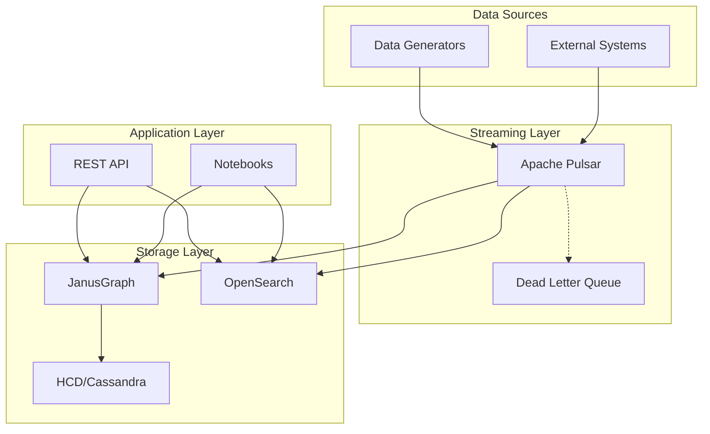

# Architecture Overview

**Author:** David Leconte, IBM Worldwide | Tiger-Team, Watsonx.Data Global Product Specialist (GPS)
**Contact:**

## System Architecture

## Components

| Component | Purpose | Technology |
|-----------|---------|------------|
| Data Generators | Synthetic data | Python |
| Apache Pulsar | Event streaming | Pulsar 3.x |
| JanusGraph | Graph database | JanusGraph 1.x |
| HCD | Graph storage | Cassandra 4.x |
| OpenSearch | Vector search | OpenSearch 2.x |
| REST API | External access | FastAPI |

## Data Flow

See [Unified Data Flow](data-flow-unified.md) for detailed data pipeline documentation.

## Key Design Decisions

1. **Event-Driven Architecture**: Pulsar enables decoupled, scalable data ingestion
2. **Dual Storage**: Graph (JanusGraph) + Vector (OpenSearch) for different query patterns
3. **Consistent IDs**: Entity IDs consistent across all systems
