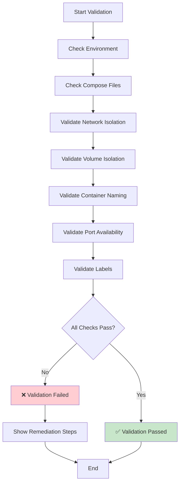

# Podman Isolation Architecture

**Version:** 1.0  
**Date:** 2026-02-19  
**Status:** Active  
**Supersedes:** `.bob/rules-plan/PODMAN_ISOLATION.md`

---

## Executive Summary

This document defines the **five-layer isolation architecture** for Podman-based deployments in the HCD + JanusGraph Banking Compliance Platform. Proper isolation enables multiple projects to coexist on the same Podman machine without conflicts, resource contention, or data mixing.

**Key Principle:** Every project must be completely isolated at network, storage, resource, port, and management layers.

---

## Table of Contents

1. [Overview](#overview)
2. [Five-Layer Isolation Model](#five-layer-isolation-model)
3. [Layer 1: Network Isolation](#layer-1-network-isolation)
4. [Layer 2: Volume Isolation](#layer-2-volume-isolation)
5. [Layer 3: Resource Limits](#layer-3-resource-limits)
6. [Layer 4: Port Mapping](#layer-4-port-mapping)
7. [Layer 5: Label-Based Management](#layer-5-label-based-management)
8. [Deployment Integration](#deployment-integration)
9. [Validation & Verification](#validation--verification)
10. [Troubleshooting](#troubleshooting)
11. [References](#references)

---

## Overview

### Why Isolation Matters

**Problem:** Without proper isolation, multiple projects on the same Podman machine can:
- Share networks (security risk, DNS conflicts)
- Mix data in shared volumes (data corruption)
- Compete for resources (performance degradation)
- Conflict on ports (deployment failures)
- Interfere with each other's operations

**Solution:** Five-layer isolation architecture ensures complete project independence.

### Architecture Principles

1. **Project-Name Prefixing:** All resources prefixed with `COMPOSE_PROJECT_NAME`
2. **Label-Based Tagging:** All resources tagged with `project=<name>` label
3. **Explicit Resource Limits:** CPU and memory quotas enforced
4. **Network Segmentation:** Separate subnet per project
5. **Automated Validation:** Pre-deployment and continuous validation

---

## Five-Layer Isolation Model

```
┌─────────────────────────────────────────────────────────────────┐
│                      PODMAN MACHINE                              │
│                                                                  │
│  ┌────────────────────────────────────────────────────────┐    │
│  │  PROJECT: janusgraph-demo (ISOLATED)                   │    │
│  │                                                         │    │
│  │  Layer 5: Labels (project=janusgraph-demo)             │    │
│  │  ┌──────────────────────────────────────────────────┐  │    │
│  │  │  Layer 1: Network (10.89.X.0/24)                 │  │    │
│  │  │  ┌────────────────────────────────────────────┐  │  │    │
│  │  │  │  Layer 4: Ports (19042, 18182, ...)       │  │  │    │
│  │  │  │  ┌──────────┐  ┌──────────┐  ┌──────────┐ │  │  │    │
│  │  │  │  │   HCD    │  │JanusGraph│  │OpenSearch│ │  │  │    │
│  │  │  │  │ (Layer 3)│  │ (Layer 3)│  │ (Layer 3)│ │  │  │    │
│  │  │  │  │ CPU: 2   │  │ CPU: 2   │  │ CPU: 2   │ │  │  │    │
│  │  │  │  │ MEM: 4G  │  │ MEM: 6G  │  │ MEM: 4G  │ │  │  │    │
│  │  │  │  └────┬─────┘  └────┬─────┘  └────┬─────┘ │  │  │    │
│  │  │  └───────┼─────────────┼─────────────┼───────┘  │  │    │
│  │  └──────────┼─────────────┼─────────────┼──────────┘  │    │
│  │             │             │             │             │    │
│  │  Layer 2: Volumes (project-prefixed)                  │    │
│  │  ┌──────────▼─────────────▼─────────────▼──────────┐  │    │
│  │  │  janusgraph-demo_hcd-data                       │  │    │
│  │  │  janusgraph-demo_janusgraph-db                  │  │    │
│  │  │  janusgraph-demo_opensearch-data                │  │    │
│  │  └─────────────────────────────────────────────────┘  │    │
│  └─────────────────────────────────────────────────────────┘    │
│                                                                  │
│  ┌────────────────────────────────────────────────────────┐    │
│  │  PROJECT: other-project (ISOLATED)                     │    │
│  │  (Separate network, volumes, resources, ports, labels) │    │
│  └────────────────────────────────────────────────────────┘    │
└─────────────────────────────────────────────────────────────────┘
```

---

## Layer 1: Network Isolation

### Purpose
Isolate network traffic between projects, prevent DNS conflicts, enable independent network policies.

### Requirements

**MANDATORY:** Each project MUST have its own isolated network with unique subnet.

```yaml
# docker-compose.yml
networks:
  default:
    name: ${COMPOSE_PROJECT_NAME}_hcd-janusgraph-network
    driver: bridge
    labels:
      project: ${COMPOSE_PROJECT_NAME}
    ipam:
      config:
        - subnet: 10.89.X.0/24  # X = unique per project
```

### Benefits

- **Traffic Isolation:** Containers in `janusgraph-demo` cannot reach `other-project`
- **DNS Namespace:** Each project has independent DNS resolution
- **No IP Conflicts:** Unique subnets prevent address collisions
- **Security Boundary:** Network-level separation

### Verification

```bash
# List project networks
podman network ls --filter "label=project=janusgraph-demo"

# Inspect network details
podman network inspect janusgraph-demo_hcd-janusgraph-network

# Verify subnet
podman network inspect janusgraph-demo_hcd-janusgraph-network | grep Subnet
# Expected: "Subnet": "10.89.X.0/24"
```

### Network Topology Diagram

```mermaid
graph TB
    subgraph PM["Podman Machine"]
        subgraph N1["Network: janusgraph-demo_network<br/>Subnet: 10.89.5.0/24"]
            C1[HCD<br/>10.89.5.2]
            C2[JanusGraph<br/>10.89.5.3]
            C3[OpenSearch<br/>10.89.5.4]
        end
        
        subgraph N2["Network: other-project_network<br/>Subnet: 10.89.6.0/24"]
            C4[Service A<br/>10.89.6.2]
            C5[Service B<br/>10.89.6.3]
        end
    end
    
    C1 -.->|Can communicate| C2
    C2 -.->|Can communicate| C3
    C1 -.X|Cannot communicate| C4
    C2 -.X|Cannot communicate| C5
    
    style N1 fill:#e3f2fd
    style N2 fill:#fff3e0
```

---

## Layer 2: Volume Isolation

### Purpose
Prevent data mixing between projects, enable independent backup/restore, ensure data persistence.

### Requirements

**MANDATORY:** All volumes MUST be prefixed with project name.

```yaml
# docker-compose.yml
volumes:
  hcd-data:
    name: ${COMPOSE_PROJECT_NAME}_hcd-data
    labels:
      project: ${COMPOSE_PROJECT_NAME}
  janusgraph-db:
    name: ${COMPOSE_PROJECT_NAME}_janusgraph-db
    labels:
      project: ${COMPOSE_PROJECT_NAME}
```

### Benefits

- **Data Isolation:** No shared volumes between projects
- **Independent Persistence:** Each project's data persists independently
- **Backup Granularity:** Per-project backup and restore
- **No Accidental Mixing:** Impossible to mount wrong project's data

### Verification

```bash
# List project volumes
podman volume ls --filter "label=project=janusgraph-demo"

# Inspect volume
podman volume inspect janusgraph-demo_hcd-data

# Check volume usage
podman volume inspect janusgraph-demo_hcd-data --format '{{.Mountpoint}}'
du -sh $(podman volume inspect janusgraph-demo_hcd-data --format '{{.Mountpoint}}')
```

### Volume Architecture Diagram

```
┌─────────────────────────────────────────────────────────────┐
│                    PODMAN MACHINE STORAGE                    │
├─────────────────────────────────────────────────────────────┤
│                                                              │
│  Project: janusgraph-demo                                   │
│  ┌────────────────────────────────────────────────────┐    │
│  │  janusgraph-demo_hcd-data                          │    │
│  │  └─ /var/lib/hcd/data                              │    │
│  │  janusgraph-demo_janusgraph-db                     │    │
│  │  └─ /var/lib/janusgraph                            │    │
│  │  janusgraph-demo_opensearch-data                   │    │
│  │  └─ /usr/share/opensearch/data                     │    │
│  └────────────────────────────────────────────────────┘    │
│                                                              │
│  Project: other-project                                     │
│  ┌────────────────────────────────────────────────────┐    │
│  │  other-project_data-volume                         │    │
│  │  └─ /app/data                                      │    │
│  └────────────────────────────────────────────────────┘    │
│                                                              │
└─────────────────────────────────────────────────────────────┘
```

---

## Layer 3: Resource Limits

### Purpose
Prevent resource starvation, ensure fair resource allocation, enable capacity planning.

### Requirements

**MANDATORY:** Every container MUST have explicit CPU and memory limits.

```yaml
# docker-compose.yml
services:
  hcd-server:
    deploy:
      resources:
        limits:
          cpus: '4.0'
          memory: 8G
        reservations:
          cpus: '2.0'
          memory: 4G
```

### Recommended Allocation

| Service | CPU Limit | Memory Limit | CPU Reserve | Memory Reserve |
|---------|-----------|--------------|-------------|----------------|
| HCD | 4.0 | 8G | 2.0 | 4G |
| JanusGraph | 2.0 | 6G | 1.0 | 3G |
| OpenSearch | 2.0 | 4G | 1.0 | 2G |
| Monitoring | 1.0 | 2G | 0.5 | 1G |
| **Total** | **9.0** | **20G** | **4.5** | **10G** |

### Benefits

- **No Starvation:** One project cannot consume all resources
- **Predictable Performance:** Guaranteed minimum resources
- **Capacity Planning:** Clear resource requirements
- **Cost Control:** Prevent runaway resource usage

### Verification

```bash
# Check resource usage
podman stats --no-stream --filter "label=project=janusgraph-demo"

# Check resource limits
podman inspect janusgraph-demo_hcd-server_1 --format '{{.HostConfig.Memory}}'
podman inspect janusgraph-demo_hcd-server_1 --format '{{.HostConfig.NanoCpus}}'
```

---

## Layer 4: Port Mapping

### Purpose
Prevent port conflicts, enable multiple projects, provide external access.

### Requirements

**MANDATORY:** Check for port conflicts BEFORE deployment.

```bash
# Preflight port check
./scripts/validation/preflight_check.sh

# Manual port check
netstat -an | grep -E "19042|18182|8888|9090|3001"
```

### Default Port Allocation

| Service | Internal Port | External Port | Purpose |
|---------|---------------|---------------|---------|
| HCD CQL | 9042 | 19042 | Cassandra queries |
| JanusGraph | 8182 | 18182 | Gremlin WebSocket |
| Jupyter | 8888 | 8888 | Notebook interface |
| Prometheus | 9090 | 9090 | Metrics collection |
| Grafana | 3000 | 3001 | Dashboards |
| OpenSearch | 9200 | 9200 | Search API |
| Pulsar | 6650 | 6650 | Message broker |

### Custom Port Configuration

If ports conflict, use environment variables:

```bash
# .env file
HOST_JANUSGRAPH_PORT=28182
HOST_HCD_PORT=29042
HOST_JUPYTER_PORT=28888
```

### Verification

```bash
# Check port mappings
podman port janusgraph-demo_janusgraph-server_1

# Verify no conflicts
lsof -i :18182
# Should show: janusgraph-demo_janusgraph-server_1
```

---

## Layer 5: Label-Based Management

### Purpose
Enable bulk operations, simplify filtering, enforce ownership, automate management.

### Requirements

**MANDATORY:** Every resource MUST be tagged with project label.

```yaml
# docker-compose.yml
services:
  hcd-server:
    labels:
      project: ${COMPOSE_PROJECT_NAME}
      component: database
      tier: storage

networks:
  default:
    labels:
      project: ${COMPOSE_PROJECT_NAME}

volumes:
  hcd-data:
    labels:
      project: ${COMPOSE_PROJECT_NAME}
```

### Label Taxonomy

| Label | Purpose | Example Values |
|-------|---------|----------------|
| `project` | Project identification | `janusgraph-demo` |
| `component` | Component type | `database`, `api`, `monitoring` |
| `tier` | Architecture tier | `storage`, `query`, `presentation` |
| `environment` | Deployment environment | `dev`, `staging`, `prod` |

### Benefits

- **Easy Filtering:** List all resources for a project
- **Bulk Operations:** Start/stop/remove all project resources
- **Clear Ownership:** No ambiguity about resource ownership
- **Automation:** Scripts can target by label

### Verification

```bash
# List all project resources
podman ps --filter "label=project=janusgraph-demo"
podman volume ls --filter "label=project=janusgraph-demo"
podman network ls --filter "label=project=janusgraph-demo"

# Bulk operations
podman ps --filter "label=project=janusgraph-demo" --format "{{.Names}}" | \
  xargs -I {} podman stop {}
```

---

## Deployment Integration

### Compose File Requirements

```yaml
version: '3.8'

# REQUIRED: Use environment variable for project name
networks:
  default:
    name: ${COMPOSE_PROJECT_NAME}_hcd-janusgraph-network
    labels:
      project: ${COMPOSE_PROJECT_NAME}

volumes:
  hcd-data:
    name: ${COMPOSE_PROJECT_NAME}_hcd-data
    labels:
      project: ${COMPOSE_PROJECT_NAME}

services:
  hcd-server:
    # CRITICAL: Do NOT use container_name (breaks isolation)
    # container_name: hcd-server  # ❌ WRONG
    
    labels:
      project: ${COMPOSE_PROJECT_NAME}
    
    deploy:
      resources:
        limits:
          cpus: '4.0'
          memory: 8G
    
    networks:
      - default
    
    volumes:
      - hcd-data:/var/lib/hcd/data
```

### Deployment Script Requirements

```bash
#!/bin/bash
# deploy_full_stack.sh

# REQUIRED: Set project name
export COMPOSE_PROJECT_NAME="${COMPOSE_PROJECT_NAME:-janusgraph-demo}"

# REQUIRED: Use -p flag
podman-compose -p "$COMPOSE_PROJECT_NAME" -f docker-compose.full.yml up -d

# REQUIRED: Verify isolation
./scripts/validation/validate_podman_isolation.sh --strict
```

### Environment Configuration

```bash
# .env file (REQUIRED)
COMPOSE_PROJECT_NAME=janusgraph-demo
PODMAN_CONNECTION=podman-wxd
```

---

## Validation & Verification

### Automated Validation

```bash
# Run comprehensive isolation validation
./scripts/validation/validate_podman_isolation.sh --strict

# Expected output:
# ✅ Layer 1: Network Isolation - PASS
# ✅ Layer 2: Volume Isolation - PASS
# ✅ Layer 3: Resource Limits - PASS
# ✅ Layer 4: Port Mapping - PASS
# ✅ Layer 5: Label Management - PASS
```

### Manual Validation Checklist

- [ ] All containers have project prefix: `janusgraph-demo_*_1`
- [ ] All volumes have project prefix: `janusgraph-demo_*`
- [ ] All networks have project prefix: `janusgraph-demo_*`
- [ ] All resources have `project=janusgraph-demo` label
- [ ] No port conflicts on host
- [ ] Resource limits applied to all containers
- [ ] Containers can communicate within project network
- [ ] Containers CANNOT communicate with other projects
- [ ] Volumes are isolated (no cross-project access)

### Validation Flow



---

## Troubleshooting

### Issue 1: Container Name Conflicts

**Symptom:**
```
Error: container name "hcd-server" is already in use
```

**Cause:** Hardcoded `container_name:` in compose file

**Fix:**
```bash
# Remove all container_name directives
sed -i '/container_name:/d' config/compose/docker-compose.full.yml

# Redeploy with project name
cd config/compose
podman-compose -p janusgraph-demo -f docker-compose.full.yml up -d
```

### Issue 2: Network Conflicts

**Symptom:**
```
Error: network "hcd-janusgraph-network" already exists
```

**Cause:** Network not project-prefixed

**Fix:**
```yaml
# Update docker-compose.yml
networks:
  default:
    name: ${COMPOSE_PROJECT_NAME}_hcd-janusgraph-network
```

### Issue 3: Volume Data Mixing

**Symptom:** Data from different projects appears mixed

**Cause:** Volumes not project-prefixed

**Fix:**
```yaml
# Update docker-compose.yml
volumes:
  hcd-data:
    name: ${COMPOSE_PROJECT_NAME}_hcd-data
```

### Issue 4: Port Already in Use

**Symptom:**
```
Error: port 18182 is already allocated
```

**Cause:** Another service using the port

**Fix:**
```bash
# Find process using port
lsof -i :18182

# Option 1: Stop conflicting service
podman stop <container-name>

# Option 2: Use custom port
export HOST_JANUSGRAPH_PORT=28182
```

### Issue 5: Resource Limits Not Applied

**Symptom:** Container consuming unlimited resources

**Cause:** Missing `deploy.resources` section

**Fix:**
```yaml
services:
  hcd-server:
    deploy:
      resources:
        limits:
          cpus: '4.0'
          memory: 8G
```

### Diagnostic Commands

```bash
# Check isolation status
./scripts/validation/validate_podman_isolation.sh

# List all project resources
podman ps -a --filter "label=project=janusgraph-demo"
podman volume ls --filter "label=project=janusgraph-demo"
podman network ls --filter "label=project=janusgraph-demo"

# Check resource usage
podman stats --no-stream --filter "label=project=janusgraph-demo"

# Check network connectivity
podman exec janusgraph-demo_janusgraph-server_1 ping -c 1 hcd-server

# Check volume mounts
podman inspect janusgraph-demo_hcd-server_1 --format '{{.Mounts}}'
```

---

## References

### Internal Documentation
- [Deployment Architecture](deployment-architecture.md)
- [System Architecture](system-architecture.md)
- [Operations Runbook](../operations/operations-runbook.md)
- [Deployment Guide](../guides/deployment-guide.md)

### Scripts
- Validation: `scripts/validation/validate_podman_isolation.sh`
- Deployment: `scripts/deployment/deploy_full_stack.sh`
- Preflight: `scripts/validation/preflight_check.sh`

### External Resources
- [Podman Documentation](https://docs.podman.io/)
- [Podman Compose](https://github.com/containers/podman-compose)
- [Docker Compose Specification](https://docs.docker.com/compose/compose-file/)

---

**Document Status:** Active  
**Last Updated:** 2026-02-19  
**Next Review:** 2026-03-19  
**Owner:** Platform Engineering Team