# Service Startup Sequence

## Document Information

- **Document Version:** 1.0.0
- **Last Updated:** 2026-02-19
- **Owner:** Platform Engineering Team
- **Status:** Active
- **Related:** [Deployment Architecture](deployment-architecture.md), [Operations Runbook](../operations/operations-runbook.md)

---

## Executive Summary

This document defines the **service startup sequence** for the HCD JanusGraph Banking Compliance Platform, including dependency graph, timing expectations, health check cascade, and troubleshooting procedures. Understanding this sequence is critical for:

- **Operators:** Diagnosing startup failures and timing issues
- **Developers:** Understanding service dependencies
- **SREs:** Optimizing deployment performance
- **Architects:** Planning capacity and scaling

---

## Table of Contents

1. [Startup Overview](#1-startup-overview)
2. [Dependency Graph](#2-dependency-graph)
3. [Startup Phases](#3-startup-phases)
4. [Service Timing](#4-service-timing)
5. [Health Check Cascade](#5-health-check-cascade)
6. [Startup Troubleshooting](#6-startup-troubleshooting)
7. [Performance Optimization](#7-performance-optimization)

---

## 1. Startup Overview

### 1.1 Total Startup Time

**Expected Duration:** 90-270 seconds (1.5-4.5 minutes)

| Phase | Duration | Services Started |
|-------|----------|------------------|
| **Phase 1: Foundation** | 0-60s | Vault, HCD, OpenSearch |
| **Phase 2: Core Services** | 60-120s | JanusGraph, Pulsar |
| **Phase 3: Applications** | 120-180s | Analytics API, Jupyter, Consumers |
| **Phase 4: Monitoring** | 180-240s | Prometheus, Grafana, Exporters |
| **Phase 5: Visualization** | 240-270s | Visualizer, GraphExp, Dashboards |

### 1.2 Critical Path

The **critical path** determines minimum startup time:

```
Vault (10s) → HCD (180s) → JanusGraph (90s) → Analytics API (15s) = 295s minimum
```

**Optimization opportunities:**
- HCD startup (180s) is the bottleneck
- Parallel service starts reduce total time to ~270s
- Health check retries add 30-60s buffer

### 1.3 Startup Command

**Canonical deployment command:**

```bash
cd config/compose
bash ../../scripts/deployment/deploy_full_stack.sh
```

**What happens:**
1. Validates environment (preflight checks)
2. Builds custom images (HCD, OpenSearch+JVector, Jupyter, etc.)
3. Starts services via `podman-compose up -d`
4. Waits 90 seconds for core services
5. Returns control (services continue initializing)

---

## 2. Dependency Graph

### 2.1 Service Dependency Tree

```
Foundation Layer (No Dependencies)
├── vault (10s)
├── hcd-server (180s)
└── opensearch (60s)

Core Services Layer (Depends on Foundation)
├── janusgraph-server (90s)
│   ├── depends_on: hcd-server (healthy)
│   └── depends_on: opensearch (healthy)
├── pulsar (90s)
│   └── no dependencies
└── opensearch-dashboards (60s)
    └── depends_on: opensearch (healthy)

Application Layer (Depends on Core)
├── analytics-api (15s)
│   └── depends_on: janusgraph-server (healthy)
├── jupyter (30s)
│   └── depends_on: janusgraph-server (healthy)
├── graph-consumer
│   ├── depends_on: pulsar (healthy)
│   └── depends_on: janusgraph-server (healthy)
└── vector-consumer
    ├── depends_on: pulsar (healthy)
    └── depends_on: opensearch (healthy)

Monitoring Layer (Depends on Core)
├── prometheus (10s)
│   └── depends_on: hcd-server (started)
├── janusgraph-exporter (10s)
│   └── depends_on: janusgraph-server (healthy)
├── alertmanager (10s)
│   └── no dependencies
└── grafana (10s)
    ├── depends_on: prometheus (started)
    └── depends_on: alertmanager (started)

Visualization Layer (Depends on Core)
├── janusgraph-visualizer (30s)
│   └── depends_on: janusgraph-server (healthy)
└── graphexp (30s)
    └── depends_on: janusgraph-server (healthy)

Client Tools (Depends on Core)
├── gremlin-console
│   └── depends_on: janusgraph-server (healthy)
├── cqlsh-client
│   └── depends_on: hcd-server (started)
└── pulsar-cli
    └── depends_on: pulsar (healthy)
```

### 2.2 Dependency Matrix

| Service | Depends On | Condition | Start Delay |
|---------|-----------|-----------|-------------|
| **vault** | - | - | 0s |
| **hcd-server** | - | - | 0s |
| **opensearch** | - | - | 0s |
| **janusgraph-server** | hcd-server, opensearch | healthy | 20s after deps |
| **pulsar** | - | - | 0s |
| **opensearch-dashboards** | opensearch | healthy | 0s after deps |
| **analytics-api** | janusgraph-server | healthy | 0s after deps |
| **jupyter** | janusgraph-server | healthy | 0s after deps |
| **graph-consumer** | pulsar, janusgraph-server | healthy | 0s after deps |
| **vector-consumer** | pulsar, opensearch | healthy | 0s after deps |
| **prometheus** | hcd-server | started | 0s after deps |
| **janusgraph-exporter** | janusgraph-server | healthy | 0s after deps |
| **alertmanager** | - | - | 0s |
| **grafana** | prometheus, alertmanager | started | 0s after deps |
| **janusgraph-visualizer** | janusgraph-server | healthy | 0s after deps |
| **graphexp** | janusgraph-server | healthy | 0s after deps |
| **gremlin-console** | janusgraph-server | healthy | 0s after deps |
| **cqlsh-client** | hcd-server | started | 0s after deps |
| **pulsar-cli** | pulsar | healthy | 0s after deps |

### 2.3 Mermaid Dependency Graph

```mermaid
graph TD
    %% Foundation Layer
    vault[Vault<br/>10s]
    hcd[HCD Server<br/>180s]
    opensearch[OpenSearch<br/>60s]

    %% Core Services Layer
    janusgraph[JanusGraph Server<br/>90s]
    pulsar[Pulsar<br/>90s]
    os_dash[OpenSearch Dashboards<br/>60s]

    %% Application Layer
    api[Analytics API<br/>15s]
    jupyter[Jupyter<br/>30s]
    graph_consumer[Graph Consumer]
    vector_consumer[Vector Consumer]

    %% Monitoring Layer
    prometheus[Prometheus<br/>10s]
    exporter[JanusGraph Exporter<br/>10s]
    alertmanager[AlertManager<br/>10s]
    grafana[Grafana<br/>10s]

    %% Visualization Layer
    visualizer[Visualizer<br/>30s]
    graphexp[GraphExp<br/>30s]

    %% Client Tools
    gremlin[Gremlin Console]
    cqlsh[CQLSH Client]
    pulsar_cli[Pulsar CLI]

    %% Dependencies
    hcd -->|healthy| janusgraph
    opensearch -->|healthy| janusgraph
    opensearch -->|healthy| os_dash
    janusgraph -->|healthy| api
    janusgraph -->|healthy| jupyter
    janusgraph -->|healthy| exporter
    janusgraph -->|healthy| visualizer
    janusgraph -->|healthy| graphexp
    janusgraph -->|healthy| gremlin
    janusgraph -->|healthy| graph_consumer
    pulsar -->|healthy| graph_consumer
    pulsar -->|healthy| vector_consumer
    pulsar -->|healthy| pulsar_cli
    opensearch -->|healthy| vector_consumer
    hcd -->|started| prometheus
    hcd -->|started| cqlsh
    prometheus -->|started| grafana
    alertmanager -->|started| grafana

    %% Styling
    classDef foundation fill:#e1f5ff,stroke:#01579b,stroke-width:2px
    classDef core fill:#fff9c4,stroke:#f57f17,stroke-width:2px
    classDef app fill:#c8e6c9,stroke:#2e7d32,stroke-width:2px
    classDef monitoring fill:#f8bbd0,stroke:#c2185b,stroke-width:2px
    classDef viz fill:#d1c4e9,stroke:#512da8,stroke-width:2px
    classDef client fill:#ffccbc,stroke:#d84315,stroke-width:2px

    class vault,hcd,opensearch foundation
    class janusgraph,pulsar,os_dash core
    class api,jupyter,graph_consumer,vector_consumer app
    class prometheus,exporter,alertmanager,grafana monitoring
    class visualizer,graphexp viz
    class gremlin,cqlsh,pulsar_cli client
```



---

## 3. Startup Phases

### 3.1 Phase 1: Foundation (0-60s)

**Services:** Vault, HCD, OpenSearch

**Purpose:** Establish foundational infrastructure

**Sequence:**

```bash
# All start in parallel
podman-compose up -d vault hcd-server opensearch
```

**Timing:**

| Service | Start | Health Check | Ready |
|---------|-------|--------------|-------|
| **vault** | 0s | 10s | 10s |
| **hcd-server** | 0s | 180s | 180s |
| **opensearch** | 0s | 60s | 60s |

**Critical Path:** HCD (180s)

**Health Checks:**

```bash
# Vault
vault status  # Exit 0 when ready

# HCD
nodetool status  # Shows UN (Up/Normal)

# OpenSearch
curl http://localhost:9200/_cluster/health  # status: green/yellow
```

**Common Issues:**

- **Vault:** Needs initialization on first run
- **HCD:** Slow startup (180s), requires 4GB+ memory
- **OpenSearch:** Requires memory lock, may fail on low memory

### 3.2 Phase 2: Core Services (60-120s)

**Services:** JanusGraph, Pulsar, OpenSearch Dashboards

**Purpose:** Start core graph and streaming services

**Sequence:**

```bash
# Wait for Phase 1 health checks
# Then start Phase 2 in parallel
podman-compose up -d janusgraph-server pulsar opensearch-dashboards
```

**Timing:**

| Service | Wait For | Start | Health Check | Ready |
|---------|----------|-------|--------------|-------|
| **janusgraph-server** | HCD+OpenSearch healthy | 180s | 90s | 270s |
| **pulsar** | - | 0s | 90s | 90s |
| **opensearch-dashboards** | OpenSearch healthy | 60s | 60s | 120s |

**Critical Path:** JanusGraph (270s cumulative)

**Health Checks:**

```bash
# JanusGraph
bash -c 'cat < /dev/null > /dev/tcp/127.0.0.1/8182'  # Port open

# Pulsar
curl http://localhost:8080/admin/v2/clusters  # Returns cluster info

# OpenSearch Dashboards
curl http://localhost:5601/api/status  # status: available
```

**Common Issues:**

- **JanusGraph:** Waits 20s for HCD, then 90s to start
- **Pulsar:** Creates topics on startup (45s delay)
- **Dashboards:** Requires OpenSearch healthy first

### 3.3 Phase 3: Applications (120-180s)

**Services:** Analytics API, Jupyter, Graph Consumer, Vector Consumer

**Purpose:** Start application services

**Sequence:**

```bash
# Wait for Phase 2 health checks
# Then start Phase 3 in parallel
podman-compose up -d analytics-api jupyter graph-consumer vector-consumer
```

**Timing:**

| Service | Wait For | Start | Health Check | Ready |
|---------|----------|-------|--------------|-------|
| **analytics-api** | JanusGraph healthy | 270s | 15s | 285s |
| **jupyter** | JanusGraph healthy | 270s | 30s | 300s |
| **graph-consumer** | Pulsar+JanusGraph healthy | 270s | - | 270s |
| **vector-consumer** | Pulsar+OpenSearch healthy | 90s | - | 90s |

**Critical Path:** Jupyter (300s cumulative)

**Health Checks:**

```bash
# Analytics API
curl http://localhost:8001/health  # {"status": "healthy"}

# Jupyter
curl http://localhost:8888/api  # Returns API info

# Consumers (no health check, check logs)
podman logs janusgraph-demo_graph-consumer_1
podman logs janusgraph-demo_vector-consumer_1
```

**Common Issues:**

- **Analytics API:** Requires API_JWT_SECRET environment variable
- **Jupyter:** May take 30s to fully initialize
- **Consumers:** Check logs for connection errors

### 3.4 Phase 4: Monitoring (180-240s)

**Services:** Prometheus, JanusGraph Exporter, AlertManager, Grafana

**Purpose:** Start monitoring and alerting

**Sequence:**

```bash
# Can start early (depends on HCD started, not healthy)
podman-compose up -d prometheus alertmanager
# Wait for JanusGraph healthy
podman-compose up -d janusgraph-exporter grafana
```

**Timing:**

| Service | Wait For | Start | Health Check | Ready |
|---------|----------|-------|--------------|-------|
| **prometheus** | HCD started | 0s | 10s | 10s |
| **alertmanager** | - | 0s | 10s | 10s |
| **janusgraph-exporter** | JanusGraph healthy | 270s | 10s | 280s |
| **grafana** | Prometheus+AlertManager | 10s | 10s | 20s |

**Critical Path:** JanusGraph Exporter (280s cumulative)

**Health Checks:**

```bash
# Prometheus
wget --spider http://localhost:9090/-/healthy

# AlertManager
wget --spider http://localhost:9093/-/healthy

# JanusGraph Exporter
curl http://localhost:8000/metrics  # Returns Prometheus metrics

# Grafana
curl http://localhost:3001/api/health  # {"database": "ok"}
```

**Common Issues:**

- **Prometheus:** Check config file syntax
- **Exporter:** Requires JanusGraph connection
- **Grafana:** May need datasource configuration

### 3.5 Phase 5: Visualization (240-270s)

**Services:** JanusGraph Visualizer, GraphExp

**Purpose:** Start visualization tools

**Sequence:**

```bash
# Wait for JanusGraph healthy
podman-compose up -d janusgraph-visualizer graphexp
```

**Timing:**

| Service | Wait For | Start | Health Check | Ready |
|---------|----------|-------|--------------|-------|
| **janusgraph-visualizer** | JanusGraph healthy | 270s | 30s | 300s |
| **graphexp** | JanusGraph healthy | 270s | 30s | 300s |

**Critical Path:** Visualizer/GraphExp (300s cumulative)

**Health Checks:**

```bash
# Visualizer
curl http://localhost:3000/  # Returns HTML

# GraphExp
curl http://localhost:8080/  # Returns HTML
```

**Common Issues:**

- **Visualizer:** Check Gremlin URL configuration
- **GraphExp:** Verify JanusGraph connectivity

---

## 4. Service Timing

### 4.1 Timing Summary Table

| Service | Start Period | Health Interval | Health Timeout | Health Retries | Max Wait |
|---------|--------------|-----------------|----------------|----------------|----------|
| **vault** | 10s | 10s | 5s | 3 | 40s |
| **hcd-server** | 180s | 30s | 30s | 10 | 480s |
| **opensearch** | 60s | 30s | 10s | 5 | 210s |
| **janusgraph-server** | 90s | 30s | 10s | 5 | 240s |
| **pulsar** | 90s | 30s | 10s | 5 | 240s |
| **opensearch-dashboards** | 60s | 30s | 10s | 5 | 210s |
| **analytics-api** | 15s | 30s | 10s | 3 | 105s |
| **jupyter** | 30s | 30s | 10s | 3 | 120s |
| **prometheus** | - | 10s | 5s | 3 | 35s |
| **alertmanager** | - | 10s | 5s | 3 | 35s |
| **janusgraph-exporter** | 10s | 30s | 10s | 3 | 100s |
| **grafana** | - | - | - | - | - |
| **janusgraph-visualizer** | 30s | 30s | 10s | 3 | 120s |
| **graphexp** | 30s | 30s | 10s | 3 | 120s |

**Formula:** `Max Wait = Start Period + (Health Interval × Health Retries)`

### 4.2 Cumulative Timing

**Best Case (All Parallel):**

```
Foundation:  180s (HCD bottleneck)
Core:        +90s (JanusGraph after HCD)
Application: +30s (Jupyter after JanusGraph)
Total:       300s (5 minutes)
```

**Worst Case (Sequential + Retries):**

```
Foundation:  480s (HCD max wait)
Core:        +240s (JanusGraph max wait)
Application: +120s (Jupyter max wait)
Total:       840s (14 minutes)
```

**Typical Case (Parallel + Some Retries):**

```
Foundation:  200s (HCD + buffer)
Core:        +100s (JanusGraph + buffer)
Application: +40s (API/Jupyter + buffer)
Total:       340s (5.7 minutes)
```

### 4.3 Timing Optimization

**Current Bottlenecks:**

1. **HCD Startup (180s):** Cassandra initialization
2. **JanusGraph Startup (90s):** Schema initialization
3. **Pulsar Topic Creation (45s):** Namespace and topic setup

**Optimization Strategies:**

1. **Pre-warm HCD:** Keep HCD running between deployments
2. **Parallel Starts:** Maximize parallel service starts
3. **Reduce Health Check Intervals:** Faster failure detection
4. **Optimize Images:** Reduce image size and startup overhead

---

## 5. Health Check Cascade

### 5.1 Health Check Flow

```
1. Vault Health Check (10s)
   └─> Status: unsealed

2. HCD Health Check (180s)
   └─> nodetool status: UN (Up/Normal)
       └─> Triggers: JanusGraph, Prometheus, CQLSH

3. OpenSearch Health Check (60s)
   └─> Cluster health: green/yellow
       └─> Triggers: JanusGraph, OpenSearch Dashboards, Vector Consumer

4. JanusGraph Health Check (90s after HCD+OpenSearch)
   └─> Port 8182 open
       └─> Triggers: Analytics API, Jupyter, Exporter, Visualizer, GraphExp, Gremlin Console, Graph Consumer

5. Pulsar Health Check (90s)
   └─> Cluster API responds
       └─> Triggers: Pulsar CLI, Graph Consumer, Vector Consumer

6. Application Health Checks (15-30s after dependencies)
   └─> Analytics API: /health endpoint
   └─> Jupyter: /api endpoint
   └─> Visualizer: / endpoint
   └─> GraphExp: / endpoint
```

### 5.2 Health Check Commands

**Manual health check script:**

```bash
#!/bin/bash
# scripts/operations/check_all_health.sh

PROJECT_NAME="${COMPOSE_PROJECT_NAME:-janusgraph-demo}"

echo "=== Health Check Cascade ==="

# Phase 1: Foundation
echo "Phase 1: Foundation"
echo -n "  Vault: "
podman exec ${PROJECT_NAME}_vault_1 vault status >/dev/null 2>&1 && echo "✅" || echo "❌"

echo -n "  HCD: "
podman exec ${PROJECT_NAME}_hcd-server_1 nodetool status 2>/dev/null | grep -q "UN" && echo "✅" || echo "❌"

echo -n "  OpenSearch: "
curl -s http://localhost:9200/_cluster/health | grep -q "green\|yellow" && echo "✅" || echo "❌"

# Phase 2: Core Services
echo "Phase 2: Core Services"
echo -n "  JanusGraph: "
bash -c 'cat < /dev/null > /dev/tcp/localhost/18182' 2>/dev/null && echo "✅" || echo "❌"

echo -n "  Pulsar: "
curl -s http://localhost:8081/admin/v2/clusters 2>/dev/null | grep -q "standalone" && echo "✅" || echo "❌"

echo -n "  OpenSearch Dashboards: "
curl -s http://localhost:5601/api/status 2>/dev/null | grep -q "available" && echo "✅" || echo "❌"

# Phase 3: Applications
echo "Phase 3: Applications"
echo -n "  Analytics API: "
curl -s http://localhost:8001/health 2>/dev/null | grep -q "healthy" && echo "✅" || echo "❌"

echo -n "  Jupyter: "
curl -s http://localhost:8888/api 2>/dev/null >/dev/null && echo "✅" || echo "❌"

# Phase 4: Monitoring
echo "Phase 4: Monitoring"
echo -n "  Prometheus: "
curl -s http://localhost:9090/-/healthy 2>/dev/null >/dev/null && echo "✅" || echo "❌"

echo -n "  AlertManager: "
curl -s http://localhost:9093/-/healthy 2>/dev/null >/dev/null && echo "✅" || echo "❌"

echo -n "  JanusGraph Exporter: "
curl -s http://localhost:8000/metrics 2>/dev/null >/dev/null && echo "✅" || echo "❌"

echo -n "  Grafana: "
curl -s http://localhost:3001/api/health 2>/dev/null | grep -q "ok" && echo "✅" || echo "❌"

# Phase 5: Visualization
echo "Phase 5: Visualization"
echo -n "  Visualizer: "
curl -s http://localhost:3000/ 2>/dev/null >/dev/null && echo "✅" || echo "❌"

echo -n "  GraphExp: "
curl -s http://localhost:8080/ 2>/dev/null >/dev/null && echo "✅" || echo "❌"

echo "=== Health Check Complete ==="
```

### 5.3 Health Check Failure Handling

**Retry Logic:**

```yaml
healthcheck:
  test: ["CMD", "health-check-command"]
  interval: 30s      # Check every 30 seconds
  timeout: 10s       # Fail if check takes > 10s
  retries: 5         # Retry 5 times before marking unhealthy
  start_period: 90s  # Grace period before first check
```

**Failure Scenarios:**

1. **Health check fails during start_period:** Ignored (grace period)
2. **Health check fails after start_period:** Retry up to `retries` times
3. **All retries exhausted:** Service marked unhealthy
4. **Dependent services:** Wait indefinitely for dependency health

**Recovery Actions:**

```bash
# Check why service is unhealthy
podman inspect ${PROJECT_NAME}_service_1 --format '{{.State.Health.Status}}'

# View health check logs
podman inspect ${PROJECT_NAME}_service_1 --format '{{range .State.Health.Log}}{{.Output}}{{end}}'

# Restart unhealthy service
podman restart ${PROJECT_NAME}_service_1

# Force recreate if restart fails
podman-compose -p ${PROJECT_NAME} up -d --force-recreate service_1
```

---

## 6. Startup Troubleshooting

### 6.1 Common Startup Failures

**Symptom:** Services stuck in "starting" state

**Diagnosis:**

```bash
# Check service status
podman ps --filter "label=io.podman.compose.project=janusgraph-demo"

# Check logs
podman logs janusgraph-demo_service_1 --tail 100

# Check health status
podman inspect janusgraph-demo_service_1 --format '{{.State.Health.Status}}'
```

**Common Causes:**

1. **Dependency not healthy:** Check dependency health first
2. **Port conflict:** Another service using the port
3. **Resource exhaustion:** Insufficient CPU/memory
4. **Configuration error:** Invalid config file
5. **Network issue:** Cannot reach dependency

### 6.2 Service-Specific Troubleshooting

**HCD (180s startup):**

```bash
# Check if HCD is starting
podman logs janusgraph-demo_hcd-server_1 | grep "Starting listening"

# Check memory allocation
podman stats janusgraph-demo_hcd-server_1 --no-stream

# Common issues:
# - Insufficient memory (needs 4GB+)
# - Slow disk I/O
# - Port 9042 already in use
```

**JanusGraph (90s startup):**

```bash
# Check if waiting for HCD
podman logs janusgraph-demo_janusgraph-server_1 | grep "Waiting for HCD"

# Check if connected to HCD
podman logs janusgraph-demo_janusgraph-server_1 | grep "Connected to"

# Common issues:
# - HCD not healthy yet
# - OpenSearch not healthy yet
# - Configuration file error
# - Port 8182 already in use
```

**Pulsar (90s startup):**

```bash
# Check if topics created
podman logs janusgraph-demo_pulsar_1 | grep "topics created"

# Check cluster status
podman exec janusgraph-demo_pulsar-cli_1 bin/pulsar-admin clusters list

# Common issues:
# - Topic creation timeout
# - Port 6650 or 8080 already in use
# - Insufficient memory
```

**Analytics API (15s startup):**

```bash
# Check if API started
podman logs janusgraph-demo_analytics-api_1 | grep "Uvicorn running"

# Check for errors
podman logs janusgraph-demo_analytics-api_1 | grep -i error

# Common issues:
# - Missing API_JWT_SECRET
# - JanusGraph not reachable
# - Port 8001 already in use
```

### 6.3 Startup Failure Recovery

**Step 1: Identify Failed Service**

```bash
# List all services with status
podman ps -a --filter "label=io.podman.compose.project=janusgraph-demo" \
    --format "table {{.Names}}\t{{.Status}}\t{{.Ports}}"
```

**Step 2: Check Logs**

```bash
# View last 100 lines
podman logs janusgraph-demo_service_1 --tail 100

# Follow logs in real-time
podman logs janusgraph-demo_service_1 -f
```

**Step 3: Check Dependencies**

```bash
# Check if dependencies are healthy
podman inspect janusgraph-demo_dependency_1 --format '{{.State.Health.Status}}'
```

**Step 4: Restart Service**

```bash
# Restart single service
podman restart janusgraph-demo_service_1

# Or recreate service
cd config/compose
podman-compose -p janusgraph-demo up -d --force-recreate service_1
```

**Step 5: Full Reset (if needed)**

```bash
# Stop all services
cd config/compose
bash ../../scripts/deployment/stop_full_stack.sh

# Clean state
podman-compose -p janusgraph-demo down -v

# Redeploy
bash ../../scripts/deployment/deploy_full_stack.sh
```

### 6.4 Startup Performance Issues

**Symptom:** Startup takes > 10 minutes

**Diagnosis:**

```bash
# Check resource usage
podman stats --no-stream

# Check disk I/O
iostat -x 1 5

# Check network latency
ping -c 5 localhost
```

**Common Causes:**

1. **Insufficient resources:** Increase Podman machine resources
2. **Slow disk:** Use SSD, increase disk size
3. **Network issues:** Check Podman network configuration
4. **Too many services:** Reduce service count for development

**Optimization:**

```bash
# Increase Podman machine resources
podman machine stop
podman machine rm
podman machine init --cpus 8 --memory 16384 --disk-size 100

# Use faster storage
# Move Podman machine to SSD

# Reduce service count
# Comment out non-essential services in docker-compose.full.yml
```

---

## 7. Performance Optimization

### 7.1 Startup Time Optimization

**Current Baseline:** 300s (5 minutes)

**Optimization Targets:**

| Optimization | Time Saved | Effort | Priority |
|--------------|------------|--------|----------|
| Pre-warm HCD | 180s | High | Low (dev only) |
| Reduce health check intervals | 30s | Low | Medium |
| Optimize image sizes | 20s | Medium | Medium |
| Parallel service starts | 10s | Low | High |
| Reduce start_period | 20s | Low | Low (risky) |

### 7.2 Resource Optimization

**Current Resource Allocation:**

| Service | CPU Limit | Memory Limit | Actual Usage |
|---------|-----------|--------------|--------------|
| **hcd-server** | 4.0 | 8G | 3.5 / 6G |
| **janusgraph-server** | 2.0 | 6G | 1.5 / 4G |
| **opensearch** | 2.0 | 4G | 1.0 / 2G |
| **pulsar** | 2.0 | 4G | 1.0 / 2G |
| **jupyter** | 2.0 | 4G | 0.5 / 1G |
| **analytics-api** | 1.0 | 2G | 0.3 / 512M |
| **Total** | 17.0 | 36G | 10.0 / 20G |

**Optimization Recommendations:**

1. **Reduce over-provisioning:** Actual usage is 50-60% of limits
2. **Right-size containers:** Adjust limits based on actual usage
3. **Use reservations:** Ensure minimum resources available

### 7.3 Monitoring Startup Performance

**Collect startup metrics:**

```bash
#!/bin/bash
# scripts/operations/measure_startup_time.sh

START_TIME=$(date +%s)

# Deploy
cd config/compose
bash ../../scripts/deployment/deploy_full_stack.sh

# Wait for all services healthy
while true; do
    HEALTHY=$(podman ps --filter "label=io.podman.compose.project=janusgraph-demo" \
        --filter "health=healthy" --format "{{.Names}}" | wc -l)
    TOTAL=$(podman ps --filter "label=io.podman.compose.project=janusgraph-demo" \
        --format "{{.Names}}" | wc -l)
    
    echo "Healthy: $HEALTHY / $TOTAL"
    
    if [ "$HEALTHY" -eq "$TOTAL" ]; then
        break
    fi
    
    sleep 5
done

END_TIME=$(date +%s)
DURATION=$((END_TIME - START_TIME))

echo "Total startup time: ${DURATION}s"
```

---

## Appendices

### Appendix A: Service Port Reference

| Service | Internal Port | External Port | Protocol |
|---------|---------------|---------------|----------|
| **hcd-server** | 9042 | 19042 | CQL |
| **hcd-server** | 7199 | 17199 | JMX |
| **opensearch** | 9200 | 9200 | HTTP |
| **opensearch** | 9600 | 9600 | HTTP |
| **opensearch-dashboards** | 5601 | 5601 | HTTP |
| **janusgraph-server** | 8182 | 18182 | WebSocket |
| **pulsar** | 6650 | 6650 | Binary |
| **pulsar** | 8080 | 8081 | HTTP |
| **jupyter** | 8888 | 8888 | HTTP |
| **analytics-api** | 8001 | 8001 | HTTP |
| **vault** | 8200 | 8200 | HTTP |
| **prometheus** | 9090 | 9090 | HTTP |
| **alertmanager** | 9093 | 9093 | HTTP |
| **janusgraph-exporter** | 8000 | 8000 | HTTP |
| **grafana** | 3000 | 3001 | HTTP |
| **janusgraph-visualizer** | 3000 | 3000 | HTTP |
| **graphexp** | 8080 | 8080 | HTTP |

### Appendix B: Health Check Reference

| Service | Health Check Command | Expected Output |
|---------|---------------------|-----------------|
| **vault** | `vault status` | Exit code 0 |
| **hcd-server** | `nodetool status` | Contains "UN" |
| **opensearch** | `curl http://localhost:9200/_cluster/health` | status: green/yellow |
| **janusgraph-server** | `cat < /dev/null > /dev/tcp/127.0.0.1/8182` | Exit code 0 |
| **pulsar** | `curl http://localhost:8080/admin/v2/clusters` | Contains "standalone" |
| **opensearch-dashboards** | `curl http://localhost:5601/api/status` | Contains "available" |
| **analytics-api** | `curl http://localhost:8001/health` | {"status": "healthy"} |
| **jupyter** | `curl http://localhost:8888/api` | Returns JSON |
| **prometheus** | `wget --spider http://localhost:9090/-/healthy` | Exit code 0 |
| **alertmanager** | `wget --spider http://localhost:9093/-/healthy` | Exit code 0 |
| **janusgraph-exporter** | `curl http://localhost:8000/metrics` | Returns metrics |
| **grafana** | `curl http://localhost:3001/api/health` | {"database": "ok"} |
| **janusgraph-visualizer** | `curl http://localhost:3000/` | Returns HTML |
| **graphexp** | `curl http://localhost:8080/` | Returns HTML |

### Appendix C: Related Documentation

- **Architecture:**
  - [Deployment Architecture](deployment-architecture.md)
  - [Deterministic Deployment Architecture](deterministic-deployment-architecture.md)
  - [Podman Isolation Architecture](podman-isolation-architecture.md)

- **Operations:**
  - [Operations Runbook](../operations/operations-runbook.md)
  - [Troubleshooting Guide](../guides/troubleshooting-guide.md)

- **Development:**
  - [QUICKSTART.md](../../QUICKSTART.md)
  - [README.md](../../README.md)

---

**Document Classification:** Internal - Technical  
**Next Review Date:** 2026-05-19  
**Document Owner:** Platform Engineering Team  
**Version:** 1.0.0

---

## Change Log

### Version 1.0.0 (2026-02-19)
- Initial version
- Complete service dependency graph
- Timing expectations for all services
- Health check cascade documentation
- Troubleshooting procedures
- Performance optimization recommendations