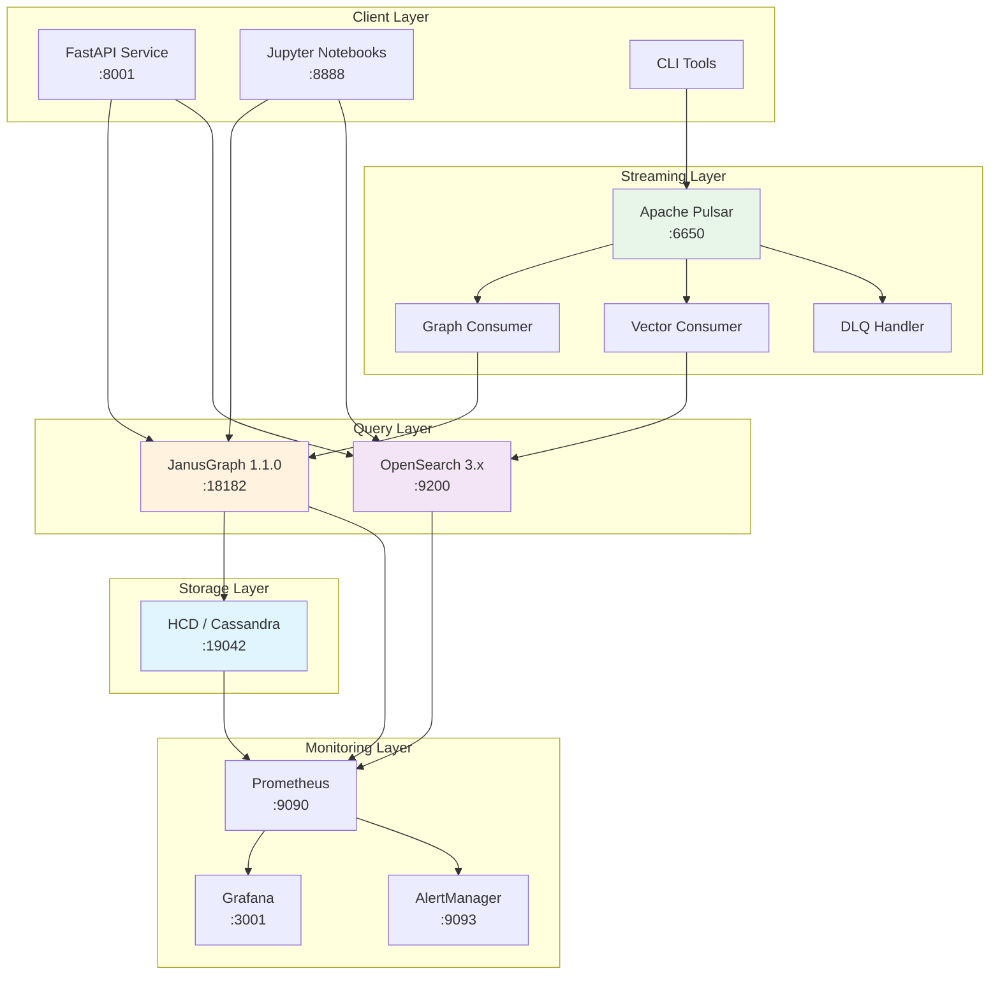
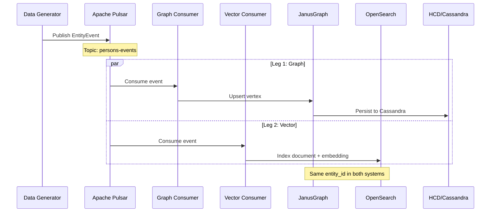

# System Architecture

**File**: docs/architecture/system-architecture.md  
**Created**: 2026-01-28  
**Updated**: 2026-02-06  
**Author**: David LECONTE - IBM Worldwide | Data & AI

---

## Overview

This document describes the complete architecture of the HCD + JanusGraph + OpenSearch + Pulsar banking compliance platform.

## High-Level Architecture



## ASCII Architecture Diagram

```
┌─────────────────────────────────────────────────────────────────────────┐
│                           CLIENT LAYER                                   │
│   ┌─────────────┐   ┌─────────────┐   ┌─────────────┐                   │
│   │ FastAPI     │   │  Jupyter    │   │  CLI Tools  │                   │
│   │   :8001     │   │   :8888     │   │             │                   │
│   └──────┬──────┘   └──────┬──────┘   └──────┬──────┘                   │
└──────────┼─────────────────┼─────────────────┼──────────────────────────┘
           │                 │                 │
           ▼                 ▼                 ▼
┌─────────────────────────────────────────────────────────────────────────┐
│                         STREAMING LAYER                                  │
│   ┌─────────────────────────────────────────────────────────────────┐   │
│   │                     Apache Pulsar :6650                          │   │
│   │   Topics: persons, accounts, transactions, companies, dlq        │   │
│   └───────────┬─────────────────────────────────┬───────────────────┘   │
│               │                                 │                        │
│   ┌───────────▼───────────┐     ┌───────────────▼───────────────┐       │
│   │    Graph Consumer     │     │      Vector Consumer          │       │
│   │    (Leg 1: Graph)     │     │      (Leg 2: Vector)          │       │
│   └───────────┬───────────┘     └───────────────┬───────────────┘       │
└───────────────┼─────────────────────────────────┼───────────────────────┘
                │                                 │
                ▼                                 ▼
┌─────────────────────────────────────────────────────────────────────────┐
│                          QUERY LAYER                                     │
│   ┌─────────────────────────┐       ┌─────────────────────────┐         │
│   │     JanusGraph 1.1.0    │       │    OpenSearch 3.x       │         │
│   │      Gremlin :18182     │       │    Vector+FTS :9200     │         │
│   │    (Graph Traversals)   │       │ (Semantic Search)       │         │
│   └───────────┬─────────────┘       └─────────────────────────┘         │
└───────────────┼─────────────────────────────────────────────────────────┘
                │
                ▼
┌─────────────────────────────────────────────────────────────────────────┐
│                         STORAGE LAYER                                    │
│   ┌─────────────────────────────────────────────────────────────────┐   │
│   │                    HCD / Cassandra :19042                        │   │
│   │                   (Persistent Graph Storage)                     │   │
│   └─────────────────────────────────────────────────────────────────┘   │
└─────────────────────────────────────────────────────────────────────────┘
```

## Components

### 1. HCD (HyperConverged Database)
- Cassandra-based distributed database
- Storage backend for JanusGraph
- Provides scalability and fault tolerance
- Port: 19042 (CQL)

### 2. JanusGraph
- Graph database built on HCD
- Supports Gremlin query language
- Lucene-based search indexing
- Port: 18182 (Gremlin WebSocket)

### 3. OpenSearch + JVector
- Vector search with embeddings
- Full-text search capabilities
- Semantic similarity matching
- Port: 9200 (REST API)

### 4. Apache Pulsar
- Event streaming platform
- Key_Shared subscriptions for parallelism
- Message deduplication
- Dead Letter Queue (DLQ) support
- Port: 6650 (Binary), 8081 (Admin)

### 5. Jupyter Lab
- Interactive Python notebooks
- Pre-configured with graph clients
- Visualization capabilities
- Port: 8888

### 6. Monitoring Stack
- **Prometheus**: Metrics collection (:9090)
- **Grafana**: Dashboards and visualization (:3001)
- **Alertmanager**: Alert routing (:9093)
- **JanusGraph Exporter**: Graph metrics (:8000)

### 7. Visualization Tools
- **GraphExp**: Web-based graph explorer (:8080)
- **Visualizer**: Alternative graph UI (:3000)

## Data Flow

### Streaming Data Flow (Real-Time)



### Batch Data Flow (Traditional)

```
Client → JanusGraph (Gremlin) → HCD (CQL) → Disk
         ↓
     Prometheus → Grafana
```

## Network Architecture

All services communicate via Podman bridge network:
- **Network name**: janusgraph-demo_hcd-janusgraph-network
- **Internal DNS**: Containers resolve by service name
- **Isolation**: Project-name prefixed for isolation

## Storage Architecture

### HCD Data
- Path: `/var/lib/cassandra/data`
- Persistence: Podman volume `hcd-data`

### JanusGraph Data
- Path: `/var/lib/janusgraph`
- Persistence: Podman volume `janusgraph-data`

### Pulsar Data
- Path: `/pulsar/data`
- Persistence: Podman volume `pulsar-data`

### Backups
- Path: `/backups/janusgraph/`
- Format: tar.gz + GraphML export

## Security Architecture

### Authentication
- HCD: Native authentication (optional)
- JanusGraph: Open by default (can add auth)
- OpenSearch: Basic auth (admin/admin for dev)
- Grafana: User-based authentication
- Vault: Token-based (unhealthy in current deployment)

### Network Security
- Services isolated in Podman network
- Only necessary ports exposed to host
- No external access by default
- SSL/TLS available for production

## Scalability Considerations

### Vertical Scaling
- Increase heap sizes in `.env`
- Add resource limits in compose files

### Horizontal Scaling
- HCD supports multi-node clusters
- JanusGraph supports multiple instances
- Pulsar supports multi-broker clusters
- Load balancing required

## ID Consistency Guarantee

The architecture guarantees the same UUID across all systems:

```
EntityEvent.entity_id  ─┬─▶ Pulsar partition_key
                        ├─▶ JanusGraph vertex.entity_id property
                        └─▶ OpenSearch document._id
```

This enables:
- Cross-system joins by ID
- Deduplication at each layer
- Consistent audit trails

---

**Signature**: David LECONTE - IBM Worldwide | Data & AI
