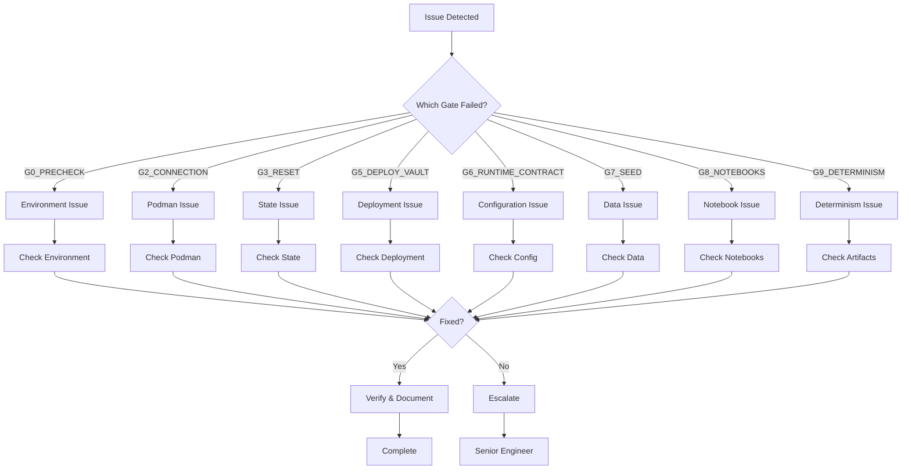

# Troubleshooting Architecture

## Document Information

- **Document Version:** 1.0.0
- **Last Updated:** 2026-02-19
- **Owner:** Platform Engineering Team
- **Status:** Active
- **Related:** [Operations Runbook](../operations/operations-runbook.md), [Deterministic Deployment Architecture](deterministic-deployment-architecture.md), [Service Startup Sequence](service-startup-sequence.md)

---

## Executive Summary

This document defines the **troubleshooting architecture** for the HCD JanusGraph Banking Compliance Platform, providing a systematic framework for diagnosing and resolving issues. It expands on the gate-based validation system (G0-G9) with detailed troubleshooting procedures, common failure patterns, diagnostic tools, and recovery strategies.

**Key Principles:**
- **Systematic Approach:** Follow structured diagnostic procedures
- **Gate-Based:** Troubleshoot by validation gate (G0-G9)
- **Evidence-Based:** Collect logs and metrics before action
- **Minimal Impact:** Prefer least disruptive solutions first
- **Documentation:** Record all actions and outcomes

---

## Table of Contents

1. [Troubleshooting Framework](#1-troubleshooting-framework)
2. [Gate-Specific Troubleshooting](#2-gate-specific-troubleshooting)
3. [Common Failure Patterns](#3-common-failure-patterns)
4. [Diagnostic Tools](#4-diagnostic-tools)
5. [Recovery Procedures](#5-recovery-procedures)
6. [Root Cause Analysis](#6-root-cause-analysis)
7. [Escalation Framework](#7-escalation-framework)

---

## 1. Troubleshooting Framework

### 1.1 Systematic Approach

**The 5-Step Troubleshooting Process:**

```
1. IDENTIFY
   └─> What is failing? Which gate? What symptoms?

2. COLLECT
   └─> Gather logs, metrics, status information

3. ANALYZE
   └─> Identify root cause from evidence

4. RESOLVE
   └─> Apply fix (least disruptive first)

5. VERIFY
   └─> Confirm resolution and document
```

### 1.2 Troubleshooting Decision Tree



### 1.3 Severity Classification

| Severity | Description | Response Time | Examples |
|----------|-------------|---------------|----------|
| **P0 - Critical** | System down, data loss | 15 minutes | G5 failure, complete outage |
| **P1 - High** | Major functionality impaired | 1 hour | G8 failure, high error rate |
| **P2 - Medium** | Degraded performance | 4 hours | G7 failure, slow queries |
| **P3 - Low** | Minor issues | 1 business day | G9 failure, non-critical warnings |

### 1.4 Troubleshooting Checklist

**Before starting troubleshooting:**

- [ ] Identify which gate failed
- [ ] Check failed_gate.txt file
- [ ] Review recent changes
- [ ] Check system resources
- [ ] Verify network connectivity
- [ ] Review logs for errors
- [ ] Check service status
- [ ] Document initial state

---

## 2. Gate-Specific Troubleshooting

### 2.1 G0: Preflight Validation

**Purpose:** Validate environment before deployment

**Common Failures:**

1. **uv not installed**
2. **podman not installed**
3. **podman machine not running**
4. **conda environment not activated**
5. **Insufficient disk space**

**Diagnostic Commands:**

```bash
# Check uv
command -v uv || echo "uv not found"

# Check podman
command -v podman || echo "podman not found"
command -v podman-compose || echo "podman-compose not found"

# Check podman machine
podman machine list
podman machine inspect

# Check conda environment
conda env list | grep janusgraph-analysis

# Check disk space
df -h | grep -E '(Filesystem|podman)'
```

**Resolution Steps:**

```bash
# 1. Install uv
curl -LsSf https://astral.sh/uv/install.sh | sh

# 2. Install podman
brew install podman podman-compose

# 3. Initialize podman machine
podman machine init --cpus 4 --memory 8192 --disk-size 50
podman machine start

# 4. Activate conda environment
conda activate janusgraph-analysis

# 5. Free disk space
# Remove old exports
find exports/ -type d -mtime +30 -exec rm -rf {} +
# Remove old podman images
podman image prune -a -f
```

**Verification:**

```bash
# Run preflight check
bash scripts/validation/preflight_check.sh --strict

# Expected: All checks pass
```

**Escalation Criteria:**
- Preflight check fails after fixes
- System requirements cannot be met
- Persistent environment issues

---

### 2.2 G2: Connection Validation

**Purpose:** Validate Podman connectivity

**Common Failures:**

1. **Podman machine stopped**
2. **No active connection**
3. **Connection timeout**
4. **Network configuration issue**

**Diagnostic Commands:**

```bash
# Check podman machine status
podman machine list

# Check connections
podman system connection list

# Test connection
podman --remote ps

# Check machine details
podman machine inspect

# Check network
podman network ls
```

**Resolution Steps:**

```bash
# 1. Start podman machine
podman machine start

# 2. Set default connection
podman system connection default podman-machine-default

# 3. Test connection
podman --remote ps

# 4. If connection fails, recreate machine
podman machine stop
podman machine rm
podman machine init --cpus 4 --memory 8192 --disk-size 50 --now

# 5. Verify connection
export PODMAN_CONNECTION=$(podman system connection list --format=json | jq -r '.[0].Name')
podman --remote --connection $PODMAN_CONNECTION ps
```

**Verification:**

```bash
# Connection should work
podman --remote ps

# Should return empty list or running containers
```

**Escalation Criteria:**
- Cannot start podman machine
- Connection fails after machine restart
- Network configuration issues persist

---

### 2.3 G3: State Reset

**Purpose:** Reset system to clean state

**Common Failures:**

1. **Containers stuck in removing state**
2. **Volumes in use**
3. **Network conflicts**
4. **Permission issues**

**Diagnostic Commands:**

```bash
# Check running containers
podman ps -a --filter "label=io.podman.compose.project=janusgraph-demo"

# Check volumes
podman volume ls --filter "label=io.podman.compose.project=janusgraph-demo"

# Check networks
podman network ls --filter "label=io.podman.compose.project=janusgraph-demo"

# Check for stuck processes
podman ps -a --filter "status=removing"
```

**Resolution Steps:**

```bash
# 1. Stop all containers
cd config/compose
podman-compose -p janusgraph-demo -f docker-compose.full.yml down

# 2. Force remove stuck containers
podman rm -f $(podman ps -a -q --filter "label=io.podman.compose.project=janusgraph-demo")

# 3. Remove volumes
podman volume rm $(podman volume ls -q --filter "label=io.podman.compose.project=janusgraph-demo")

# 4. Remove networks
podman network rm $(podman network ls -q --filter "label=io.podman.compose.project=janusgraph-demo")

# 5. Prune system
podman system prune -a -f --volumes

# 6. Restart podman machine (if needed)
podman machine stop
podman machine start
```

**Verification:**

```bash
# No containers should exist
podman ps -a --filter "label=io.podman.compose.project=janusgraph-demo"

# No volumes should exist
podman volume ls --filter "label=io.podman.compose.project=janusgraph-demo"

# Expected: Empty lists
```

**Escalation Criteria:**
- Cannot remove containers after force
- Volumes cannot be removed
- Podman machine restart required repeatedly

---

### 2.4 G5: Deploy/Vault Validation

**Purpose:** Validate service deployment and Vault initialization

**Common Failures:**

1. **Port conflicts**
2. **Image build failures**
3. **Service startup failures**
4. **Vault initialization failures**
5. **Resource exhaustion**

**Diagnostic Commands:**

```bash
# Check service status
podman ps --filter "label=io.podman.compose.project=janusgraph-demo"

# Check logs
podman logs janusgraph-demo_hcd-server_1 --tail 100
podman logs janusgraph-demo_vault_1 --tail 100

# Check port conflicts
lsof -i :8182  # JanusGraph
lsof -i :9042  # HCD
lsof -i :8200  # Vault

# Check resource usage
podman stats --no-stream

# Check Vault status
podman exec janusgraph-demo_vault_1 vault status
```

**Resolution Steps:**

```bash
# 1. Check for port conflicts
# Kill processes using required ports
lsof -ti :8182 | xargs kill -9
lsof -ti :9042 | xargs kill -9
lsof -ti :8200 | xargs kill -9

# 2. Rebuild images if build failed
cd config/compose
podman-compose -p janusgraph-demo -f docker-compose.full.yml build --no-cache

# 3. Check Vault initialization
if ! podman exec janusgraph-demo_vault_1 vault status 2>/dev/null; then
    # Initialize Vault
    bash scripts/security/init_vault.sh
fi

# 4. Check service health
bash scripts/testing/check_graph_counts.sh

# 5. Increase resources if needed
# Edit podman machine
podman machine stop
podman machine set --cpus 8 --memory 16384
podman machine start

# 6. Redeploy
cd config/compose
bash ../../scripts/deployment/deploy_full_stack.sh
```

**Verification:**

```bash
# All services should be running
podman ps --filter "label=io.podman.compose.project=janusgraph-demo" \
    --format "table {{.Names}}\t{{.Status}}"

# Vault should be unsealed
podman exec janusgraph-demo_vault_1 vault status | grep "Sealed.*false"

# Graph should be accessible
bash scripts/testing/check_graph_counts.sh
```

**Escalation Criteria:**
- Services fail to start after multiple attempts
- Vault cannot be initialized
- Resource limits cannot be increased
- Persistent image build failures

---

### 2.5 G6: Runtime Contract Validation

**Purpose:** Validate runtime configuration and dependencies

**Common Failures:**

1. **Missing API_JWT_SECRET**
2. **Missing Python dependencies**
3. **Configuration file errors**
4. **Environment variable issues**

**Diagnostic Commands:**

```bash
# Check runtime contracts
bash scripts/testing/check_runtime_contracts.sh

# Check environment variables
env | grep -E '(API_JWT_SECRET|VAULT_TOKEN|PULSAR)'

# Check Python environment
conda activate janusgraph-analysis
python -c "import sys; print(sys.version)"
uv pip list

# Check configuration files
ls -la config/janusgraph/*.properties
ls -la config/vault/*.hcl
```

**Resolution Steps:**

```bash
# 1. Set required environment variables
export API_JWT_SECRET="test-jwt-secret-not-for-production"
export api_jwt_secret="$API_JWT_SECRET"

# 2. Source Vault credentials
if [ -f .vault-keys ]; then
    source .vault-keys
    export VAULT_ADDR=http://localhost:8200
    export VAULT_TOKEN=$VAULT_ROOT_TOKEN
fi

# 3. Install missing dependencies
conda activate janusgraph-analysis
uv pip install -r requirements.txt
uv pip install email-validator slowapi opentelemetry-exporter-jaeger

# 4. Verify Python packages
python -c "import numpy,pandas,sklearn; print('OK')"

# 5. Fix ABI mismatches (if needed)
uv pip install --force-reinstall "numpy==2.2.6" "pandas==2.2.3"
```

**Verification:**

```bash
# Runtime contracts should pass
bash scripts/testing/check_runtime_contracts.sh

# Expected: All checks pass
```

**Escalation Criteria:**
- Runtime contracts fail after fixes
- Persistent dependency issues
- Configuration errors cannot be resolved

---

### 2.6 G7: Seed Validation

**Purpose:** Validate graph data seeding

**Common Failures:**

1. **Graph not accessible**
2. **Seed data load failure**
3. **Schema initialization failure**
4. **Connection timeout**

**Diagnostic Commands:**

```bash
# Check graph connectivity
bash scripts/testing/check_graph_counts.sh

# Check JanusGraph logs
podman logs janusgraph-demo_janusgraph-server_1 --tail 100

# Check HCD status
podman exec janusgraph-demo_hcd-server_1 nodetool status

# Test Gremlin query
curl -X POST http://localhost:18182 \
  -H "Content-Type: application/json" \
  -d '{"gremlin":"g.V().count()"}'
```

**Resolution Steps:**

```bash
# 1. Verify JanusGraph is healthy
podman ps --filter "name=janusgraph-server"

# 2. Check HCD connectivity
podman exec janusgraph-demo_hcd-server_1 cqlsh -e "SELECT now() FROM system.local;"

# 3. Reinitialize schema (if needed)
podman exec janusgraph-demo_gremlin-console_1 \
    bin/gremlin.sh -e /opt/janusgraph/scripts/janusgraph-init.groovy

# 4. Reseed graph
bash scripts/testing/seed_demo_graph.sh

# 5. Verify data
bash scripts/testing/check_graph_counts.sh
```

**Verification:**

```bash
# Graph should have data
bash scripts/testing/check_graph_counts.sh

# Expected: Vertex and edge counts > 0
```

**Escalation Criteria:**
- Graph remains inaccessible
- Seed data cannot be loaded
- Schema initialization fails repeatedly

---

### 2.7 G8: Notebooks Validation

**Purpose:** Validate notebook execution

**Common Failures:**

1. **Notebook execution timeout**
2. **Kernel crash**
3. **Missing dependencies**
4. **Data access errors**
5. **Non-deterministic output**

**Diagnostic Commands:**

```bash
# Check notebook report
LATEST_RUN=$(ls -t exports/ | grep "demo-" | head -1)
cat "exports/${LATEST_RUN}/notebook_run_report.tsv"

# Check notebook logs
cat "exports/${LATEST_RUN}/notebooks.log" | tail -100

# Check Jupyter status
podman logs janusgraph-demo_jupyter_1 --tail 50

# Check for failing notebooks
awk -F'\t' '$2 != "PASS" && NR>1 {print $1, $2, $3}' \
    "exports/${LATEST_RUN}/notebook_run_report.tsv"
```

**Resolution Steps:**

```bash
# 1. Identify failing notebook
LATEST_RUN=$(ls -t exports/ | grep "demo-" | head -1)
FAILED_NOTEBOOK=$(awk -F'\t' '$2 != "PASS" && NR>1 {print $1; exit}' \
    "exports/${LATEST_RUN}/notebook_run_report.tsv")

echo "Failed notebook: $FAILED_NOTEBOOK"

# 2. Run notebook manually for debugging
conda activate janusgraph-analysis
jupyter nbconvert --to notebook --execute \
    "notebooks/${FAILED_NOTEBOOK}" \
    --ExecutePreprocessor.timeout=300

# 3. Check for missing dependencies
conda activate janusgraph-analysis
uv pip install -r requirements.txt

# 4. Increase timeouts (if needed)
export DEMO_NOTEBOOK_TOTAL_TIMEOUT=600
export DEMO_NOTEBOOK_CELL_TIMEOUT=300

# 5. Rerun notebooks
bash scripts/testing/run_notebooks_live_repeatable.sh
```

**Verification:**

```bash
# All notebooks should pass
LATEST_RUN=$(ls -t exports/ | grep "demo-" | head -1)
awk -F'\t' '$2 != "PASS" && NR>1 {count += 1} END {print count+0}' \
    "exports/${LATEST_RUN}/notebook_run_report.tsv"

# Expected: 0 (all passed)
```

**Escalation Criteria:**
- Notebooks fail after timeout increase
- Kernel crashes persist
- Data access errors cannot be resolved

---

### 2.8 G9: Determinism Validation

**Purpose:** Validate deterministic artifact generation

**Common Failures:**

1. **Baseline missing**
2. **Artifact mismatch**
3. **Non-deterministic code**
4. **Timing variance**

**Diagnostic Commands:**

```bash
# Check determinism logs
LATEST_RUN=$(ls -t exports/ | grep "demo-" | head -1)
cat "exports/${LATEST_RUN}/determinism.log"

# Check baseline
ls -la exports/determinism-baselines/

# Compare artifacts
diff exports/determinism-baselines/notebook_run_report.tsv \
     "exports/${LATEST_RUN}/notebook_run_report.tsv"
```

**Resolution Steps:**

```bash
# 1. If baseline missing, create it
if [ ! -d exports/determinism-baselines ]; then
    echo "Creating baseline..."
    bash scripts/deployment/deterministic_setup_and_proof_wrapper.sh \
        --status-report exports/deterministic-status.json
fi

# 2. If artifacts mismatch, identify source
LATEST_RUN=$(ls -t exports/ | grep "demo-" | head -1)
diff -u exports/determinism-baselines/notebook_run_report.tsv \
        "exports/${LATEST_RUN}/notebook_run_report.tsv"

# 3. Check for non-deterministic patterns
bash scripts/testing/check_notebook_determinism_contracts.sh

# 4. Regenerate baseline (if code changed)
rm -rf exports/determinism-baselines
bash scripts/deployment/deterministic_setup_and_proof_wrapper.sh \
    --status-report exports/deterministic-status.json

# 5. Verify determinism
bash scripts/testing/verify_deterministic_artifacts.sh \
    "exports/${LATEST_RUN}"
```

**Verification:**

```bash
# Determinism check should pass
LATEST_RUN=$(ls -t exports/ | grep "demo-" | head -1)
bash scripts/testing/verify_deterministic_artifacts.sh \
    "exports/${LATEST_RUN}"

# Expected: All artifacts match baseline
```

**Escalation Criteria:**
- Determinism cannot be achieved
- Non-deterministic code cannot be fixed
- Baseline regeneration fails

---

## 3. Common Failure Patterns

### 3.1 Startup Failures

**Pattern:** Services fail to start or become healthy

**Symptoms:**
- Containers in "starting" state for > 5 minutes
- Health checks failing repeatedly
- Services restarting continuously

**Common Causes:**

| Cause | Symptoms | Solution |
|-------|----------|----------|
| **Port conflict** | "Address already in use" | Kill process using port |
| **Resource exhaustion** | OOMKilled, CPU throttling | Increase resources |
| **Dependency not ready** | Connection refused | Wait for dependency |
| **Configuration error** | Parse error in logs | Fix config file |
| **Image build failure** | Build error in logs | Rebuild image |

**Diagnostic Approach:**

```bash
# 1. Check service status
podman ps -a --filter "label=io.podman.compose.project=janusgraph-demo"

# 2. Check logs
podman logs janusgraph-demo_service_1 --tail 100

# 3. Check resources
podman stats --no-stream

# 4. Check dependencies
podman inspect janusgraph-demo_dependency_1 --format '{{.State.Health.Status}}'

# 5. Check ports
lsof -i :PORT
```

### 3.2 Performance Degradation

**Pattern:** System becomes slow over time

**Symptoms:**
- Query latency increasing
- High CPU/memory usage
- Slow response times

**Common Causes:**

| Cause | Symptoms | Solution |
|-------|----------|----------|
| **Memory leak** | Memory usage growing | Restart service |
| **Disk full** | Write failures | Clean up disk |
| **Too many connections** | Connection pool exhausted | Increase pool size |
| **Unoptimized queries** | Slow query log entries | Optimize queries |
| **Resource contention** | High CPU wait time | Scale resources |

**Diagnostic Approach:**

```bash
# 1. Check resource usage
podman stats --no-stream

# 2. Check disk space
df -h

# 3. Check query performance
# View slow queries in logs
podman logs janusgraph-demo_janusgraph-server_1 | grep "slow query"

# 4. Check connection pool
curl http://localhost:18182/metrics | grep connection_pool

# 5. Check for memory leaks
podman stats janusgraph-demo_service_1 --no-stream
# Compare over time
```

### 3.3 Data Inconsistency

**Pattern:** Data appears corrupted or inconsistent

**Symptoms:**
- Unexpected query results
- Missing data
- Duplicate data
- Schema errors

**Common Causes:**

| Cause | Symptoms | Solution |
|-------|----------|----------|
| **Incomplete transaction** | Missing related data | Rollback and retry |
| **Schema mismatch** | Type errors | Reinitialize schema |
| **Concurrent writes** | Duplicate data | Use transactions |
| **Backup restore issue** | Old data | Verify backup |
| **Replication lag** | Stale reads | Check replication |

**Diagnostic Approach:**

```bash
# 1. Check data counts
bash scripts/testing/check_graph_counts.sh

# 2. Check schema
podman exec janusgraph-demo_gremlin-console_1 \
    bin/gremlin.sh -e "mgmt = graph.openManagement(); mgmt.printSchema(); mgmt.rollback()"

# 3. Check for duplicates
# Run query to find duplicates
curl -X POST http://localhost:18182 \
  -H "Content-Type: application/json" \
  -d '{"gremlin":"g.V().groupCount().by(id).unfold().filter(values.is(gt(1)))"}'

# 4. Check HCD status
podman exec janusgraph-demo_hcd-server_1 nodetool status

# 5. Check for errors
podman logs janusgraph-demo_janusgraph-server_1 | grep -i "error\|exception"
```

### 3.4 Network Issues

**Pattern:** Services cannot communicate

**Symptoms:**
- Connection refused errors
- Timeout errors
- DNS resolution failures

**Common Causes:**

| Cause | Symptoms | Solution |
|-------|----------|----------|
| **Network not created** | Network not found | Create network |
| **Service not in network** | Cannot resolve hostname | Add to network |
| **Firewall blocking** | Connection timeout | Check firewall |
| **Port mapping wrong** | Connection refused | Fix port mapping |
| **DNS issue** | Cannot resolve name | Use IP address |

**Diagnostic Approach:**

```bash
# 1. Check networks
podman network ls --filter "label=io.podman.compose.project=janusgraph-demo"

# 2. Check service network membership
podman inspect janusgraph-demo_service_1 --format '{{.NetworkSettings.Networks}}'

# 3. Test connectivity
podman exec janusgraph-demo_service_1 ping janusgraph-server

# 4. Check DNS resolution
podman exec janusgraph-demo_service_1 nslookup janusgraph-server

# 5. Check port mapping
podman port janusgraph-demo_service_1
```

### 3.5 Authentication Failures

**Pattern:** Authentication or authorization fails

**Symptoms:**
- 401 Unauthorized errors
- 403 Forbidden errors
- Token validation failures

**Common Causes:**

| Cause | Symptoms | Solution |
|-------|----------|----------|
| **Missing API_JWT_SECRET** | Token validation fails | Set environment variable |
| **Vault sealed** | Cannot access secrets | Unseal Vault |
| **Expired token** | 401 errors | Regenerate token |
| **Wrong credentials** | Authentication fails | Update credentials |
| **Missing permissions** | 403 errors | Update policy |

**Diagnostic Approach:**

```bash
# 1. Check API_JWT_SECRET
echo $API_JWT_SECRET

# 2. Check Vault status
podman exec janusgraph-demo_vault_1 vault status

# 3. Check Vault token
echo $VAULT_TOKEN

# 4. Test authentication
curl -H "Authorization: Bearer $TOKEN" http://localhost:8001/health

# 5. Check logs
podman logs janusgraph-demo_analytics-api_1 | grep -i "auth"
```

---

## 4. Diagnostic Tools

### 4.1 Log Analysis Tools

**View logs:**

```bash
# View logs for specific service
podman logs janusgraph-demo_service_1 --tail 100

# Follow logs in real-time
podman logs janusgraph-demo_service_1 -f

# View logs with timestamps
podman logs janusgraph-demo_service_1 --timestamps

# View logs since specific time
podman logs janusgraph-demo_service_1 --since 1h

# Search logs for errors
podman logs janusgraph-demo_service_1 | grep -i "error\|exception\|fatal"
```

**Aggregate logs:**

```bash
# View all logs for project
for container in $(podman ps -q --filter "label=io.podman.compose.project=janusgraph-demo"); do
    echo "=== $(podman inspect $container --format '{{.Name}}') ==="
    podman logs $container --tail 20
    echo ""
done
```

### 4.2 Health Check Tools

**Manual health checks:**

```bash
# Check all services
bash scripts/operations/check_all_health.sh

# Check specific service
podman inspect janusgraph-demo_service_1 --format '{{.State.Health.Status}}'

# View health check logs
podman inspect janusgraph-demo_service_1 \
    --format '{{range .State.Health.Log}}{{.Output}}{{end}}'

# Test health check manually
podman exec janusgraph-demo_service_1 /health-check-command
```

### 4.3 Resource Monitoring Tools

**Check resource usage:**

```bash
# Real-time stats
podman stats

# Snapshot stats
podman stats --no-stream

# Specific service stats
podman stats janusgraph-demo_service_1 --no-stream

# Format output
podman stats --no-stream --format "table {{.Name}}\t{{.CPUPerc}}\t{{.MemUsage}}"
```

**Check disk usage:**

```bash
# Check disk space
df -h

# Check volume usage
podman volume ls
du -sh /var/lib/podman/volumes/*

# Check image sizes
podman images --format "table {{.Repository}}\t{{.Tag}}\t{{.Size}}"
```

### 4.4 Network Diagnostic Tools

**Check network connectivity:**

```bash
# List networks
podman network ls

# Inspect network
podman network inspect janusgraph-demo_hcd-janusgraph-network

# Test connectivity
podman exec janusgraph-demo_service_1 ping janusgraph-server

# Check DNS
podman exec janusgraph-demo_service_1 nslookup janusgraph-server

# Check port connectivity
podman exec janusgraph-demo_service_1 nc -zv janusgraph-server 8182
```

### 4.5 Database Diagnostic Tools

**HCD/Cassandra:**

```bash
# Check node status
podman exec janusgraph-demo_hcd-server_1 nodetool status

# Check keyspaces
podman exec janusgraph-demo_hcd-server_1 cqlsh -e "DESCRIBE KEYSPACES;"

# Check table
podman exec janusgraph-demo_hcd-server_1 cqlsh -e "SELECT * FROM janusgraph.edgestore LIMIT 5;"

# Check compaction stats
podman exec janusgraph-demo_hcd-server_1 nodetool compactionstats
```

**JanusGraph:**

```bash
# Check graph counts
bash scripts/testing/check_graph_counts.sh

# Run Gremlin query
curl -X POST http://localhost:18182 \
  -H "Content-Type: application/json" \
  -d '{"gremlin":"g.V().count()"}'

# Check via Gremlin console
podman exec janusgraph-demo_gremlin-console_1 \
    bin/gremlin.sh -e "g.V().count()"
```

---

## 5. Recovery Procedures

### 5.1 Service Recovery

**Restart single service:**

```bash
# Restart service
podman restart janusgraph-demo_service_1

# Verify restart
podman ps --filter "name=janusgraph-demo_service_1"

# Check logs
podman logs janusgraph-demo_service_1 --tail 50
```

**Recreate service:**

```bash
# Stop and remove service
podman stop janusgraph-demo_service_1
podman rm janusgraph-demo_service_1

# Recreate service
cd config/compose
podman-compose -p janusgraph-demo up -d --force-recreate service_1

# Verify
podman ps --filter "name=janusgraph-demo_service_1"
```

### 5.2 Full Stack Recovery

**Graceful restart:**

```bash
# Stop services
cd config/compose
bash ../../scripts/deployment/stop_full_stack.sh

# Wait for clean shutdown
sleep 10

# Redeploy
bash ../../scripts/deployment/deploy_full_stack.sh

# Verify
bash ../../scripts/operations/check_all_health.sh
```

**Hard reset:**

```bash
# Stop and remove everything
cd config/compose
podman-compose -p janusgraph-demo -f docker-compose.full.yml down -v

# Clean up
podman system prune -a -f --volumes

# Redeploy with deterministic validation
cd ../..
bash scripts/deployment/deterministic_setup_and_proof_wrapper.sh \
    --status-report exports/deterministic-status.json
```

### 5.3 Data Recovery

**Restore from backup:**

```bash
# Stop services
cd config/compose
bash ../../scripts/deployment/stop_full_stack.sh

# Restore backup
bash ../../scripts/backup/restore.sh /path/to/backup.tar.gz.gpg

# Verify restoration
bash ../../scripts/operations/check_all_health.sh
bash ../../scripts/testing/check_graph_counts.sh
```

**Reseed graph:**

```bash
# Clear existing data
curl -X POST http://localhost:18182 \
  -H "Content-Type: application/json" \
  -d '{"gremlin":"g.V().drop()"}'

# Reseed
bash scripts/testing/seed_demo_graph.sh

# Verify
bash scripts/testing/check_graph_counts.sh
```

### 5.4 Configuration Recovery

**Reset to default configuration:**

```bash
# Backup current config
cp config/janusgraph/janusgraph-hcd.properties \
   config/janusgraph/janusgraph-hcd.properties.backup

# Restore from git
git checkout config/janusgraph/janusgraph-hcd.properties

# Restart services
cd config/compose
podman-compose -p janusgraph-demo restart janusgraph-server
```

**Regenerate certificates:**

```bash
# Backup old certificates
mv config/ssl config/ssl.backup

# Generate new certificates
bash scripts/security/generate_certificates.sh

# Restart services
cd config/compose
podman-compose -p janusgraph-demo restart
```

---

## 6. Root Cause Analysis

### 6.1 RCA Framework

**The 5 Whys Technique:**

```
Problem: JanusGraph failed to start

Why? → Connection to HCD failed
Why? → HCD was not healthy
Why? → HCD health check timed out
Why? → HCD startup took > 180s
Why? → Insufficient memory allocated

Root Cause: Podman machine memory too low (4GB instead of 8GB)
```

### 6.2 RCA Template

```markdown
# Root Cause Analysis

**Incident ID:** INC-YYYY-MM-DD-NNN
**Date:** YYYY-MM-DD
**Severity:** P0/P1/P2/P3
**Duration:** HH:MM
**Impact:** Description of impact

## Timeline

- HH:MM - Issue detected
- HH:MM - Investigation started
- HH:MM - Root cause identified
- HH:MM - Fix applied
- HH:MM - Verification complete
- HH:MM - Incident closed

## Symptoms

- Symptom 1
- Symptom 2
- Symptom 3

## Root Cause

Detailed description of root cause.

## 5 Whys Analysis

1. Why did X happen? → Because Y
2. Why did Y happen? → Because Z
3. Why did Z happen? → Because A
4. Why did A happen? → Because B
5. Why did B happen? → Because C (root cause)

## Resolution

Steps taken to resolve the issue.

## Prevention

Actions to prevent recurrence:
- Action 1
- Action 2
- Action 3

## Lessons Learned

- Lesson 1
- Lesson 2
- Lesson 3

## Action Items

- [ ] Action item 1 (Owner: Name, Due: Date)
- [ ] Action item 2 (Owner: Name, Due: Date)
- [ ] Action item 3 (Owner: Name, Due: Date)
```

### 6.3 Common Root Causes

| Symptom | Common Root Causes | Prevention |
|---------|-------------------|------------|
| **Startup failures** | Resource limits, port conflicts, config errors | Preflight checks, resource monitoring |
| **Performance issues** | Memory leaks, unoptimized queries, resource contention | Performance testing, monitoring |
| **Data issues** | Schema mismatches, incomplete transactions | Schema validation, transaction management |
| **Network issues** | Network misconfiguration, firewall rules | Network testing, documentation |
| **Auth failures** | Missing secrets, expired tokens | Secret management, token rotation |

---

## 7. Escalation Framework

### 7.1 Escalation Levels

| Level | Role | Responsibility | When to Escalate |
|-------|------|----------------|------------------|
| **L1** | On-Call Engineer | Initial response, basic troubleshooting | Cannot resolve in 30 min |
| **L2** | Senior Engineer | Advanced troubleshooting, code fixes | Cannot resolve in 2 hours |
| **L3** | Team Lead | Architecture decisions, resource allocation | Cannot resolve in 4 hours |
| **L4** | Engineering Manager | Cross-team coordination, escalation | Business impact > 4 hours |
| **L5** | CTO | Executive decisions, external communication | Critical business impact |

### 7.2 Escalation Criteria

**Escalate to L2 if:**
- Issue not resolved in 30 minutes
- Root cause unclear
- Requires code changes
- Affects multiple services

**Escalate to L3 if:**
- Issue not resolved in 2 hours
- Requires architecture changes
- Affects multiple teams
- Requires resource allocation

**Escalate to L4 if:**
- Issue not resolved in 4 hours
- Critical business impact
- Requires cross-team coordination
- External communication needed

**Escalate to L5 if:**
- Business-critical outage
- Data loss risk
- Security breach
- Regulatory impact

### 7.3 Escalation Procedure

```bash
# Send escalation notification
./scripts/operations/escalate.sh \
  --level L2 \
  --incident INC-2026-02-19-001 \
  --summary "JanusGraph startup failure after 3 attempts" \
  --impact "Cannot deploy new version" \
  --actions-taken "Checked logs, restarted services, verified resources"
```

### 7.4 Escalation Checklist

**Before escalating:**

- [ ] Documented all symptoms
- [ ] Collected relevant logs
- [ ] Checked recent changes
- [ ] Attempted basic troubleshooting
- [ ] Verified resource availability
- [ ] Checked for known issues
- [ ] Estimated business impact
- [ ] Prepared summary for next level

---

## Appendices

### Appendix A: Quick Reference Commands

```bash
# Check failed gate
cat exports/demo-*/failed_gate.txt

# View deployment status
cat exports/deterministic-status.json

# Check all services
podman ps --filter "label=io.podman.compose.project=janusgraph-demo"

# View logs
podman logs janusgraph-demo_service_1 --tail 100

# Check health
bash scripts/operations/check_all_health.sh

# Restart service
podman restart janusgraph-demo_service_1

# Full reset
cd config/compose && podman-compose -p janusgraph-demo down -v

# Redeploy
bash scripts/deployment/deterministic_setup_and_proof_wrapper.sh \
    --status-report exports/deterministic-status.json
```

### Appendix B: Related Documentation

- **Architecture:**
  - [Deterministic Deployment Architecture](deterministic-deployment-architecture.md)
  - [Service Startup Sequence](service-startup-sequence.md)
  - [Deployment Architecture](deployment-architecture.md)
  - [Gate-Based Validation (ADR-016)](adr-016-gate-based-validation.md)

- **Operations:**
  - [Operations Runbook](../operations/operations-runbook.md)
  - [Disaster Recovery Plan](../operations/disaster-recovery-plan.md)

- **Development:**
  - [AGENTS.md](../../.bob/rules-code/AGENTS.md)
  - [QUICKSTART.md](../../QUICKSTART.md)

---

**Document Classification:** Internal - Technical  
**Next Review Date:** 2026-05-19  
**Document Owner:** Platform Engineering Team  
**Version:** 1.0.0

---

## Change Log

### Version 1.0.0 (2026-02-19)
- Initial version
- Complete troubleshooting framework
- Gate-specific troubleshooting procedures (G0-G9)
- Common failure patterns
- Diagnostic tools and commands
- Recovery procedures
- Root cause analysis framework
- Escalation framework