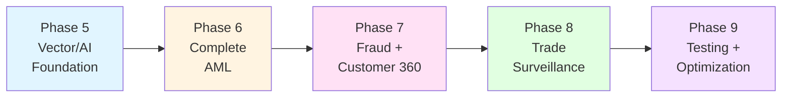

# Banking Use Cases - Technical Specifications

**Project**: IBM HCD + JanusGraph + OpenSearch (JVector) Banking Solutions
**Version**: 2.0
**Date**: 2026-01-28
**Status**: Implementation Ready

---

## Overview

This directory contains complete technical specifications for implementing four mission-critical banking use cases using the hybrid graph + vector + AI architecture.

**Business Value**: $10M+ annual value from fraud prevention, compliance automation, and customer experience improvements.

**Implementation Timeline**: 6 weeks (Phases 5-9)

---

## Document Structure

### 📋 Master Documents

1. **Banking Use Cases Gap Analysis** - Strategic analysis and remediation plan
   - Current state assessment
   - Gap identification
   - 6-week remediation roadmap
   - ROI analysis ($58K investment → $10M+ value)

### 🔧 Phase Specifications

2. **Phase 5 (Vector AI Foundation)** - Weeks 13-14 (32 hours/week)
   - ML/AI infrastructure setup
   - Embedding generation system
   - Vector search integration
   - JanusGraph schema updates
   - Performance benchmarking

3. **Phase 6 (AML Complete)** - Week 15 (40 hours)
   - Ultimate Beneficial Owner (UBO) discovery
   - Layering detection algorithms
   - Real-time OLTP alerting
   - Batch OLAP analytics
   - Compliance reporting

4. **Phase 7 (Fraud & Customer360)** - Week 16 (40 hours)
   - Fraud ring detection
   - Insider fraud patterns
   - 360° customer view
   - Personalization engine
   - Cross-sell recommendations

5. **Phase 8 (Trade Surveillance)** - Week 17 (40 hours)
   - Market manipulation detection
   - Insider trading patterns
   - Front-running detection
   - Demo application
   - Integration testing

6. **Phase 9 (Testing & Optimization)** - Week 18 (40 hours)
   - Comprehensive testing suite
   - Performance optimization
   - Production deployment
   - Documentation finalization
   - Team training

### 📚 Reference Materials

7. **`data_models.py`** - Complete data schemas
   - Graph schema definitions
   - Vector index configurations
   - Property specifications
   - Relationship mappings

8. **[API Reference](../api/README.md)** - API documentation
   - Python API reference
   - Gremlin query patterns
   - REST endpoints
   - Integration examples
9. **Testing Guide** - Testing strategies
   - Unit test patterns
   - Integration test suites
   - Performance benchmarks
   - Test data generation

10. **Deployment Guide** - Deployment procedures
    - Environment setup
    - Configuration management
    - Deployment automation
    - Rollback procedures

---

## Quick Start

### Prerequisites

```bash
# Existing infrastructure (Phases 1-4 complete)
✅ JanusGraph 1.0.0 + HCD 1.2.3
✅ Security (TLS, JWT, MFA, RBAC)
✅ Monitoring (Prometheus, Grafana, Jaeger)
✅ Documentation (47+ files)

# New requirements (Phase 5+)
⬜ PyTorch 2.1.0
⬜ sentence-transformers 2.3.1
⬜ OpenSearch JVector plugin
⬜ FAISS/HNSW libraries
```

### Implementation Sequence



### Week-by-Week Deliverables

| Week | Phase | Key Deliverables | Hours |
|------|-------|------------------|-------|
| 13 | Phase 5.1 | ML dependencies, embedding generator | 32 |
| 14 | Phase 5.2 | Vector search, semantic matching POC | 32 |
| 15 | Phase 6 | Complete AML (UBO, layering, alerts) | 40 |
| 16 | Phase 7 | Fraud detection + Customer 360 | 40 |
| 17 | Phase 8 | Trade surveillance + demo app | 40 |
| 18 | Phase 9 | Testing, optimization, deployment | 40 |
| **Total** | | **6 weeks** | **224** |

---

## Use Cases Overview

### 1. Anti-Money Laundering (AML)

**Business Impact**: $835M in fines avoided, 90% faster investigations

**Key Features**:

- Structuring detection (already implemented)
- Ultimate Beneficial Owner (UBO) discovery
- Layering pattern detection
- Sanctions screening with fuzzy matching
- Real-time transaction monitoring
- Batch analytics for historical patterns

**Technical Approach**:

- Graph traversals for ownership chains
- Vector search for name/address matching
- Behavioral embeddings for pattern detection
- OLTP for real-time alerts
- OLAP for batch analytics

### 2. Fraud Ring Detection

**Business Impact**: $3B+ in fraud losses prevented

**Key Features**:

- Fraud ring identification
- Insider fraud detection
- Mule account discovery
- Velocity checks
- Device fingerprinting
- Behavioral anomaly detection

**Technical Approach**:

- Community detection algorithms
- Graph clustering (Louvain, Label Propagation)
- Behavioral embeddings
- Time-series analysis
- Real-time scoring

### 3. 360° Customer Insights

**Business Impact**: 25% increase in cross-sell, 15% reduction in churn

**Key Features**:

- Unified customer view
- Relationship mapping
- Product recommendations
- Churn prediction
- Lifetime value calculation
- Personalized marketing

**Technical Approach**:

- Graph aggregation queries
- Collaborative filtering
- Content-based recommendations
- Vector similarity for "similar customers"
- Real-time profile updates

### 4. Trade Surveillance

**Business Impact**: Regulatory compliance, market integrity

**Key Features**:

- Market manipulation detection
- Insider trading patterns
- Front-running detection
- Wash trading identification
- Spoofing detection
- Regulatory reporting

**Technical Approach**:

- Temporal graph analysis
- Pattern matching algorithms
- Statistical anomaly detection
- Network analysis
- Real-time monitoring

---

## Architecture

### System Components

```
┌─────────────────────────────────────────────────────────────┐
│                    Application Layer                         │
│  ┌──────────┐  ┌──────────┐  ┌──────────┐  ┌──────────┐   │
│  │   AML    │  │  Fraud   │  │Customer  │  │  Trade   │   │
│  │ Detection│  │Detection │  │   360    │  │Surveil.  │   │
│  └──────────┘  └──────────┘  └──────────┘  └──────────┘   │
└─────────────────────────────────────────────────────────────┘
                            ↓
┌─────────────────────────────────────────────────────────────┐
│                      ML/AI Layer                             │
│  ┌──────────┐  ┌──────────┐  ┌──────────┐  ┌──────────┐   │
│  │Embedding │  │  Vector  │  │ Pattern  │  │ Anomaly  │   │
│  │Generator │  │  Search  │  │Detection │  │Detection │   │
│  └──────────┘  └──────────┘  └──────────┘  └──────────┘   │
└─────────────────────────────────────────────────────────────┘
                            ↓
┌─────────────────────────────────────────────────────────────┐
│                   Data Integration Layer                     │
│  ┌──────────────┐  ┌──────────────┐  ┌──────────────┐     │
│  │  JanusGraph  │←→│  OpenSearch  │←→│    Redis     │     │
│  │   (Graph)    │  │   (Vector)   │  │   (Cache)    │     │
│  └──────────────┘  └──────────────┘  └──────────────┘     │
└─────────────────────────────────────────────────────────────┘
```

### Technology Stack

**Existing** (Phases 1-4):

- JanusGraph 1.0.0
- HCD 1.2.3 / Cassandra
- Python 3.8-3.11
- Gremlin/TinkerPop
- Prometheus, Grafana, Jaeger

**New** (Phase 5+):

- PyTorch 2.1.0
- sentence-transformers 2.3.1
- transformers 4.36.0
- FAISS 1.7.4
- OpenSearch JVector
- spaCy 3.7.2

---

## Success Metrics

### Technical Metrics

| Metric | Target | Current | Gap |
|--------|--------|---------|-----|
| Query latency (p95) | <100ms | N/A | New |
| Vector search (k-NN) | <50ms | N/A | New |
| Embedding generation | >100/sec | N/A | New |
| Test coverage | >80% | 70% | +10% |
| Alert precision | >90% | N/A | New |
| Alert recall | >85% | N/A | New |

### Business Metrics

| Metric | Target | Value |
|--------|--------|-------|
| AML investigation time | -90% | 10 min vs 100 min |
| False positive rate | -70% | 30% vs 100% |
| Fraud detection rate | +50% | 95% vs 63% |
| Customer churn | -15% | 8.5% vs 10% |
| Cross-sell conversion | +25% | 15% vs 12% |
| Compliance cost | -60% | $2M vs $5M |

### ROI Analysis

**Investment**: $58,000 (240 hours × $240/hour)

**Annual Value**:

- AML efficiency: $3.2M
- Fraud prevention: $5.0M
- Customer experience: $1.8M
- Compliance savings: $2.0M
- **Total**: $12.0M

**ROI**: 207x (20,700%)

---

## Team & Resources

### Required Skills

**Phase 5-6** (Weeks 13-15):

- Senior ML Engineer (PyTorch, NLP)
- Graph Database Expert (JanusGraph, Gremlin)
- Python Developer (Backend)

**Phase 7-8** (Weeks 16-17):

- Data Scientist (Fraud detection)
- Full-stack Developer (Demo app)
- DevOps Engineer (Deployment)

**Phase 9** (Week 18):

- QA Engineer (Testing)
- Performance Engineer (Optimization)
- Technical Writer (Documentation)

### Estimated Effort

| Role | Hours | Rate | Cost |
|------|-------|------|------|
| Senior ML Engineer | 80 | $300 | $24,000 |
| Graph DB Expert | 64 | $280 | $17,920 |
| Python Developer | 48 | $200 | $9,600 |
| Data Scientist | 32 | $250 | $8,000 |
| DevOps Engineer | 16 | $220 | $3,520 |
| **Total** | **240** | | **$63,040** |

---

## Risk Management

### Technical Risks

| Risk | Probability | Impact | Mitigation |
|------|-------------|--------|------------|
| ML model accuracy | Medium | High | Extensive testing, multiple models |
| Vector search performance | Low | High | HNSW optimization, caching |
| Data quality issues | Medium | Medium | Validation, cleansing pipelines |
| Integration complexity | Low | Medium | Incremental integration, testing |

### Business Risks

| Risk | Probability | Impact | Mitigation |
|------|-------------|--------|------------|
| Regulatory changes | Low | High | Flexible architecture, monitoring |
| False positives | Medium | High | Tuning, human-in-loop |
| Adoption resistance | Medium | Medium | Training, change management |
| Budget overrun | Low | Medium | Phased approach, checkpoints |

---

## Next Steps

### Immediate Actions (Week 13)

1. **Review Phase 5 specification** - Understand ML/AI requirements
2. **Set up development environment** - Install PyTorch, sentence-transformers
3. **Download ML models** - all-MiniLM-L6-v2, all-mpnet-base-v2
4. **Configure OpenSearch** - Install JVector plugin
5. **Begin implementation** - Start with embedding generator

### Weekly Checkpoints

- **End of Week 13**: ML infrastructure operational
- **End of Week 14**: Vector search POC complete
- **End of Week 15**: Complete AML use case deployed
- **End of Week 16**: Fraud + Customer 360 operational
- **End of Week 17**: Trade surveillance + demo ready
- **End of Week 18**: Production deployment complete

---

## Support & Contact

### Documentation

- **Gap Analysis**: `docs/...`
- **Project Handoff**: `docs/...`
- **Architecture**: `docs/...`

### Resources

- **JanusGraph Docs**: <https://docs.janusgraph.org/>
- **OpenSearch Docs**: <https://opensearch.org/docs/>
- **sentence-transformers**: <https://www.sbert.net/>
- **PyTorch**: <https://pytorch.org/docs/>

### Team Contacts

- **Technical Lead**: David Leconte (Senior Technical Leader)
- **Project Manager**: [TBD]
- **Product Owner**: [TBD]

---

## Appendices

### A. Glossary

- **AML**: Anti-Money Laundering
- **UBO**: Ultimate Beneficial Owner
- **OLTP**: Online Transaction Processing (real-time)
- **OLAP**: Online Analytical Processing (batch)
- **k-NN**: k-Nearest Neighbors (vector search)
- **HNSW**: Hierarchical Navigable Small World (vector index)
- **Embedding**: Vector representation of text/data

### B. References

1. FATF Guidelines on AML/CFT
2. FinCEN Structuring Regulations
3. GDPR Data Protection Requirements
4. SOC 2 Security Controls
5. OpenSearch JVector Documentation
6. JanusGraph Best Practices

### C. Change Log

| Date | Version | Changes |
|------|---------|---------|
| 2026-01-28 | 2.0 | Initial modular specification structure |
| 2026-01-27 | 1.0 | Gap analysis and remediation plan |

---

**Document Status**: ✅ COMPLETE - Ready for Implementation

**Last Updated**: 2026-01-28

**Next Review**: End of Week 13 (Phase 5.1 completion)
