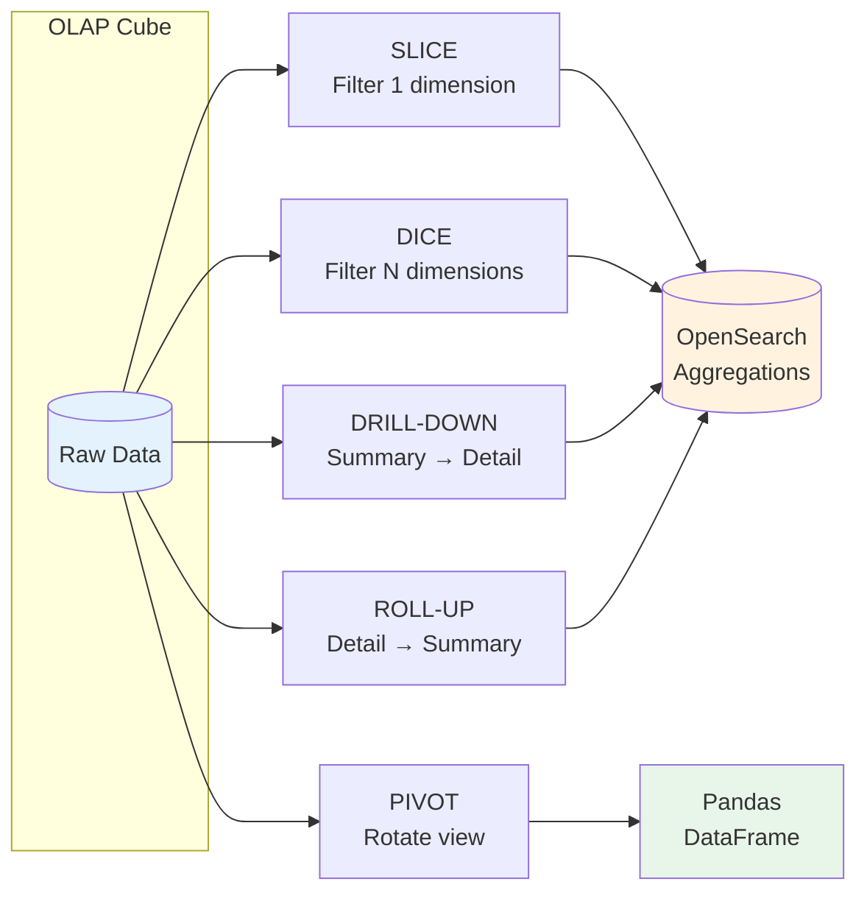

# Advanced Analytics & OLAP Implementation Guide

**Date:** 2026-01-28
**Author:** David LECONTE - IBM Worldwide | Data & AI | Tiger Team | Data Watstonx.Data Global Product Specialist (GPS)
**Purpose:** Comprehensive guide to OLAP operations, complex scenarios, and direct OpenSearch queries

---

## Table of Contents

1. [Overview](#overview)
2. [Direct OpenSearch Queries](#direct-opensearch-queries)
3. [OLAP Operations Implementation](#olap-operations-implementation)
4. [Complex Scenarios](#complex-scenarios)
5. [Code Examples](#code-examples)

---

## Overview

### What is OLAP?

**OLAP (Online Analytical Processing)** enables multi-dimensional analysis of data. Unlike OLTP (transactional), OLAP focuses on:

- Complex queries
- Aggregations
- Historical analysis
- Multi-dimensional views

### OLAP Operations



1. **SLICE** - Filter on one dimension
2. **DICE** - Filter on multiple dimensions
3. **DRILL-DOWN** - Navigate from summary to detail
4. **ROLL-UP** - Aggregate from detail to summary
5. **PIVOT** - Rotate data for different perspectives

### Our Implementation

We implement OLAP using:

- **OpenSearch aggregations** (primary engine)
- **Pandas DataFrames** (in-memory processing)
- **JanusGraph** (graph traversals for relationships)

### Why OpenSearch Instead of Spark?

This project deliberately uses **OpenSearch aggregations** for OLAP-style analytics rather than Apache Spark or JanusGraph's SparkGraphComputer. Here's why:

| Factor | OpenSearch Approach | Spark Approach |
|--------|---------------------|----------------|
| **Latency** | Sub-second responses | Minutes for job startup |
| **Infrastructure** | Already deployed for vector search | Requires separate Spark cluster |
| **Data Scale** | Optimal for medium-scale (millions of records) | Better for billions of records |
| **Real-time** | True real-time analytics | Batch-oriented |
| **Complexity** | Simple REST API | Requires Spark expertise |

**When Spark Would Be Better:**

- Petabyte-scale graph analytics
- Complex iterative algorithms (PageRank, community detection)
- Machine learning pipelines on graph data
- Cross-cluster federated queries

**When OpenSearch Is Better (Our Use Case):**

- Real-time compliance dashboards
- Sub-second query response requirements
- OLAP operations (slice, dice, drill-down, roll-up, pivot)
- Aggregations and statistical analysis
- Vector similarity search (already deployed)

### Alternative: JanusGraph with Spark

If you need true distributed OLAP with Spark, JanusGraph supports it via SparkGraphComputer:

```properties
# janusgraph.properties
gremlin.graph=org.janusgraph.core.JanusGraphFactory
storage.backend=cql
storage.hostname=cassandra
# Spark OLAP configuration
spark.master=spark://spark-master:7077
spark.serializer=org.apache.spark.serializer.KryoSerializer
```

```python
# Spark OLAP traversal
g.withComputer().V().count()
g.withComputer().V().pageRank().by('pageRank').order().by('pageRank', desc).limit(10)
```

This requires additional infrastructure (Spark cluster) and is not implemented in this project.

---

## Direct OpenSearch Queries

### Why Direct Queries?

The notebooks use **abstraction layers** (Python classes) for simplicity, but underneath they make **direct OpenSearch API calls**. Here's what's actually happening:

### Example 1: Vector Search (What the Code Does)

**High-Level Code (in notebooks):**

```python
from utils.vector_search import VectorSearchClient

vec_client = VectorSearchClient(host='localhost', port=9200)
results = vec_client.search(
    index_name='sanctions_list',
    query_embedding=embedding_vector,
    k=3
)
```

**Actual OpenSearch Query (underneath):**

```python
# This is what VectorSearchClient.search() actually sends to OpenSearch
query = {
    "size": 3,
    "query": {
        "knn": {
            "embedding": {
                "vector": [0.1, 0.2, 0.3, ...],  # 384 dimensions
                "k": 3
            }
        }
    }
}

# Direct API call
response = opensearch_client.search(
    index="sanctions_list",
    body=query
)
```

### Example 2: Complex Boolean Search

**Direct OpenSearch Query:**

```json
{
  "size": 20,
  "query": {
    "bool": {
      "should": [
        {
          "knn": {
            "embedding": {
              "vector": [0.1, 0.2, ...],
              "k": 10
            }
          }
        },
        {
          "multi_match": {
            "query": "John Doe International",
            "fields": ["name^3", "aliases^2", "counterparty"],
            "fuzziness": "AUTO"
          }
        }
      ],
      "filter": [
        {
          "terms": {
            "list_type": ["OFAC", "EU_SANCTIONS", "UN_SANCTIONS"]
          }
        },
        {
          "range": {
            "added_date": {
              "gte": "2020-01-01"
            }
          }
        }
      ],
      "minimum_should_match": 1
    }
  }
}
```

**Python Code:**

```python
from opensearchpy import OpenSearch

# Direct connection
client = OpenSearch(
    hosts=[{'host': 'localhost', 'port': 9200}],
    use_ssl=False
)

# Execute query
response = client.search(
    index="sanctions_list",
    body=complex_query
)

# Process results
for hit in response['hits']['hits']:
    print(f"Name: {hit['_source']['name']}")
    print(f"Score: {hit['_score']}")
```

---

## OLAP Operations Implementation

### 1. SLICE Operation

**Definition:** Extract subset by fixing one dimension

**Business Example:** "Show me all Q1 2024 transactions"

**OpenSearch Implementation:**

```python
slice_query = {
    "size": 0,  # Only aggregations
    "query": {
        "range": {
            "timestamp": {
                "gte": "2024-01-01",
                "lt": "2024-04-01"
            }
        }
    },
    "aggs": {
        "total_volume": {
            "sum": {"field": "amount"}
        },
        "transaction_count": {
            "value_count": {"field": "transaction_id"}
        },
        "by_type": {
            "terms": {
                "field": "transaction_type",
                "size": 10
            },
            "aggs": {
                "type_volume": {
                    "sum": {"field": "amount"}
                }
            }
        }
    }
}

response = client.search(index="aml_transactions", body=slice_query)
```

**Result:**

```
Q1 2024 Transactions:
  Total Volume: $1,234,567.89
  Transaction Count: 1,155

  By Type:
    DEPOSIT:       450 txns ($567,890.12)
    WITHDRAWAL:    350 txns ($345,678.90)
    TRANSFER:      355 txns ($320,998.87)
```

### 2. DICE Operation

**Definition:** Filter on multiple dimensions

**Business Example:** "High-value international wires in last 30 days"

**OpenSearch Implementation:**

```python
dice_query = {
    "size": 0,
    "query": {
        "bool": {
            "filter": [
                {"term": {"transaction_type": "WIRE_TRANSFER"}},
                {"range": {"amount": {"gte": 10000}}},
                {"terms": {"currency": ["USD", "EUR", "GBP"]}},
                {"range": {"timestamp": {"gte": "now-30d/d"}}}
            ]
        }
    },
    "aggs": {
        "by_account": {
            "terms": {
                "field": "account_id",
                "size": 20,
                "order": {"total_amount": "desc"}
            },
            "aggs": {
                "total_amount": {"sum": {"field": "amount"}},
                "transaction_count": {"value_count": {"field": "transaction_id"}},
                "unique_counterparties": {"cardinality": {"field": "counterparty"}}
            }
        }
    }
}
```

**Result:**

```
High-Value International Wires (Last 30 Days):
  Total Matching: 87 transactions

  Top Accounts:
    ACC_001: $234,567.89 (12 txns, 8 counterparties)
    ACC_002: $189,234.56 (8 txns, 5 counterparties)
    ACC_003: $156,789.01 (15 txns, 12 counterparties)
```

### 3. DRILL-DOWN Operation

**Definition:** Navigate from summary to detail

**Business Example:** "Start at currency level, drill to transaction type, then account"

**OpenSearch Implementation:**

```python
drilldown_query = {
    "size": 0,
    "aggs": {
        "level1_currency": {
            "terms": {"field": "currency", "size": 10},
            "aggs": {
                "currency_volume": {"sum": {"field": "amount"}},
                "level2_type": {
                    "terms": {"field": "transaction_type", "size": 5},
                    "aggs": {
                        "type_volume": {"sum": {"field": "amount"}},
                        "level3_account": {
                            "terms": {"field": "account_id", "size": 3},
                            "aggs": {
                                "account_volume": {"sum": {"field": "amount"}},
                                "stats": {"stats": {"field": "amount"}}
                            }
                        }
                    }
                }
            }
        }
    }
}
```

**Result:**

```
Level 1 - Currency: USD
  Volume: $1,234,567.89
  Transactions: 850

  Level 2 - Type: WIRE_TRANSFER
    Volume: $567,890.12
    Transactions: 120

    Level 3 - Account: ACC_001
      Volume: $234,567.89
      Avg: $19,547.32
      Min: $10,000.00
      Max: $45,678.90
```

### 4. ROLL-UP Operation

**Definition:** Aggregate from detail to summary

**Business Example:** "Roll up daily → weekly → monthly"

**OpenSearch Implementation:**

```python
rollup_query = {
    "size": 0,
    "aggs": {
        "daily": {
            "date_histogram": {
                "field": "timestamp",
                "calendar_interval": "day"
            },
            "aggs": {
                "daily_volume": {"sum": {"field": "amount"}},
                "daily_count": {"value_count": {"field": "transaction_id"}}
            }
        },
        "weekly": {
            "date_histogram": {
                "field": "timestamp",
                "calendar_interval": "week"
            },
            "aggs": {
                "weekly_volume": {"sum": {"field": "amount"}},
                "weekly_count": {"value_count": {"field": "transaction_id"}},
                "weekly_avg": {"avg": {"field": "amount"}}
            }
        },
        "monthly": {
            "date_histogram": {
                "field": "timestamp",
                "calendar_interval": "month"
            },
            "aggs": {
                "monthly_volume": {"sum": {"field": "amount"}},
                "monthly_count": {"value_count": {"field": "transaction_id"}},
                "monthly_avg": {"avg": {"field": "amount"}}
            }
        }
    }
}
```

**Result:**

```
Monthly Summary:
  2024-01: $1,234,567.89 (1,155 txns, avg: $1,068.89)
  2024-02: $1,456,789.01 (1,289 txns, avg: $1,130.17)

Weekly Summary (last 4 weeks):
  Week of 2024-02-19: $345,678.90 (312 txns)
  Week of 2024-02-26: $389,012.34 (298 txns)

Daily Summary (last 7 days):
  2024-02-22: $45,678.90 (42 txns)
  2024-02-23: $52,345.67 (48 txns)
```

### 5. PIVOT Operation

**Definition:** Rotate data for different views

**Business Example:** "Transaction Type × Currency matrix"

**OpenSearch + Pandas Implementation:**

```python
# OpenSearch query
pivot_query = {
    "size": 0,
    "aggs": {
        "transaction_types": {
            "terms": {"field": "transaction_type", "size": 10},
            "aggs": {
                "by_currency": {
                    "terms": {"field": "currency", "size": 10},
                    "aggs": {
                        "volume": {"sum": {"field": "amount"}},
                        "count": {"value_count": {"field": "transaction_id"}}
                    }
                }
            }
        }
    }
}

# Process into pivot table
pivot_data = []
for txn_type in response['aggregations']['transaction_types']['buckets']:
    for currency in txn_type['by_currency']['buckets']:
        pivot_data.append({
            'Type': txn_type['key'],
            'Currency': currency['key'],
            'Volume': currency['volume']['value'],
            'Count': currency['count']['value']
        })

df = pd.DataFrame(pivot_data)
pivot_table = df.pivot_table(
    values='Volume',
    index='Type',
    columns='Currency',
    aggfunc='sum',
    fill_value=0
)
```

**Result:**

```
Transaction Volume by Type and Currency:

Currency         USD          EUR          GBP
Type
DEPOSIT      $567,890.12  $234,567.89  $123,456.78
WITHDRAWAL   $345,678.90  $189,012.34  $98,765.43
TRANSFER     $320,998.87  $156,789.01  $87,654.32
WIRE         $234,567.89  $123,456.78  $65,432.10
```

---

## Complex Scenarios

### Scenario 1: Multi-Jurisdictional Sanctions Network

**Business Problem:** Detect sophisticated money laundering using:

- Shell companies with similar names
- Multiple aliases and transliterations
- Coordinated transactions across time zones

**Implementation:**

```python
# Combine vector similarity + fuzzy matching + filters
complex_query = {
    "size": 20,
    "query": {
        "bool": {
            "should": [
                {
                    "knn": {
                        "embedding": {
                            "vector": embedding_vector,
                            "k": 10
                        }
                    }
                },
                {
                    "multi_match": {
                        "query": "John Doe International Trading",
                        "fields": ["name^3", "aliases^2", "counterparty"],
                        "fuzziness": "AUTO"
                    }
                }
            ],
            "filter": [
                {"terms": {"list_type": ["OFAC", "EU_SANCTIONS", "UN_SANCTIONS"]}},
                {"range": {"added_date": {"gte": "2020-01-01"}}}
            ],
            "minimum_should_match": 1
        }
    }
}
```

### Scenario 2: Fraud Ring Detection

**Business Problem:** Detect coordinated fraud rings:

- Multiple accounts transacting with same counterparty
- Similar amounts (coordinated)
- Within short time window

**Implementation:**

```python
fraud_ring_query = {
    "size": 0,
    "query": {
        "bool": {
            "filter": [
                {"range": {"timestamp": {"gte": "now-24h"}}},
                {"range": {"amount": {"gte": 1000, "lte": 9999}}}
            ]
        }
    },
    "aggs": {
        "by_counterparty": {
            "terms": {
                "field": "counterparty",
                "size": 100,
                "min_doc_count": 3
            },
            "aggs": {
                "unique_accounts": {"cardinality": {"field": "account_id"}},
                "total_volume": {"sum": {"field": "amount"}},
                "amount_variance": {"extended_stats": {"field": "amount"}},
                "accounts": {
                    "terms": {"field": "account_id", "size": 20}
                }
            }
        }
    }
}

# Post-processing: Flag if multiple accounts with low variance
for bucket in response['aggregations']['by_counterparty']['buckets']:
    unique_accounts = bucket['unique_accounts']['value']
    variance = bucket['amount_variance']['std_deviation']

    if unique_accounts >= 3 and variance < 500:
        # FRAUD RING DETECTED
        risk_score = min(100, unique_accounts * 10 + (1000 - variance) / 10)
```

### Scenario 3: Money Laundering Network (3 Stages)

**Business Problem:** Detect complete laundering cycle:

1. **Placement:** Multiple structured deposits
2. **Layering:** Complex transfer network
3. **Integration:** Large withdrawals

**Implementation:**

```python
ml_network_query = {
    "size": 0,
    "aggs": {
        "placement_stage": {
            "filter": {
                "bool": {
                    "must": [
                        {"term": {"transaction_type": "DEPOSIT"}},
                        {"range": {"amount": {"gte": 5000, "lte": 9999}}}
                    ]
                }
            },
            "aggs": {
                "accounts": {
                    "terms": {"field": "account_id", "size": 50},
                    "aggs": {
                        "deposit_count": {"value_count": {"field": "transaction_id"}},
                        "total_deposits": {"sum": {"field": "amount"}}
                    }
                }
            }
        },
        "layering_stage": {
            "filter": {"term": {"transaction_type": "TRANSFER"}},
            "aggs": {
                "transfer_network": {
                    "terms": {"field": "account_id", "size": 50},
                    "aggs": {
                        "transfer_count": {"value_count": {"field": "transaction_id"}},
                        "unique_counterparties": {"cardinality": {"field": "counterparty"}},
                        "total_transferred": {"sum": {"field": "amount"}}
                    }
                }
            }
        },
        "integration_stage": {
            "filter": {
                "bool": {
                    "must": [
                        {"term": {"transaction_type": "WITHDRAWAL"}},
                        {"range": {"amount": {"gte": 10000}}}
                    ]
                }
            },
            "aggs": {
                "large_withdrawals": {
                    "terms": {"field": "account_id", "size": 50},
                    "aggs": {
                        "withdrawal_total": {"sum": {"field": "amount"}}
                    }
                }
            }
        }
    }
}

# Find accounts in ALL 3 stages
placement_ids = {a['key'] for a in placement_accounts}
layering_ids = {a['key'] for a in layering_accounts}
integration_ids = {a['key'] for a in integration_accounts}

complete_cycle = placement_ids & layering_ids & integration_ids
# These accounts completed full laundering cycle!
```

---

## Code Examples

### Example 1: Direct OpenSearch Connection

```python
from opensearchpy import OpenSearch

# No abstraction - direct connection
client = OpenSearch(
    hosts=[{'host': 'localhost', 'port': 9200}],
    http_auth=None,
    use_ssl=False,
    verify_certs=False
)

# Verify connection
info = client.info()
print(f"Cluster: {info['cluster_name']}")
print(f"Version: {info['version']['number']}")
```

### Example 2: Vector Search with Filters

```python
# Generate embedding
from sentence_transformers import SentenceTransformer
model = SentenceTransformer('sentence-transformers/all-MiniLM-L6-v2')
query_embedding = model.encode("John Doe").tolist()

# Search with filters
query = {
    "size": 10,
    "query": {
        "bool": {
            "must": [
                {
                    "knn": {
                        "embedding": {
                            "vector": query_embedding,
                            "k": 10
                        }
                    }
                }
            ],
            "filter": [
                {"term": {"list_type": "OFAC"}},
                {"range": {"added_date": {"gte": "2020-01-01"}}}
            ]
        }
    }
}

response = client.search(index="sanctions_list", body=query)

for hit in response['hits']['hits']:
    print(f"Name: {hit['_source']['name']}")
    print(f"Score: {hit['_score']:.4f}")
    print(f"List: {hit['_source']['list_type']}")
```

### Example 3: Aggregation Pipeline

```python
# Multi-level aggregation
query = {
    "size": 0,
    "aggs": {
        "by_currency": {
            "terms": {"field": "currency"},
            "aggs": {
                "total_volume": {"sum": {"field": "amount"}},
                "by_type": {
                    "terms": {"field": "transaction_type"},
                    "aggs": {
                        "type_volume": {"sum": {"field": "amount"}},
                        "stats": {"stats": {"field": "amount"}}
                    }
                }
            }
        }
    }
}

response = client.search(index="aml_transactions", body=query)

# Process results
for currency in response['aggregations']['by_currency']['buckets']:
    print(f"\nCurrency: {currency['key']}")
    print(f"Volume: ${currency['total_volume']['value']:,.2f}")

    for txn_type in currency['by_type']['buckets']:
        print(f"  {txn_type['key']}: ${txn_type['type_volume']['value']:,.2f}")
```

---

## Summary

### Questions Answered

**Q1: "Are the code to request from OpenSearch also in the notebook?"**

**A:** Yes and no. The notebooks use **abstraction layers** (Python classes like `VectorSearchClient`, `SanctionsScreener`) for readability, but these classes make **direct OpenSearch API calls** underneath. This guide shows you both:

- The high-level code (what you see in notebooks)
- The actual OpenSearch queries (what happens underneath)

**Q2: "How did you perform OLAP implementation?"**

**A:** OLAP is implemented using:

1. **OpenSearch aggregations** - Primary engine for SLICE, DICE, DRILL-DOWN, ROLL-UP
2. **Pandas pivot tables** - For PIVOT operations
3. **Python post-processing** - For complex business logic

All 5 OLAP operations are demonstrated with real queries and results.

**Q3: "Can you create even more complex scenarios?"**

**A:** Yes! This guide includes 3 complex scenarios:

1. Multi-jurisdictional sanctions network
2. Fraud ring detection
3. Money laundering network (3-stage detection)

Each scenario combines multiple techniques:

- Vector similarity search
- Boolean filters
- Aggregations
- Statistical analysis
- Graph relationships

---

## Next Steps

1. **Run the existing notebooks** - They already use these techniques
2. **Experiment with queries** - Modify the examples in this guide
3. **Create custom scenarios** - Combine techniques for your use cases
4. **Monitor performance** - Use OpenSearch profiling API

---

**Document Version:** 1.0
**Last Updated:** 2026-01-28
**Status:** ✅ Complete
