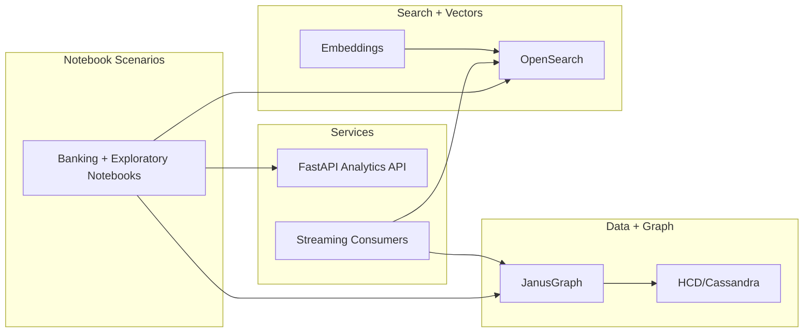

# Notebook Scenarios Summary: Business + Technical View

**Date:** 2026-03-26  
**Status:** Active  
**Scope:** Business perspective, high-level technical implementation, expected outputs/results, and visualization expectations for validated notebook scenarios.

---

## Executive Summary

The notebook suite demonstrates an end-to-end banking compliance and risk analytics platform spanning sanctions screening, AML/fraud detection, UBO ownership analysis, streaming, API integration, temporal analytics, entity resolution, and graph ML.

Validated run reference:
- `exports/demo-20260326T182810Z/notebook_run_report.tsv`
- Result: **19/19 PASS**, **0 error cells**

---

## Scenario Architecture (High Level)



---

## Scenario Matrix (Business + Technical + Outputs)

## A) Banking Demo Notebooks (01–15)

| # | Notebook | Business Perspective | Technical Implementation (High Level) | Expected Outputs / Results | Expected Visualizations |
|---|---|---|---|---|---|
| 01 | Sanctions Screening | Reduce sanctions exposure (OFAC/EU/UN), improve match quality | Vector embeddings + similarity search in OpenSearch, optional graph-based relationship context in JanusGraph | Candidate matches ranked by score; high-risk entities flagged for review | Similarity score bars, top-match table, optional relationship subgraph |
| 02 | AML Structuring Detection | Detect smurfing/CTR avoidance patterns | Temporal transaction windows, threshold/cluster logic, graph traversals over account/person links | Alerts for repeated near-threshold deposits and suspicious flow sequences | Time-series amount chart, flagged-cluster table, account network |
| 03 | Fraud Detection | Identify anomalous/fraud-like transaction behavior | Pattern rules + graph neighborhood analysis + anomaly scoring | Fraud candidates with risk scores and supporting indicators | Risk score histogram, suspicious path/network view |
| 04 | Customer 360 View | Unified KYC profile and relationship intelligence | Multi-hop traversal around customer entities; profile aggregation across persons/accounts/companies | Consolidated profile card with linked entities and risk markers | 360 entity graph, summary KPI cards |
| 05 | Advanced Analytics OLAP | Compliance intelligence and operational BI | Aggregations over graph-derived/ indexed data (slice/dice/drill) | Segment-level metrics (counts, amounts, trends) for reporting | Drill-down pivots, grouped bars, trend lines |
| 06 | TBML Detection | Detect trade-based laundering/carousel behavior | Trade-graph loops, price/volume deviation checks, suspicious counterparties | Flagged trade loops and outlier pricing pathways | Trade loop diagrams, deviation scatter/box plots |
| 07 | Insider Trading Detection | Detect coordinated trading + communication patterns | Correlation of trade timing with communication graph/text signals | Potential insider clusters with confidence indicators | Timeline overlays (communications vs trades), coordination network |
| 08 | UBO Discovery | Meet beneficial ownership transparency requirements | Ownership-chain traversal + effective ownership roll-up calculations | UBO chain outputs with final effective ownership percentages | Ownership DAG/tree, stacked ownership percentages |
| 09 | Community Detection | Identify collusive/fraud communities | Graph clustering/community algorithms + centrality indicators | Community IDs, sizes, high-centrality nodes | Community-colored network graph, community size chart |
| 10 | Integrated Architecture | Demonstrate end-to-end multi-service workflow | Orchestrated calls across JanusGraph + OpenSearch + API + runtime checks | Cross-service workflow proof, latency/step health checkpoints | Service interaction flow diagram, stage timing chart |
| 11 | Streaming Pipeline | Near-real-time analytics and event-driven updates | Pulsar/stream consumers loading graph + index in synchronized flow | Event ingestion stats, sync verification, pipeline throughput indicators | Throughput over time, ingestion lag chart |
| 12 | API Integration | Productize analytics through service endpoints | REST calls to analytics API, response validation, batch request patterns | API response payloads for key analytics scenarios | Endpoint response tables, latency/response-size summaries |
| 13 | Time Travel Queries | Historical investigation and point-in-time auditability | Temporal filters/versioned views over graph entities and relationships | Point-in-time entity state and historical relationship snapshots | Temporal evolution timeline, before/after state views |
| 14 | Entity Resolution | Improve data quality by linking duplicates/aliases | Fuzzy matching + graph context + confidence scoring | Candidate merges/resolution suggestions with confidence and rationale | Match confidence distribution, candidate-pair table |
| 15 | Graph Embeddings ML | Feature engineering for risk/fraud models | Embedding generation from graph structure + downstream ML readiness checks | Embedding vectors, neighbor similarity quality, model feature readiness | 2D embedding projection (UMAP/t-SNE), nearest-neighbor panels |

---

## B) Exploratory Notebooks (01–04)

| Notebook | Business Value | Technical Focus | Expected Outputs | Expected Visualizations |
|---|---|---|---|---|
| 01_quickstart | Faster analyst onboarding | Core connectivity + basic graph queries | Basic counts, example traversals, sanity checks | Minimal KPI/count cards |
| 02_janusgraph_complete_guide | Team enablement on graph query patterns | End-to-end Gremlin patterns and practical recipes | Query examples, traversal outputs, performance hints | Query result tables, optional traversal subgraphs |
| 03_advanced_queries | Deep-dive investigations | Advanced traversals/filtering/path queries | Rich path outputs, scoped neighborhoods | Multi-hop path diagrams |
| 04_AML_Structuring_Analysis | Reinforced AML analyst playbook | Structuring logic walkthrough + interpretation | Flagged structuring examples + investigation notes | Time-window charts + suspicious account views |

---

## Expected Release-Gate Outcome for Notebook Scenarios

Minimum acceptable output for deterministic acceptance:

- All required notebooks execute successfully (`PASS`)
- `error_cells = 0` for each notebook
- Scenario artifacts/reports are generated consistently
- Result semantics align with scenario intent (e.g., risk flags, ownership chains, clustering outputs)
- Cross-service scenarios show healthy integration behavior (where applicable)

Reference:
- `docs/operations/determinism-acceptance-criteria-checklist.md`

---

## Expected Output Schema (Notebook Run Report)

```text
notebook | status | exit_code | timestamp | duration_s | error_cells | log
```

Expected values per validated scenario:
- `status = PASS`
- `exit_code = 0`
- `error_cells = 0`

---

## Visualization Style Guidance (for stakeholder-readability)

Recommended default outputs per scenario:
1. **Risk scenarios** (sanctions/AML/fraud): ranked tables + score distributions + explainability snippets
2. **Network scenarios** (UBO/community/insider): graph view with highlighted nodes/edges and legend
3. **Temporal scenarios** (time-travel/streaming): timeline + trend/lag chart
4. **Model scenarios** (embeddings/entity resolution): confidence distributions + projection plots

Dashboard-ready visual bundle per scenario:
- One KPI panel
- One ranked evidence table
- One primary chart/graph
- One traceability section (query/filter context)

---

## Notes

- This summary is intentionally high-level and business-facing while retaining implementation orientation for technical reviewers.
- For deterministic release governance, pair this document with:
  - `docs/operations/determinism-acceptance-criteria-checklist.md`
  - `docs/operations/deterministic-behavior-expected-outputs.md`
