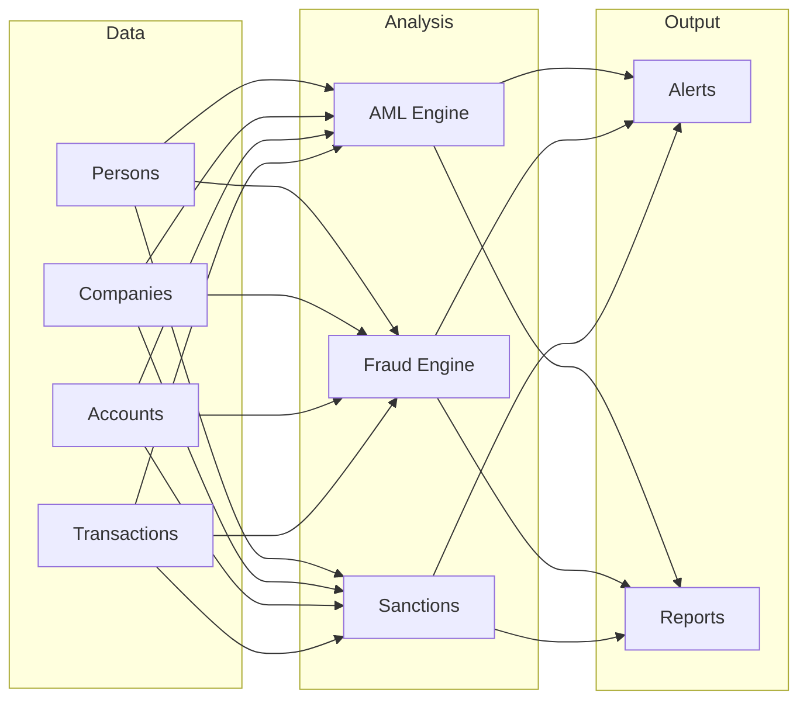

# Banking Platform Overview

**Author:** David Leconte, IBM Worldwide | Tiger-Team, Watsonx.Data Global Product Specialist (GPS)  
**Contact:** +33614126117

## Purpose

Enterprise banking compliance and fraud detection platform leveraging graph analytics.

## Capabilities

| Capability | Description | Documentation |
|------------|-------------|---------------|
| AML Detection | Anti-money laundering patterns | [AML Guide](aml-detection.md) |
| Fraud Detection | Transaction fraud analysis | [Fraud Guide](fraud-detection.md) |
| Sanctions Screening | Entity screening | Notebook 01 |
| Insider Trading | Trading pattern detection | Notebook 07 |
| UBO Discovery | Ultimate beneficial owner | Notebook 08 |

## Architecture



## Quick Start

```python
from banking.data_generators.orchestration import MasterOrchestrator

orchestrator = MasterOrchestrator(seed=42)
data = orchestrator.generate_all()
```

See [User Guide](user-guide.md) for detailed usage.
