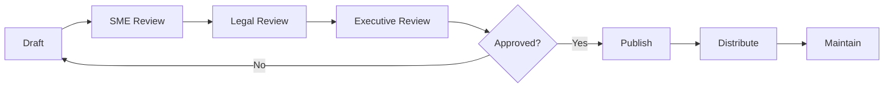

# Business Documentation Master Plan
# HCD + JanusGraph Banking Compliance Platform

**Date:** 2026-02-19  
**Version:** 1.0  
**Status:** Planning  
**Owner:** David LECONTE - IBM Worldwide | Data & AI | Tiger Team

---

## Executive Summary

This master plan defines a comprehensive business documentation strategy for the HCD + JanusGraph Banking Compliance Platform, addressing the needs of business owners, executives, compliance officers, and strategic decision-makers.

### Documentation Objectives

1. **Enable Business Decision-Making**: Provide executives with clear ROI, TCO, and business value metrics
2. **Ensure Regulatory Compliance**: Document compliance with GDPR, SOC 2, BSA/AML, PCI DSS
3. **Support Sales & Marketing**: Create compelling business cases and competitive positioning
4. **Facilitate Stakeholder Communication**: Provide clear, accessible documentation for non-technical audiences
5. **Drive Adoption**: Create user-friendly guides for business users and analysts

### Target Audiences

| Audience | Primary Needs | Priority |
|----------|--------------|----------|
| **C-Suite Executives** | ROI, strategic value, risk mitigation | P0 (Critical) |
| **Compliance Officers** | Regulatory compliance, audit trails | P0 (Critical) |
| **Financial Controllers** | TCO, budget planning, cost optimization | P1 (High) |
| **Business Analysts** | Use cases, capabilities, workflows | P1 (High) |
| **Product Managers** | Roadmap, competitive analysis | P2 (Medium) |
| **Sales Teams** | Business cases, value propositions | P2 (Medium) |

---

## Documentation Portfolio: 10 Categories

### Category 1: Executive Documentation

#### 1.1 Executive Summary (One-Pager)
- **Target**: CEO, CFO, CTO, Board Members
- **Format**: 1-page PDF, PowerPoint slide
- **Timeline**: Week 1 (P0)
- **Content**:
  - Platform overview (2 sentences)
  - Business value proposition (3 bullets)
  - Key capabilities (4 bullets)
  - Competitive advantages (3 bullets)
  - Investment summary (ROI 300-500%, payback 12-18 months)
  - Next steps

#### 1.2 Comprehensive Business Case
- **Target**: CFO, Finance Committee
- **Format**: 15-20 page document, Executive presentation
- **Timeline**: Week 2-3 (P0)
- **Content**:
  - Business problem statement
  - Proposed solution
  - Financial analysis (TCO, benefits, ROI)
  - Risk analysis
  - Alternatives considered
  - Implementation roadmap
  - Success metrics and KPIs
  - Recommendation

#### 1.3 Business Value Metrics Dashboard
- **Target**: Executives, Business Owners
- **Format**: Interactive Grafana dashboard, Monthly PDF
- **Timeline**: Week 4-5 (P1)
- **Metrics**:
  - Financial: ROI, cost savings, revenue impact
  - Compliance: Audit pass rate, violations detected
  - Operational: Detection rate, processing time
  - User adoption: Active users, satisfaction scores

---

### Category 2: Compliance & Regulatory Documentation

#### 2.1 Compliance Certifications Portfolio
- **Target**: Compliance Officers, Auditors, Regulators
- **Format**: Document repository (PDF), Compliance portal
- **Timeline**: Week 3-4 (P0)
- **Content**:
  - GDPR compliance (DPIA, Article 30, data subject rights)
  - SOC 2 Type II (system description, controls, audit report)
  - BSA/AML (AML program, CDD/EDD, SAR/CTR processes)
  - PCI DSS (SAQ, AOC, network segmentation)
  - ISO certifications (27001, 27017, 27018)

#### 2.2 Risk Management Framework
- **Target**: CRO, Risk Committee
- **Format**: 30-40 page document, Risk register
- **Timeline**: Week 4-5 (P0)
- **Content**:
  - Risk identification and categorization
  - Risk assessment methodology
  - Risk mitigation strategies
  - Risk monitoring and KRIs
  - Incident management
  - Business continuity and DR

#### 2.3 Data Governance Framework
- **Target**: Chief Data Officer, Data Stewards
- **Format**: 25-35 page document, Policy portal
- **Timeline**: Week 5-6 (P1)
- **Content**:
  - Data governance organization
  - Data quality management
  - Data privacy and protection
  - Data security controls
  - Data lifecycle management
  - Compliance and audit

---

### Category 3: Financial Documentation

#### 3.1 Total Cost of Ownership (TCO) Analysis
- **Target**: CFO, Finance Controllers
- **Format**: Excel workbook, 10-page summary
- **Timeline**: Week 2-3 (P1)
- **3-Year TCO**: $1,381,000
  - Initial investment: $352,000
  - Annual operating costs: $343,000/year
  - Cost breakdown: Software (40%), Personnel (46%), Services (20%)

#### 3.2 Return on Investment (ROI) Calculator
- **Target**: CFO, Business Case Owners
- **Format**: Excel workbook, Web calculator
- **Timeline**: Week 3-4 (P1)
- **Base Case Results**:
  - Annual benefits: $3,810,000
  - NPV: $8,276,000
  - IRR: 985%
  - Payback: 1.2 months
  - 3-year ROI: 599%

#### 3.3 Budget Planning and Forecasting
- **Target**: Budget Managers, Program Managers
- **Format**: Excel workbook, 15-page guide
- **Timeline**: Week 4-5 (P2)
- **Content**:
  - Annual budget template
  - Multi-year forecast (3-5 years)
  - Budget allocation by function
  - Budget tracking and reporting
  - Cost control measures

---

### Category 4: Operational Documentation

#### 4.1 Service Level Agreement (SLA)
- **Target**: Business Owners, Operations Managers
- **Format**: 20-25 page document, SLA dashboard
- **Timeline**: Week 5-6 (P1)
- **Key SLAs**:
  - Availability: 99.9% uptime
  - API response time: <200ms (95th percentile)
  - Support response: 15 min (P1), 1 hour (P2)
  - RTO: 4 hours, RPO: 1 hour

#### 4.2 Capacity Planning Guide
- **Target**: Operations Managers, Capacity Planners
- **Format**: 25-30 page document, Excel model
- **Timeline**: Week 6-7 (P1)
- **Content**:
  - Current capacity baseline
  - Demand forecasting
  - Capacity requirements
  - Optimization opportunities
  - Monitoring and thresholds

#### 4.3 Business Continuity and DR Plan
- **Target**: CIO, BC/DR Managers
- **Format**: 40-50 page document, DR runbooks
- **Timeline**: Week 7-8 (P1)
- **Content**:
  - Business impact analysis
  - Recovery strategies
  - Disaster scenarios
  - DR procedures
  - Testing and validation

---

### Category 5: User-Facing Documentation

#### 5.1 Business User Guide
- **Target**: Business Analysts, Compliance Officers
- **Format**: 50-60 page guide, Interactive tutorials
- **Timeline**: Week 8-9 (P1)
- **Content**:
  - Platform overview for business users
  - Common use cases and workflows
  - Dashboard navigation
  - Report generation
  - Alert management
  - Best practices

#### 5.2 Dashboard and Reporting Guide
- **Target**: Business Analysts, Managers
- **Format**: 30-40 page guide, Video tutorials
- **Timeline**: Week 9-10 (P2)
- **Content**:
  - Dashboard overview
  - Key metrics and KPIs
  - Custom report creation
  - Data export and sharing
  - Scheduling and automation

#### 5.3 Training Materials
- **Target**: All business users
- **Format**: E-learning modules, Videos, Quick reference cards
- **Timeline**: Week 10-12 (P2)
- **Content**:
  - Getting started (30 min)
  - Core features (2 hours)
  - Advanced analytics (3 hours)
  - Compliance workflows (2 hours)
  - Certification program

---

### Category 6: Strategic Documentation

#### 6.1 Product Roadmap
- **Target**: Product Managers, Executives
- **Format**: Interactive roadmap, Quarterly presentations
- **Timeline**: Week 6-7 (P2)
- **Content**:
  - Current capabilities
  - Planned features (6-12 months)
  - Strategic initiatives (12-24 months)
  - Technology evolution
  - Market trends

#### 6.2 Competitive Analysis
- **Target**: Sales, Marketing, Product Management
- **Format**: 20-25 page document, Comparison matrix
- **Timeline**: Week 7-8 (P2)
- **Content**:
  - Market landscape
  - Competitor profiles
  - Feature comparison
  - Pricing comparison
  - Competitive advantages
  - Win/loss analysis

#### 6.3 Go-to-Market Strategy
- **Target**: Sales, Marketing, Business Development
- **Format**: 30-35 page document, Sales playbook
- **Timeline**: Week 8-9 (P2)
- **Content**:
  - Target market segments
  - Value propositions by segment
  - Sales messaging
  - Customer success stories
  - Objection handling
  - Pricing strategy

---

### Category 7: Vendor & Partnership Documentation

#### 7.1 Integration Capabilities Guide
- **Target**: Partners, System Integrators
- **Format**: 25-30 page document, API catalog
- **Timeline**: Week 9-10 (P3)
- **Content**:
  - Integration architecture
  - API documentation
  - Data exchange formats
  - Authentication and security
  - Integration patterns
  - Sample code

#### 7.2 Partnership Program Guide
- **Target**: Technology Partners, Resellers
- **Format**: 20-25 page document, Partner portal
- **Timeline**: Week 10-11 (P3)
- **Content**:
  - Partnership tiers and benefits
  - Technical requirements
  - Certification program
  - Co-marketing opportunities
  - Revenue sharing model

---

### Category 8: Governance Documentation

#### 8.1 Steering Committee Charter
- **Target**: Steering Committee, Executives
- **Format**: 10-15 page document
- **Timeline**: Week 4-5 (P1)
- **Content**:
  - Committee purpose and scope
  - Membership and roles
  - Meeting cadence
  - Decision-making authority
  - Escalation procedures

#### 8.2 Change Management Plan
- **Target**: Change Management Team, Stakeholders
- **Format**: 25-30 page document
- **Timeline**: Week 6-7 (P2)
- **Content**:
  - Change management strategy
  - Stakeholder analysis
  - Communication plan
  - Training plan
  - Resistance management
  - Success metrics

---

### Category 9: Customer Success Documentation

#### 9.1 Customer Success Stories
- **Target**: Sales, Marketing, Prospects
- **Format**: 2-3 page case studies (multiple)
- **Timeline**: Ongoing (P2)
- **Content per story**:
  - Customer profile
  - Business challenge
  - Solution implemented
  - Results achieved
  - Customer testimonial

#### 9.2 Best Practices Guide
- **Target**: Customers, Implementation Teams
- **Format**: 40-50 page guide
- **Timeline**: Week 11-12 (P2)
- **Content**:
  - Implementation best practices
  - Configuration recommendations
  - Performance optimization
  - Security hardening
  - Operational excellence

---

### Category 10: Industry-Specific Documentation

#### 10.1 Banking & Financial Services Guide
- **Target**: Banking executives, Compliance officers
- **Format**: 35-40 page guide
- **Timeline**: Week 8-9 (P1)
- **Content**:
  - Banking use cases (AML, fraud, insider trading, TBML, UBO)
  - Regulatory landscape (BSA/AML, OFAC, FinCEN)
  - Industry benchmarks
  - Implementation patterns
  - Success metrics

#### 10.2 Regulatory Compliance Mapping
- **Target**: Compliance officers, Auditors
- **Format**: 25-30 page document, Compliance matrix
- **Timeline**: Week 9-10 (P1)
- **Content**:
  - Regulation-to-control mapping
  - Evidence collection
  - Audit preparation
  - Reporting templates

---

## Implementation Plan

### Phase 1: Foundation (Weeks 1-4) - P0 Documents
**Priority**: Critical business decision-making and compliance

1. **Week 1**: Executive Summary (1.1)
2. **Week 2-3**: Business Case (1.2), TCO Analysis (3.1)
3. **Week 3-4**: Compliance Certifications (2.1), ROI Calculator (3.2)
4. **Week 4**: Steering Committee Charter (8.1)

**Deliverables**: 5 documents enabling investment decision and compliance baseline

### Phase 2: Operational Excellence (Weeks 5-8) - P1 Documents
**Priority**: Operational readiness and risk management

5. **Week 4-5**: Risk Management Framework (2.2), Business Value Dashboard (1.3)
6. **Week 5-6**: Data Governance (2.3), SLA Documentation (4.1)
7. **Week 6-7**: Capacity Planning (4.2), Product Roadmap (6.1)
8. **Week 7-8**: BC/DR Plan (4.3), Competitive Analysis (6.2)
9. **Week 8-9**: Business User Guide (5.1), Banking Guide (10.1)

**Deliverables**: 9 documents enabling operational excellence and strategic planning

### Phase 3: Market Enablement (Weeks 9-12) - P2 Documents
**Priority**: Sales enablement and user adoption

10. **Week 9-10**: Dashboard Guide (5.2), GTM Strategy (6.3), Integration Guide (7.1), Compliance Mapping (10.2)
11. **Week 10-11**: Partnership Program (7.2), Best Practices (9.2)
12. **Week 11-12**: Training Materials (5.3), Change Management (8.2)
13. **Ongoing**: Customer Success Stories (9.1)

**Deliverables**: 8 documents enabling market success and user adoption

---

## Data Sources and Metrics

### Technical Data Sources
- **Project Status**: [`docs/project-status.md`](../project-status.md)
- **Audit Results**: [`docs/implementation/audits/comprehensive-rigorous-audit-2026-02-19.md`](../implementation/audits/comprehensive-rigorous-audit-2026-02-19.md)
- **Use Cases**: [`docs/BANKING_USE_CASES_TECHNICAL_SPEC.md`](../BANKING_USE_CASES_TECHNICAL_SPEC.md)
- **Data Generators**: [`banking/data_generators/README.md`](../../banking/data_generators/README.md)
- **Monitoring**: Prometheus/Grafana metrics
- **Compliance**: Audit logs from [`banking/compliance/`](../../banking/compliance/)

### Business Metrics
- **Financial**: TCO, ROI, cost savings, revenue impact
- **Compliance**: Audit pass rate, violations detected, remediation time
- **Operational**: Detection rate, false positive rate, processing time
- **User Adoption**: Active users, feature utilization, satisfaction scores
- **Risk**: Fraud losses prevented, incidents detected, response time

---

## Documentation Standards

### Format Standards
- **Executive documents**: PowerPoint, 1-2 page PDFs
- **Detailed documents**: Word/PDF, 15-50 pages
- **Interactive content**: Grafana dashboards, web portals
- **Training**: E-learning modules, videos, quick reference cards

### Writing Guidelines
- **Audience-appropriate language**: No technical jargon for business audiences
- **Visual communication**: Use charts, diagrams, infographics
- **Actionable content**: Clear next steps and recommendations
- **Evidence-based**: Support claims with data and metrics
- **Consistent branding**: Use company templates and style guide

### Review and Approval Workflow

**Review Roles**:
- **Subject Matter Expert (SME)**: Technical accuracy
- **Legal**: Compliance and risk
- **Executive Sponsor**: Strategic alignment
- **Communications**: Clarity and messaging

---

## Maintenance Schedule

### Update Frequency by Document Type

| Document Type | Update Frequency | Owner |
|--------------|------------------|-------|
| Executive Summary | Quarterly | Product Management |
| Business Case | Annual | Finance |
| Dashboards | Real-time | Operations |
| Compliance Docs | Continuous | Compliance |
| Financial Docs | Quarterly | Finance |
| SLA | Quarterly | Operations |
| User Guides | Semi-annual | Product Management |
| Training | Annual | Training Team |
| Roadmap | Quarterly | Product Management |
| Case Studies | As needed | Marketing |

### Version Control
- **Major updates**: New version number (1.0 → 2.0)
- **Minor updates**: Increment decimal (1.0 → 1.1)
- **Document history**: Track all changes with dates and authors
- **Archive policy**: Retain previous versions for 3 years

---

## Success Metrics

### Documentation Quality Metrics
- **Completeness**: 100% of planned documents delivered
- **Timeliness**: 90% delivered on schedule
- **Accuracy**: <5% error rate in reviews
- **Usability**: >80% user satisfaction score

### Business Impact Metrics
- **Decision velocity**: 50% faster investment decisions
- **Compliance readiness**: 100% audit pass rate
- **User adoption**: 80% of target users trained
- **Sales effectiveness**: 30% increase in win rate

---

## Resource Requirements

### Team Composition
- **Documentation Lead**: 1 FTE (overall coordination)
- **Business Writers**: 2 FTE (content creation)
- **Technical Writers**: 1 FTE (technical accuracy)
- **Graphic Designers**: 0.5 FTE (visual content)
- **SME Contributors**: 5-10 people (part-time)

### Budget Estimate
- **Personnel**: $400,000 (12 weeks)
- **Tools and software**: $10,000
- **External reviews**: $20,000
- **Printing and distribution**: $5,000
- **Total**: $435,000

### Timeline
- **Phase 1 (P0)**: Weeks 1-4 (Critical path)
- **Phase 2 (P1)**: Weeks 5-8 (Operational readiness)
- **Phase 3 (P2)**: Weeks 9-12 (Market enablement)
- **Total duration**: 12 weeks

---

## Risk Management

### Documentation Risks

| Risk | Impact | Probability | Mitigation |
|------|--------|-------------|------------|
| Resource availability | High | Medium | Secure commitments early |
| SME availability | Medium | High | Schedule reviews in advance |
| Scope creep | Medium | Medium | Strict change control |
| Quality issues | High | Low | Multiple review cycles |
| Missed deadlines | Medium | Medium | Buffer time in schedule |

---

## Next Steps

### Immediate Actions (Week 1)
1. **Secure executive sponsorship** and budget approval
2. **Assemble documentation team** and assign roles
3. **Conduct stakeholder interviews** to validate requirements
4. **Create detailed project plan** with milestones
5. **Set up documentation infrastructure** (templates, tools, repositories)

### Week 2-4 Actions
6. **Begin Phase 1 documents** (Executive Summary, Business Case, TCO)
7. **Establish review workflows** and approval processes
8. **Create document templates** and style guides
9. **Schedule SME interviews** and data collection
10. **Set up metrics tracking** and reporting

---

## Appendices

### A. Document Templates
- Executive summary template
- Business case template
- User guide template
- Case study template

### B. Style Guide
- Writing guidelines
- Visual standards
- Branding requirements
- Accessibility standards

### C. Glossary
- Business terms
- Technical terms
- Acronyms and abbreviations

### D. References
- Industry standards
- Regulatory requirements
- Best practices
- Competitive intelligence

---

**Document Control**

| Field | Value |
|-------|-------|
| **Document ID** | BUS-DOC-PLAN-001 |
| **Version** | 1.0 |
| **Status** | Planning |
| **Owner** | David LECONTE |
| **Approved By** | [Pending] |
| **Approval Date** | [Pending] |
| **Next Review** | 2026-03-19 |

---

**End of Business Documentation Master Plan**
