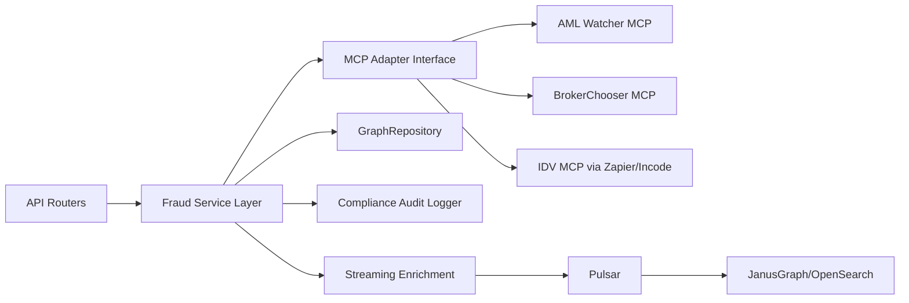

# MCP Fraud Pilot Plan for Retail and Corporate Banking

- Created: 2026-02-18
- Scope: Remote MCP servers specialized in fraud/AML-adjacent use cases
- Context: HCD + JanusGraph banking platform

## Candidate Summary and Subscription Signal

| Provider | Primary fit | Remote MCP | Subscription signal |
|---|---|---|---|
| AML Watcher | Sanctions/PEP/watchlists for onboarding and monitoring | Yes | Paid plans, trial/demo available |
| BrokerChooser ScamShield | Retail scam/broker/site risk checks | Yes | Base usage free with limits; paid/enterprise for scale |
| iDenfy via Zapier MCP | Identity/KYC actions for onboarding fraud reduction | Yes (via Zapier MCP) | Typically paid for production volume |
| Incode IDV | Identity verification and fraud prevention | MCP available | Commercial/enterprise model likely |
| AnChain AML | Crypto exposure AML screening | MCP-compatible | Free starter exists; MCP feature appears in paid tiers |

## Recommended Ranking

### Retail banking
1. AML Watcher
2. Incode IDV or iDenfy via Zapier MCP
3. BrokerChooser ScamShield

### Corporate banking
1. AML Watcher
2. AnChain AML (if crypto/cross-chain exposure exists)
3. Incode IDV for signatory/beneficial-owner checks

## Phase 1 (2 weeks): Free-first validation

### Objective
Validate operational fit and data contract compatibility with minimal spend.

### Stack
1. BrokerChooser ScamShield MCP (free base tier)
2. Optional Zapier MCP with low-volume iDenfy test account

### Implementation in this repo
1. Add provider adapters under `src/python/integrations/mcp/`:
   - `brokerchooser_client.py`
   - `zapier_idenfy_client.py`
2. Add a normalized risk schema in `src/python/api/models.py`:
   - `risk_source`
   - `risk_score`
   - `risk_reason_codes`
   - `decision_recommendation`
3. Add routing/service integration points:
   - Risk enrichment in `src/python/api/routers/fraud.py`
   - Event enrichment in `banking/streaming/graph_consumer.py`
4. Write contract tests:
   - `tests/unit/integrations/test_mcp_normalization.py`
   - `tests/integration/test_mcp_fraud_enrichment.py`
5. Store provider provenance for audit evidence:
   - Add fields in compliance log path via `banking/compliance/audit_logger.py`

### Exit criteria
1. End-to-end enrichment works for at least one retail flow.
2. Risk objects are normalized and reproducible in tests.
3. No deterministic pipeline regressions.

## Phase 2 (6 weeks): Paid production PoC

### Objective
Implement production-grade fraud/AML orchestration for retail and corporate flows.

### Stack
1. AML Watcher MCP as primary compliance intelligence source
2. Incode IDV or iDenfy for onboarding identity fraud controls
3. AnChain AML only if crypto-linked corporate exposure is in-scope

### Implementation workstreams
1. Reliability and governance:
   - Retry/backoff/circuit-breaker policy in MCP adapters
   - Provider SLA and timeout budgets
2. Security and compliance:
   - Secrets in Vault only
   - Full request/response audit trail with redaction
3. Risk decisioning:
   - Introduce policy thresholds by segment: retail vs corporate
   - Add reason-code mapping for explainability
4. Observability:
   - Metrics for latency, failures, fallback rates, provider availability
   - Alerting on fraud-enrichment degradation
5. CI/CD quality gates:
   - Contract tests against mocked provider fixtures
   - Negative-path tests for provider outages and malformed responses

### Exit criteria
1. Production PoC supports both retail and corporate onboarding/monitoring paths.
2. Fraud decisions are traceable with provider provenance and reason codes.
3. Performance and failure budgets are met under integration load tests.

## Target Architecture Mapping

## Delivery Estimate

| Phase | Duration | Team |
|---|---|---|
| Phase 1 | 2 weeks | 1 backend + 1 QA (part-time) |
| Phase 2 | 6 weeks | 2 backend + 1 QA + 0.5 DevOps + 0.5 security/compliance |

## Decision Gate After Phase 1

1. Proceed to paid PoC if:
2. Normalized risk schema remains stable across providers.
3. False-positive behavior is acceptable on historical replay samples.
4. Added latency per request remains within service SLO budget.

