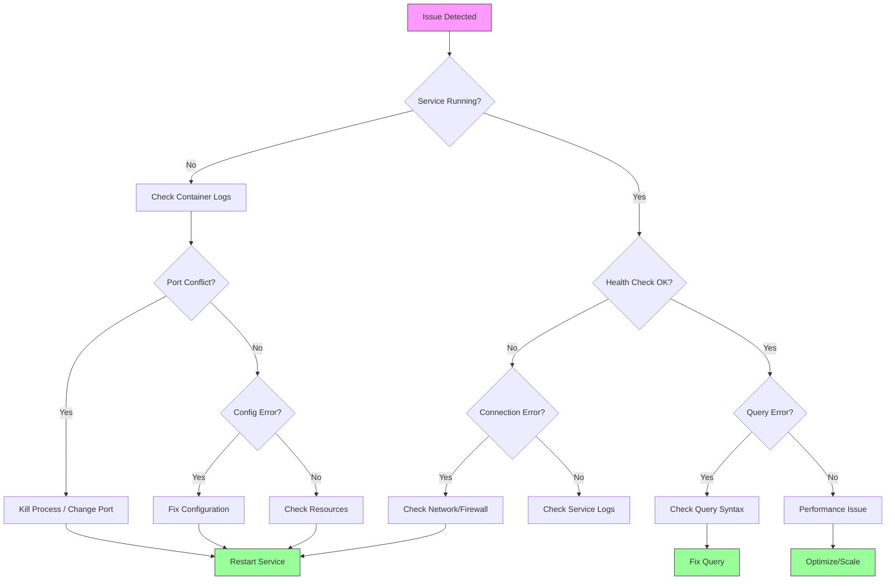

# Troubleshooting Guide

**File**: docs/TROUBLESHOOTING.md
**Created**: 2026-01-28T11:08:00.123
**Author**: David LECONTE - IBM Worldwide | Data & AI | Tiger Team | Data Watstonx.Data Global Product Specialist (GPS)

---

## Troubleshooting Flow



---

## Common Issues and Solutions

### Container Issues

#### Container Won't Start

**Symptoms**: Container exits immediately after starting

**Check**:

```bash
podman logs <container-name>
podman ps -a  # See exit codes
```

**Common causes**:

- Port already in use
- Insufficient resources
- Configuration error

**Solutions**:

```bash
# Check port usage
lsof -i :<port>

# Kill process using port
kill -9 <PID>

# Or change port in .env
vim .env

# Restart container
podman restart <container-name>
```

#### Container Keeps Restarting

**Symptoms**: Container restarts in loop

**Check health**:

```bash
podman inspect <container-name> | grep Health
```

**Common causes**:

- Health check failing
- Application crash
- Configuration issue

**Solutions**:

- Check logs for errors
- Verify configuration
- Increase startup timeout

---

### HCD Issues

#### HCD Won't Start

**Error**: "Unable to gossip with any seeds"

**Solution**:

```bash
# Check if port is available
lsof -i :7000

# Check logs
podman logs hcd-server

# Increase heap size in .env
HCD_HEAP_SIZE=8G

# Restart
podman restart hcd-server
```

#### HCD Not Ready (DN Status)

**Symptoms**: nodetool shows DN (Down/Normal)

**Check**:

```bash
podman exec hcd-server nodetool status
```

**Solution**:
Wait 60-90 seconds for initialization. If still down:

```bash
# Check logs for errors
podman logs hcd-server

# Restart
podman restart hcd-server
```

#### CQL Connection Refused

**Error**: "Connection refused on port 9042"

**Solution**:

```bash
# Verify HCD is running
podman ps | grep hcd

# Check if port is mapped correctly
podman port hcd-server

# Test connection
cqlsh localhost 19042
```

---

### JanusGraph Issues

#### Can't Connect to JanusGraph

**Error**: Connection refused on port 8182

**Check**:

```bash
curl http://localhost:18182
```

**Solutions**:

```bash
# Verify JanusGraph is running
podman ps | grep janusgraph

# Check if HCD is ready first
podman exec hcd-server nodetool status

# Restart JanusGraph
podman restart janusgraph-server
```

#### Schema Not Initialized

**Symptoms**: No vertex labels found

**Verify**:

```python
from gremlin_python.driver import client
gc = client.Client('ws://localhost:18182/gremlin', 'g')
labels = gc.submit('g.V().label().dedup()').all().result()
print(labels)
```

**Solution**:

```bash
python3 scripts/init/load_data.py
```

#### Slow Queries

**Symptoms**: Queries take >1 second

**Check indexes**:

```python
gc.submit('mgmt = graph.openManagement(); mgmt.printIndexes()').all().result()
```

**Solutions**:

- Add composite indexes for common queries
- Increase JanusGraph heap size
- Check HCD performance

---

### Jupyter Issues

#### Can't Access Jupyter

**Error**: 404 Not Found

**Solutions**:

```bash
# Check if running
podman ps | grep jupyter

# Get token
podman logs jupyter-lab | grep token

# Restart
podman restart jupyter-lab
```

#### Event Loop Error in Notebook

**Error**: "Cannot run the event loop while another loop is running"

**Solution**:
Add to first cell:

```python
import nest_asyncio
nest_asyncio.apply()
```

#### Kernel Dies

**Symptoms**: Kernel keeps crashing

**Solutions**:

- Increase container memory
- Check for memory leaks in code
- Restart Jupyter

---

### Network Issues

#### Services Can't Communicate

**Symptoms**: JanusGraph can't reach HCD

**Check**:

```bash
# Verify network exists
podman network ls

# Check container network
podman inspect janusgraph-server | grep Network

# Ping between containers
podman exec janusgraph-server ping hcd-server
```

**Solution**:

```bash
# Recreate network
podman network create hcd-janusgraph-network

# Restart containers
bash scripts/deployment/stop_full_stack.sh
bash scripts/deployment/deploy_full_stack.sh
```

#### Port Conflicts

**Error**: "Address already in use"

**Solution**:

```bash
# Find what's using port
lsof -i :18182

# Kill process
kill <PID>

# Or change port in .env
JANUSGRAPH_PORT=28182
```

---

### Performance Issues

#### High Memory Usage

**Check**:

```bash
podman stats
```

**Solutions**:

```bash
# Increase heap sizes in .env
HCD_HEAP_SIZE=8G
JANUSGRAPH_HEAP_SIZE=4G

# Add resource limits in compose configuration
deploy:
  resources:
    limits:
      memory: 8G
```

#### High CPU Usage

**Check**:

```bash
podman stats
top -o cpu
```

**Solutions**:

- Check for inefficient queries
- Add indexes
- Increase CPU limits

#### Disk Space Full

**Check**:

```bash
df -h
du -sh /var/lib/containers/
```

**Solutions**:

```bash
# Clean up old containers
podman system prune -a

# Clean up old images
podman image prune -a

# Clean up volumes (careful!)
podman volume prune
```

---

### Test Failures

#### Tests Won't Run

**Error**: "pytest: command not found"

**Solution**:

```bash
pip install -r requirements-dev.txt
```

#### Connection Tests Fail

**Verify services running**:

```bash
podman ps
```

**Check connectivity**:

```bash
curl http://localhost:18182
```

#### Data Tests Fail

**Symptoms**: Expected data not found

**Solution**:

```bash
# Reinitialize schema and data
python3 scripts/init/load_data.py
```

---

### Deployment Issues

#### Deploy Script Fails

**Check**:

```bash
# Verify Podman machine running
podman machine list

# Start if needed
podman machine start

# Check .env configuration
cat .env
```

#### Services Won't Stop

**Solution**:

```bash
# Force stop
podman stop -t 10 $(podman ps -q)

# Remove containers
podman rm -f $(podman ps -aq)
```

---

### Monitoring Issues

#### Prometheus Not Scraping Targets

**Check targets**: <http://localhost:9090/targets>

**Common issues**:

- Service not exposing metrics
- Network connectivity
- Incorrect service names in config

**Solution**:
Verify prometheus.yml configuration.

#### Grafana Shows No Data

**Check**:

- Prometheus datasource configured
- Time range correct
- Queries valid

**Solution**:
Verify datasource URL: <http://prometheus:9090>

---

## Pulsar Issues

### Check Pulsar Health

```bash
# Check if Pulsar is running
podman exec janusgraph-demo_pulsar_1 curl -s http://localhost:8080/admin/v2/clusters

# List topics
podman exec janusgraph-demo_pulsar-cli_1 bin/pulsar-admin topics list public/banking
```

### Pulsar Connection Timeout

**Symptoms**: `pulsar-client` Python library times out connecting to Pulsar

**Root Cause**: On macOS (especially Apple Silicon), Pulsar's advertised address resolution can return stale container IPs

**Solution**: The compose file includes `--advertised-address localhost` fix. If issues persist:

```bash
# Restart Pulsar container
podman restart janusgraph-demo_pulsar_1
```

### Debug Messages with Pulsar CLI

```bash
# Consume messages from a topic (for debugging)
podman exec janusgraph-demo_pulsar-cli_1 bin/pulsar-client consume \
  -s debug-subscription \
  persistent://public/banking/persons-events -n 5

# Check topic stats
podman exec janusgraph-demo_pulsar-cli_1 bin/pulsar-admin topics stats \
  persistent://public/banking/persons-events
```

---

## Notebook Issues

### UBO Discovery Notebook Timeout (Notebook 08)

**Symptoms**: Notebook 08 times out during automated execution (>300s)

**Root Cause**: Complex graph traversals in `find_ubos_for_company()` combined with Jupyter kernel module caching

**Solutions**:

1. **Run interactively**: Execute notebook manually in JupyterLab with longer cell timeout

   ```bash
   conda activate janusgraph-analysis
   jupyter lab banking/notebooks/08_UBO_Discovery_Demo.ipynb
   ```

2. **Reduce iterations**: Modify cells to analyze fewer companies (already optimized to 3)

3. **Skip indirect ownership**: Set `include_indirect=False` in `find_ubos_for_company()` calls

4. **Add graph indexes**: Improve performance with JanusGraph indexes:

   ```groovy
   mgmt = graph.openManagement()
   mgmt.buildIndex('byCompanyId', Vertex.class).addKey(mgmt.getPropertyKey('company_id')).buildCompositeIndex()
   mgmt.buildIndex('byPersonId', Vertex.class).addKey(mgmt.getPropertyKey('person_id')).buildCompositeIndex()
   mgmt.commit()
   ```

**Known Fixes Applied**:

- Fixed Python lambda serialization bug in `_find_direct_owners()`
- Optimized `find_shared_ubos()` with single aggregated Gremlin query
- Created `beneficial_owner` edges for testing

---

## Debug Commands

### System Info

```bash
# Podman version
podman --version

# Machine info
podman machine list
podman machine info

# Container info
podman ps
podman stats
```

### Network Debug

```bash
# List networks
podman network ls

# Inspect network
podman network inspect hcd-janusgraph-network

# Test connectivity
podman exec container1 ping container2
```

### Log Analysis

```bash
# Container logs
podman logs -f <container-name>

# Last 100 lines
podman logs --tail 100 <container-name>

# Follow logs for all containers
podman-compose logs -f
```

---

## Getting Help

### Documentation

- README.md - Project overview
- QUICKSTART.md - Essential commands
- docs/SETUP.md - Detailed setup
- docs/MONITORING.md - Monitoring guide
- docs/BACKUP.md - Backup procedures

### External Resources

- JanusGraph Docs: <https://docs.janusgraph.org/>
- HCD Docs: <https://docs.datastax.com/en/hcd/>
- Podman Docs: <https://docs.podman.io/>

### Support

- GitHub Issues: <https://github.com/davidleconte/hcd-janusgraph/issues>
- Email: <team@example.com>

---

**Signature**: David LECONTE - IBM Worldwide | Data & AI | Tiger Team | Data Watstonx.Data Global Product Specialist (GPS)
