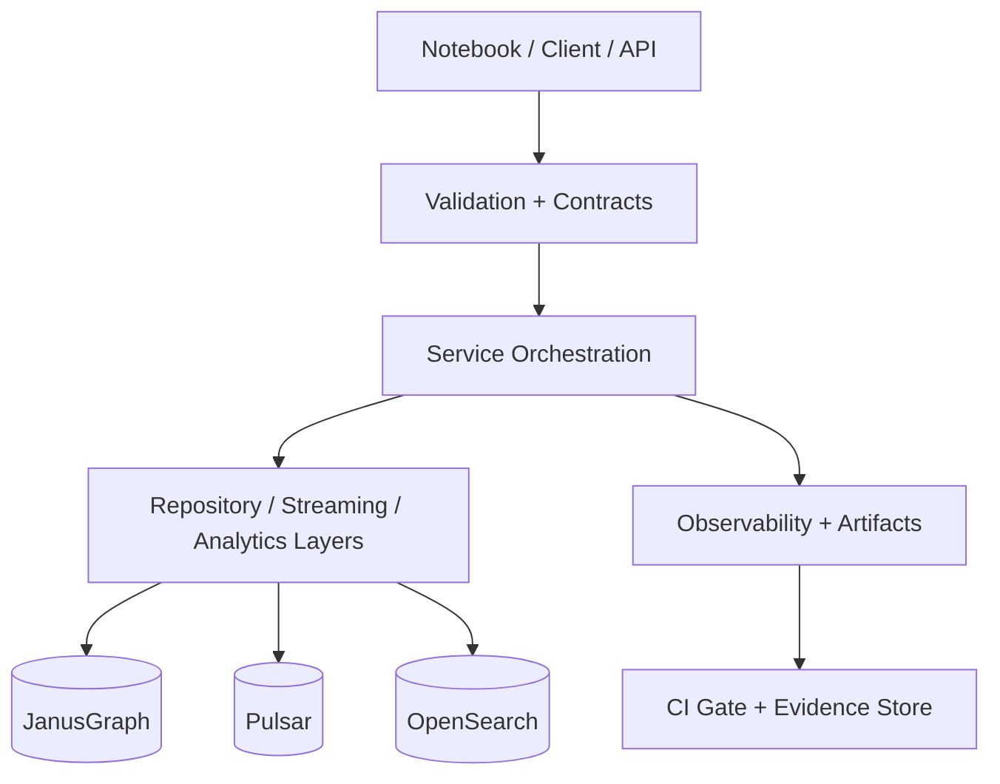

# Comprehensive Project Audit - 2026-02-16

**Date:** 2026-02-16  
**Scope:** Full codebase, documentation, architecture, CI/CD, operations scripts, security posture, and repeatable live pipeline  
**Auditor:** Claude Codex with repository evidence  
**Status:** Draft for implementation tracking (non-advisory; prioritized remediation below)

## Executive Summary

The repository is functionally advanced and close to a high-quality production demo system, with strong service orchestration, extensive notebooks, and substantial documentation/test scaffolding. The remaining blockers are primarily in quality-gate consistency and deterministic guarantees.

- **Overall Grade: B (84/100)**
- **Primary strengths:** modular code structure, robust service orchestration scripts, mature notebook execution and repeatability tooling, strong test surface breadth.
- **Primary risk:** inconsistent enforcement of quality/security contracts at key boundaries (startup, API parameter semantics, CI gating, deterministic behavior for streaming paths).

## Addendum — 2026-02-17 (Operational Remediation Closure)

This addendum captures post-audit remediation evidence executed on 2026-02-17.

### What was closed

- Deployment recovery on `podman-wxd` completed (active runtime path: `podman-wxd-root`).
- Vault restored to healthy state (initialized + unsealed).
- Analytics API startup chain fixed (dependency set + startup env contract).
- Live notebook proof run completed with full pass result.

### Evidence

- Final full notebook sweep report: `exports/live-notebooks-final-20260217T170000Z/notebook_run_report.tsv` (**15/15 PASS**).
- Detailed remediation artifact: `docs/implementation/audits/codex-podman-wxd-deployment-live-notebook-proof-remediation-log-2026-02-17.md`.
- Executive remediation status: `docs/implementation/audits/codex-podman-wxd-deployment-live-notebook-proof-executive-summary-2026-02-17.md`.

### Remaining strategic items from original audit

- CI hard-gate strictness remains an open improvement area (blocking semantics across all critical checks).
- Determinism posture is materially improved but not absolute without clean-reset orchestration for every run.

## Methodology and Evidence Inputs

- **Code and docs scanned:** entire repository `*.py`, workflow files, scripts, notebooks, documentation tree and run artifacts
- **Automation checks referenced:** pytest suite organization, notebook repeatability scripts, doc coverage report, deployment scripts, CI workflow configuration
- **Constraint handling:** all findings reference concrete files and observed behavior to minimize inferential claims

---

## Grade by Category

| Category | Grade | Score | Rationale |
|---|---|---:|---|
| Architecture and design | B | 84 | Good separation into domain modules and repository pattern, but some API boundary leakage and inconsistent orchestration assumptions remain. |
| Maintainability | B | 82 | Clear service boundaries and test organization; technical debt accumulates in TODO/FIXME areas and broad exception handling. |
| Readability | B+ | 87 | Consistent naming and module structure, but several long service scripts mix orchestration and operational concerns. |
| Type safety | B- | 79 | Strong baseline with typing; mypy/static checks are present but not always enforced as hard gates. |
| Error handling | C+ | 74 | Multiple broad catches and mixed retry/error surfaces; stronger explicit domain exception taxonomies needed. |
| Security | C | 76 | Security components are present, but defaults and fallback behavior weaken deterministic hardening posture. |
| Testing strategy | B | 83 | Breadth is wide (unit/integration/notebooks), but gating and reproducibility controls need better consistency. |
| Documentation quality | B | 82 | Large and rich, but discoverability and compliance to standards is uneven across docs directories. |
| CI/CD and deployment | C+ | 76 | Good automation surface, but some workflows are non-blocking on critical checks and include runtime mismatches. |
| Performance/scalability | B- | 80 | Streaming and service architecture is capable, but resource/throughput budgets and back-pressure tests are not consistently formalized. |

## High-Risk Findings (P0/P1)

1. **Startup security posture is not consistently fail-fast**
 - `src/python/config/settings.py` includes security-sensitive defaults that can permit insecure runtime states.
 - `src/python/api/main.py` calls startup validation with a non-strict flag while still surfacing failures in mixed ways.
 - `src/python/security/session_manager.py` fallback session secrets degrade repeatability and reduce hardening guarantees.

2. **API filter/contract mismatch in routers**
 - `src/python/api/routers/aml.py`, `fraud.py`, and `ubo.py` do not consistently apply all documented request filters.
 - Impact: incorrect response content, contract drift against expectations, and harder downstream diagnosis in demos.

3. **Non-deterministic streaming sequence behavior**
 - `banking/streaming/events.py` uses hash-derived behavior for sequence generation, undermining reproducible replay semantics.

4. **CI quality gates are advisory in places where they should fail**
 - Workflow configuration has mixed `continue-on-error` semantics on critical checks and container runtime mismatches.
 - This weakens confidence that branch state always meets declared quality bar.

5. **Deployment validation checks are not uniformly fail-fast**
 - Several compose/preflight paths issue warnings without hard failure when required ports/namespaces/services are inconsistent.

---

## Impact Map

### Security and correctness impact by severity

- **P0 (must fix before next release):** insecure defaults, API contract violations, non-deterministic core behavior in streaming.
- **P1 (fix before major release):** CI gate strictness, session/config fail-fast behavior, deployment hard-fail boundaries.
- **P2 (fix in next iteration):** docs discoverability gaps, naming convention remediation, additional observability hooks.

### Dependency and coupling impact

- **Tight coupling risks:** route handlers with undocumented domain assumptions; deployment scripts relying on ambient environment and socket assumptions.
- **Refactoring leverage:** move parameter normalization to service boundaries, centralize startup policy, and pin environment contracts through one policy module.

### Demo reliability impact

- Notebook-level evidence is mostly strong and deterministic when prerequisites are correct.
- Remaining unreliability typically comes from environment/config drift, not notebook logic alone.

---

## Detailed Remediation Plan (Actionable)

### Phase 0: Deterministic Security and API Correctness (1–2 weeks)

1. Enforce immutable startup policy in configuration layer.
 - Validate production hard-fail invariants before service bootstrap.
 - Remove/replace insecure defaults and fallback auth/session logic.
2. Fix router parameter semantics and query application in AML/Fraud/UBO.
 - Add contract tests per endpoint for all query combinations.
3. Replace unstable stream sequence derivation with deterministic, collision-safe derivation.
4. Add regression gate for notebook endpoint coverage and API correctness (target: no silent mismatches).

**Acceptance checks**
- All related API tests pass for filter permutations.
- No fallback secrets accepted in strict mode.
- Streaming replay with identical seeds produces stable event identifiers.

### Phase 1: Hardening of CI and deployment checks (2–3 weeks)

1. Make critical checks blocking in CI (type checking, lint, static security scans).
2. Normalize Podman-first workflow policy and remove docker-specific assumptions in mandatory paths.
3. Harden preflight and compose scripts to fail fast on hard resource/namespace/port conflicts.
4. Add machine-readable artifacts: check reports, readiness snapshots, and reproducibility markers.

**Acceptance checks**
- CI: fail on quality gate regressions, with explicit required jobs.
- Deployment: deterministic project naming and namespace check pass before pipeline start.

### Phase 2: Operational rigor and observability (3–4 weeks)

1. Add correlation IDs and step-level metrics around streaming and notebook replay jobs.
2. Introduce structured error taxonomy and explicit error payloads at API boundary.
3. Enforce naming convention compliance and documentation index completeness as a CI step.

**Acceptance checks**
- New observability events emitted for orchestrator start/stop/failure.
- Test counts and failure classifications are queryable from artifacts.

### Phase 3: Performance and scalability formalization (4–6 weeks)

1. Add performance budgets for streaming ingest and notebook replay duration.
2. Add stress and chaos tests for key back-pressure paths.
3. Add load-based thresholds for service health acceptance.

**Acceptance checks**
- Stable median/p95 latency baselines recorded and enforced in pipeline.

---

## Implementation Blueprint (Recommended)



### Minimal policy module skeleton

```python
class StartupPolicyError(RuntimeError):
    pass


def validate_startup_config(settings):
    errors = []
    if not settings.auth_enabled:
        errors.append("AUTH must be enabled in production mode")
    if not settings.api_secret_key or not settings.jwt_secret:
        errors.append("Authentication secrets must be provided")
    if errors:
        raise StartupPolicyError("; ".join(errors))
```

### Deterministic sequence approach

```python
import hashlib


def stable_sequence_id(seed: str) -> int:
    digest = hashlib.sha256(seed.encode("utf-8")).digest()[:8]
    return int.from_bytes(digest, byteorder="big", signed=False)
```

---

## Validation and No-Regressions Protocol

For each remediation step, require:

- **Pre-change baseline:** capture failing/passing targets and runtime baseline.
- **Change scope freeze:** one focused change set per validation cycle.
- **Post-change checks:** run targeted tests + impacted integration runs.
- **Evidence capture:** keep logs, run reports, and command transcripts.

### Suggested command order per cycle

1. `source .vault-keys` (or approved secret bootstrap)
2. `cd config/compose && bash ../../scripts/deployment/deploy_full_stack.sh`
3. service health + namespace checks
4. affected API and stream unit tests
5. targeted live notebook execution
6. `pytest` scope for touched modules with timeout wrappers where required
7. commit with a change-specific verification summary

---

## Open Items and Assumptions

- Podman socket permission variability is an environment-sensitive operational factor; each full run requires preflight verification.
- Some CI findings can vary by runner version and service state at run time; evidence artifacts are required to maintain confidence.
- This report captures current risk posture and is intended for the next active remediation cycle, not a final static certification.

## Implementation Tracking

- **Owner:** Engineering Lead + SRE support
- **Cadence:** 1 sprint for Phase 0, 1 sprint for Phase 1, then iterative Phase 2/3.
- **Success criteria:** end-to-end demo pipeline can be executed by a fresh operator with deterministic, documented outcomes.

**Last Updated:** 2026-02-16
