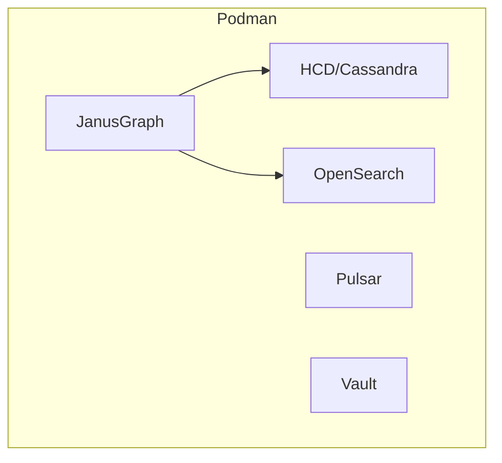

# Deployment Guide

**Author:** David Leconte, IBM Worldwide | Tiger-Team, Watsonx.Data Global Product Specialist (GPS)
**Contact:**

## Prerequisites

- Podman or Docker
- 16GB RAM minimum
- 100GB disk space

## Quick Deployment

```bash
cd config/compose
bash ../../scripts/deployment/deploy_full_stack.sh
```

## Service Architecture



## Port Mappings

| Service | Internal | External |
|---------|----------|----------|
| JanusGraph | 8182 | 18182 |
| OpenSearch | 9200 | 9200 |
| Pulsar | 6650 | 6650 |
| Vault | 8200 | 8200 |

## Health Checks

```bash
# JanusGraph
curl http://localhost:18182?gremlin=g.V().count()

# OpenSearch
curl http://localhost:9200/_cluster/health

# Pulsar
curl http://localhost:8080/admin/v2/clusters
```

## Stopping Services

```bash
cd config/compose
bash ../../scripts/deployment/stop_full_stack.sh
```
