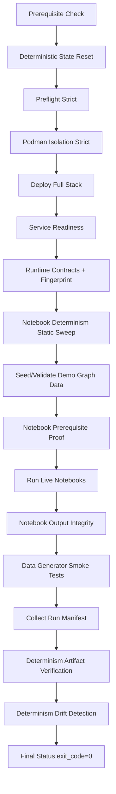
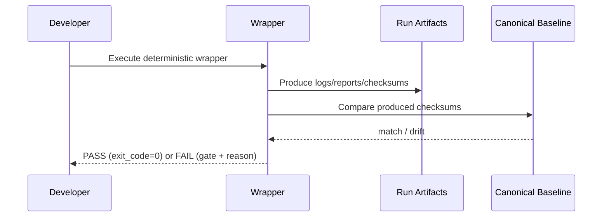

# Deterministic Behavior: Expected Outcomes, Schemas, and Pipeline Views

**Date:** 2026-03-26  
**Status:** Active  
**Created At:** 2026-03-26 20:08:42 CET  
**TL;DR:** Determinism means identical inputs produce identical pipeline outputs, enabling reliable drift detection, faster incident triage, and release-grade evidence.

---

## 1) What deterministic behavior should deliver

Deterministic behavior in this platform should produce:

- **Reproducible outcomes** across reruns for the same code/baseline/runtime profile.
- **Reliable drift detection** (signal, not noise).
- **Gate-localized failures** for fast root-cause triage.
- **Audit-ready evidence artifacts** for release/compliance proof.

---

## 2) Release-gate expectations (practical)

A deterministic pass should show:

- Wrapper status file exists: `exports/deterministic-status.json`
- Wrapper `exit_code = 0`
- Notebook report exists and all required notebooks are `PASS`
- `error_cells = 0` across notebook executions
- Determinism artifact verification passes
- Drift detection against canonical baseline passes

---

## 3) Pipeline flow (reference diagram)



---

## 4) Evidence contract (what outputs should exist)

For a successful run directory such as `exports/demo-<timestamp>/`, expected artifacts include:

- `pipeline_summary.txt`
- `state_reset.log`
- `preflight.log`
- `podman_isolation.log`
- `deploy.log`
- `runtime_contracts.log`
- `runtime_package_fingerprint.txt`
- `seed_graph.log`
- `notebook_prereq_proof.json`
- `notebooks.log`
- `notebook_run_report.tsv`
- `notebook_output_validation.json`
- `data_generators_smoke.log`
- `manifest.log`
- `determinism.log`
- `drift_detection.log`

Top-level status artifact:
- `exports/deterministic-status.json`

---

## 5) Core schemas (drafts)

### 5.1 Wrapper status JSON schema (example)

```json
{
  "timestamp_utc": "2026-03-26T18:50:05.3NZ",
  "wrapper": "scripts/deployment/deterministic_setup_and_proof_wrapper.sh",
  "pipeline_script": "scripts/testing/run_demo_pipeline_repeatable.sh",
  "compose_project_name": "janusgraph-demo",
  "args": "",
  "exit_code": 0
}
```

### 5.2 Notebook run report TSV columns

```text
notebook | status | exit_code | timestamp | duration_s | error_cells | log
```

### 5.3 Canonical checksum pointer file shape

```text
<sha256>  notebook_run_report.tsv
<sha256>  image_digests.txt
<sha256>  dependency_fingerprint.txt
<sha256>  runtime_package_fingerprint.txt
<sha256>  deterministic_manifest.json
```

---

## 6) Determinism decision model



---

## 7) Expected outputs in a successful state

- Gate progression reaches pipeline completion.
- Drift detection reports no mismatch.
- Notebook suite is fully green (required set).
- Status JSON is updated to `exit_code=0`.
- Baseline pointer remains consistent with approved canonical checksum set (or updated intentionally with override control).

---

## 8) Operational value of determinism

- **Regression confidence:** output diffs are meaningful.
- **Faster triage:** failures map to specific gates.
- **Safer releases:** deterministic checklist acts as release gate.
- **Auditability:** evidence files provide traceable proof.

---

## Related governance docs

- `docs/operations/determinism-acceptance-criteria-checklist.md`
- `.github/pull-request-template.md`
- `CHECKPOINT_20260326.md`
