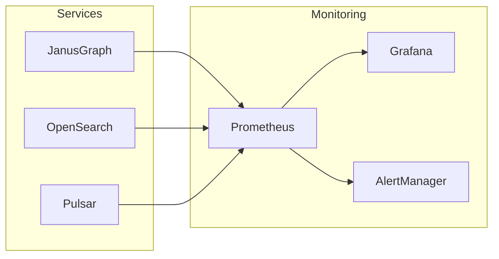

# Monitoring Guide

**Author:** David Leconte, IBM Worldwide | Tiger-Team, Watsonx.Data Global Product Specialist (GPS)  
**Contact:** +33614126117

## Monitoring Stack



## Access URLs

| Service | URL | Credentials |
|---------|-----|-------------|
| Prometheus | http://localhost:9090 | - |
| Grafana | http://localhost:3001 | admin/admin |
| AlertManager | http://localhost:9093 | - |

## Deploy Monitoring

```bash
./scripts/monitoring/deploy_monitoring.sh
```

## Key Metrics

### JanusGraph
- `janusgraph_vertices_total`
- `janusgraph_edges_total`
- `janusgraph_query_duration_seconds`

### OpenSearch
- `opensearch_cluster_health`
- `opensearch_indices_count`

### Pulsar
- `pulsar_messages_in`
- `pulsar_messages_out`
- `pulsar_backlog`

## Alert Rules

31 pre-configured alerts across 6 categories:
- System Health (8 rules)
- JanusGraph (4 rules)
- Security (8 rules)
- Performance (3 rules)
- Cassandra (3 rules)
- Compliance (2 rules)
