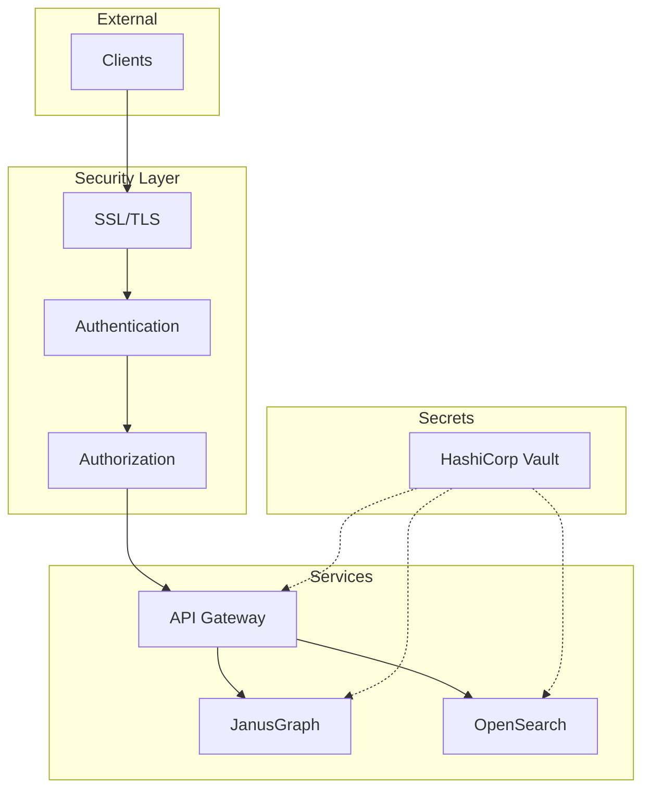

# Security Overview

**Author:** David Leconte, IBM Worldwide | Tiger-Team, Watsonx.Data Global Product Specialist (GPS)
**Contact:**

## Security Architecture

The HCD JanusGraph Banking Platform implements defense-in-depth security:



## Security Features

| Feature | Status | Documentation |
|---------|--------|---------------|
| SSL/TLS | ✅ Implemented | [SSL/TLS Guide](ssl-tls.md) |
| Vault Integration | ✅ Implemented | [Vault Guide](vault.md) |
| Audit Logging | ✅ Implemented | [Audit Guide](../compliance/audit-logging.md) |
| RBAC | ✅ Implemented | API documentation |

## Quick Security Setup

```bash
# Generate SSL certificates
./scripts/security/generate_certificates.sh

# Initialize Vault
./scripts/security/init_vault.sh

# Validate credentials
./scripts/validation/validate_credentials.sh
```

## Security Best Practices

1. **Never commit secrets** - Use Vault or environment variables
2. **Rotate credentials** - Regular rotation schedule
3. **Enable audit logging** - Track all access
4. **Use SSL/TLS** - Encrypt all traffic
